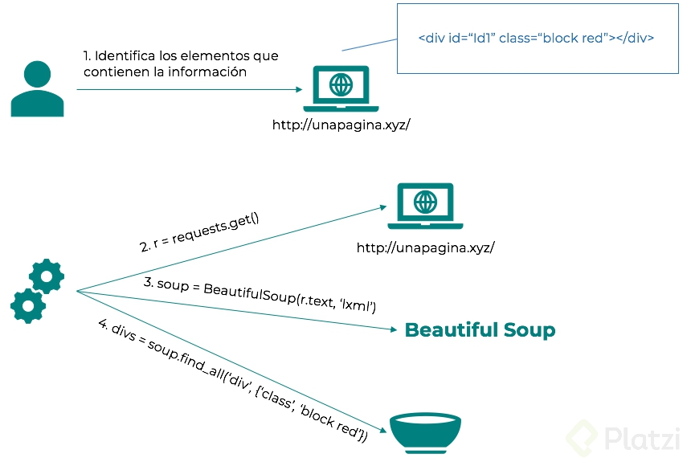
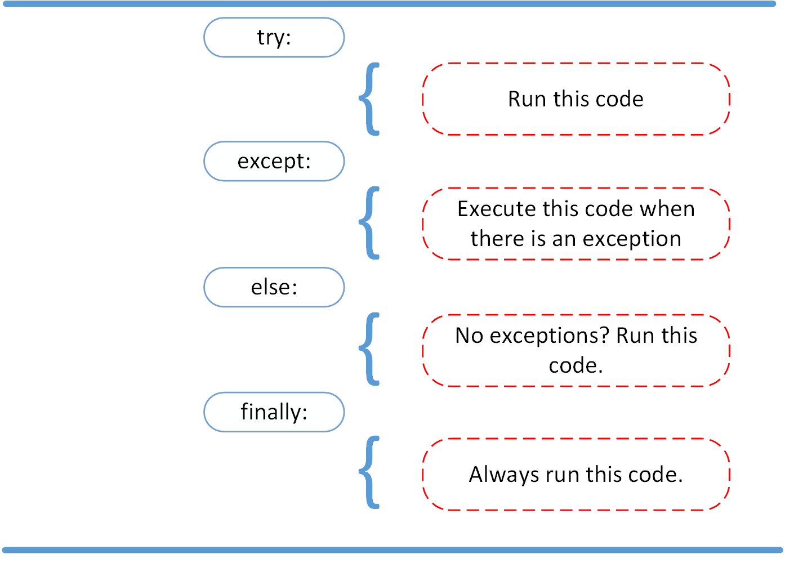
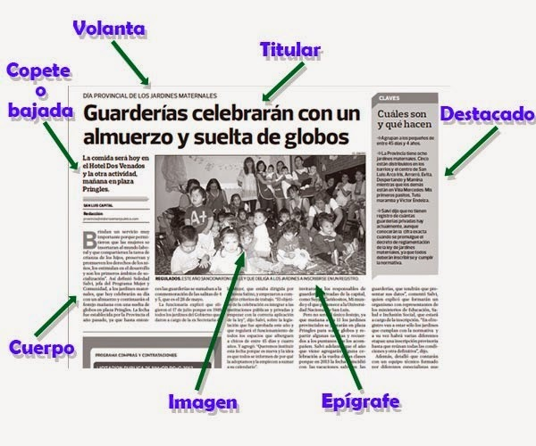

# Curso de Web Scraping: Extracción de Datos en la Web

## **Modulo II - HTML: Requests y BeautifulSoup**
- [Clase 4 Descargando una página web](#4-descargando-una-página-web)
- [Clase 5 Parseando HTML con BeautifulSoup](#5-parseando-html-con-beautifulsoup)
- [Clase 6 Extrayendo información](#6-extrayendo-información)
- [Clase 7 Manejo de errores](#7-manejo-de-errores)
- [Clase 8 Descargando Contenido](#8-descargando-contenido)
- [Clase 9 Contenido multimedia](#9-contenido-multimedia)
- [Clase 10 Unificando el Scraper](#10-unificando-el-scraper)


# 4. **Descargando una página web**
> #### [M2C1 Descargando Web](M2C1-descargando-web.ipynb) puedes mirar este archivo como guía de esta sección.

## Parsing Pagina12

En este módulo veremos cómo utilizar las bibliotecas `requests` y `bs4` para programar scrapers de sitios HTML es decir, sitios estaticos. Nos propondremos armar un scraper de noticias del diario [www.pagina12.com.ar](http://www.pagina12.com.ar/)

Supongamos que queremos leer el diario por internet. Lo primero que hacemos es abrir el navegador, escribir la URL del diario y apretar `Enter` para que aparezca la página del diario. Lo que ocurre en el momento en el que apretamos `Enter` es lo siguiente:

1. El navegador envía una solicitud a la URL pidiéndole información.
2. El servidor recibe la petición y procesa la respuesta.
3. El servidor envía la respuesta a la IP de la cual recibió la solicitud.
4. Nuestro navegador recibe la respuesta y la muestra **formateada** en pantalla.

Para hacer un scraper debemos hacer un programa que replique este flujo de forma automática y sistemática para luego extraer la información deseada de la respuesta. 

Utilizaremos `requests` para realizar peticiones y recibir las respuestas y `bs4` para *parsear* la respuesta y extraer la información.

Te dejo unos links que tal vez te sean de utilidad:

- [Códigos de status HTTP](https://developer.mozilla.org/es/docs/Web/HTTP/Status)
- [Documentación de requests](https://requests.kennethreitz.org/en/master/)
- [Documentación de bs4](https://www.crummy.com/software/BeautifulSoup/bs4/doc/)

Antes de seguir necesitamos instalar las siguientes librerías:

- jupyter
- requests
- bs4


> 💡 iniciamos nuestro entorno virtual, e instalamos.


```python
# importamos la biblioteca requests
import requests

#guardamos la URL en una variable
url='https://www.pagina12.com.ar/'

# generamos una solicitud a nuestra URL y guardamos el resultado
p12 = requests.get(url)

# verificamos si salio todo bien
p12.status_code
    # Respuestas informativas (100–199),
    # Respuestas satisfactorias (200–299),
    # Redirecciones (300–399),
    # Errores de los clientes (400–499),
    # y errores de los servidores (500–599).

# ver el contenido
print(p12.text)

#Buscar un título en el texto
#Muchas veces la respuesta a la solicitud puede ser algo que no sea un texto: una imagen, un archivo de audio, un video, etc.
p12.content

#Analicemos otros elementos de la respuesta. Encabezados de la respuesta
#vamos a ver el encabezado de la respuesta
p12.headers

#encabezado de la solicitud que hacemos
# existen paginas webs que al detectar el user-agent con nombre por defecto, bloquean la respuesta, solucion enmascarar el nombre
p12.request.headers

#que metodos utilizamos, existen varios metodos PUT, DELETE etc 
#El contenido de la request que acabamos de hacer está avisando que estamos utilizando la biblioteca requests para python 
#y que no es un navegador convencional. Se puede modificar
p12.request.method

#volver a consultar la URL a quien hicimos la solicitud
# util en caso de que existan redireccionamiento (cuando accedemos a un sitio y este nos redirecciona a otro sitio)
p12.request.url

```

## Resumen

- p12 = requests.get(url) // realiza la solicitud.
- p12.status_code // muestra el código de status HTTP de la respuesta.
- print(p12.text) // muestra el HTML de la página sin formatear.
- p12.content // muestra el contenido de la respuesta, puede ser bytes, imágenes, audio.
- p12.headers // muestra el encabezado de la respuesta.
- p12.request.headers // muestra el encabezado de la solicitud. El contenido de esta request avisa al servidor que se está utilizando requests en python y que no es un navegador convencional. Puede ser modificado.
- p12-request.url // muestra la url a la que se le hizo la solicitud.

# 5. Parseando HTML con BeautifulSoup

> #### [M2C2 Parseando HTML con BeautifulSoup](M2C2-Parseando-HTML-con-BeautifulSoup.ipynb) puedes mirar este archivo como guía de esta sección.

Beautiful Soup es una librería Python que permite extraer información de contenido en formato HTML o XML. Para usarla, es necesario especificar un parser, que es responsable de transformar un documento HTML o XML en un árbol complejo de objetos Python. 

Esto permite, por ejemplo, que podamos interactuar con los elementos de una página web como si estuviésemos utilizando las herramientas del desarrollador de un navegador.



Luego de una breve introducción continuamos con la clase. Bien, ya obtuvimos el código HTML de la página en la clase anterior. 

En esta clase veremos cómo extraer de él la información deseada.

```python
#Parseamos el codigo HTML
# esta libreria nos permite extraer la informacion que para nosotros es de interes
from bs4 import BeautifulSoup

# separamos el texto largo en pequenas partes para poder identificar
# s-> soup o sopa
s = BeautifulSoup(p12.text, 'lxml')

#para obtener/saber el tipo de dato de nuestra variable 
type(s)

#imprimir s con el metodo "prettify" de manera que tengas una nocion de como esta 
# estructurada la pagina y poder ver de manera jerarquica el DOM
print (s.prettify())

# Buscamos un elemento con el metodo find()
# BeatifulSoup nos devuelve el primer elemento que encuentra que coincida con el parametro
s.find('ul')

```

Primer ejercicio: obtener un listado de links a las distintas secciones del diario.

- DOM: estructura jerárquica, html
- Usar el inspector de elementos para ver dónde se encuentra la información, ayudara a identificar los elementos que deseemos analizar.
- Ojo cuando la página es responsive, debemos tener en cuenta tanto el diseño escritorio como mobil

```python
# Buscamos elementos especificos agregando atributos -> attrs
# Al atributo le pasamos un diccionario {'nombre atributo':'valor que esperamos obtener'}
# utilizamos el metodo find_all() -> para traer TODOS los elementos que coincidan con el parametro que estamos pasando -> 'li'
s.find('ul',attrs={'class':'horizontal-list main-sections hide-on-dropdown'}).find_all('li')
#como resultado nos devuelve una lista []
```
# 6. Extrayendo información

> #### [M2C3 Extrayendo Información](M2C3-Extrayendo-información.ipynb) puedes mirar este archivo como guía de esta sección.

Vamos a empezar a extraer información contenida en los tags. A veces puede ser el texto del tag o puede ser algún atributo

>Función que recibe un objeto de BeautifulSoup de una página de una sección y devuelve una lista de URLs a las notas de esa sección

```python
# reto-extrayendo-informacion

import requests
from bs4 import BeautifulSoup
# obtenemos la pagina de donde extraemos la informacion
link_principal='https://www.pagina12.com.ar'
pagina_principal = requests.get(link_principal)

#parseamos la pagina
soup = BeautifulSoup(pagina_principal.text, 'lxml')

#lista vacia para links de notas de secciones
URL=[]

def obtener_notas(soup):
    '''
    Función que recibe un objeto de BeautifulSoup de una página de una sección 
    y devuelve una lista de URLs a las notas de esa sección
    '''
    # Secciones -> creamos un array de todos los elementos con el tag DIV que tengan el atributo class=p12-dropdown-column
    # y seleccionamos nuestro primer elemento
    secciones= soup.find_all('div', attrs={'class':'p12-dropdown-column'})[0]

    #buscamos los tag a para obtener el href que contiene el link de la seccion
    link_secciones= secciones.find_all('a')
    
    #recorremos el array de tag a y obtemos los elementos href que contienen links
    href_link_secciones=[i.get('href') for i in link_secciones]

    #seleccionamos el primer link que corresponde a la seccion el pais
    pagina_seccion_el_pais= requests.get(href_link_secciones[0])
    #parseamos la pagina seccion el pais
    soup_pagina_seccion_el_pais= BeautifulSoup(pagina_seccion_el_pais.text,'lxml')

    #la pagina de articulos de noticias se dividen en 3 sectores
    #Top (1 noticia principal) - Semi(2 noticias semiprincipales) -  articulos (el resto de noticias)

    #!TOP
    top_noticias_seccion_el_pais = soup_pagina_seccion_el_pais.find('div', attrs={'class':'article-item__content'})
# agregamos el link principal + el contenido href dentro del elemento a que se encuentra en nuestro div 
    link_top_noticias_seccion_el_pais= [link_principal + top_noticias_seccion_el_pais.a.get('href')]

    #! Semi
    semi_noticias_seccion_el_pais = soup_pagina_seccion_el_pais.find_all('h2', attrs={'class':'title-list featured-article'})
		#recorremos el array de noticias semi importantes y seleccionamos el valor de href de los h2
    link_semi_noticias_seccion_el_pais=[link_principal+i.a.get('href') for i in semi_noticias_seccion_el_pais]

    # #! articulos
    articulos_noticias_seccion_el_pais= soup_pagina_seccion_el_pais.find_all('h2', attrs={'class':'is-display-inline title-list'})

    link_articulos_noticias_seccion_el_pais=[link_principal+i.a.get('href') for i in articulos_noticias_seccion_el_pais]

    URL.extend(link_top_noticias_seccion_el_pais)
    URL.extend(link_semi_noticias_seccion_el_pais)
    URL.extend(link_articulos_noticias_seccion_el_pais)

    
    return URL

print (obtener_notas(soup))
```

<details>
<summary><b>Otros Ejemplos resueltos</b></summary>

```python
import requests
from bs4 import BeautifulSoup

HOME_URL = 'https://www.pagina12.com.ar'

def parse_page(link):
    try:
        section = requests.get(link)
        if section.status_code == 200:
            pass
            #PARSE CURRENT PAGE
            soupSection = BeautifulSoup(section.text, 'lxml')
            #GET FEATURED ARTICLE
            featuredArticle = soupSection.find('h1', attrs={'class': 'title-list'})
            featuredLink = HOME_URL + featuredArticle.a.get('href')
            #GET HORIZONTAL ARTICLES
            articleListH = soupSection.find_all('h2', attrs={'class': 'title-list featured-article'})
            articleLinkH = [(HOME_URL + titleH.a.get('href')) for titleH in articleListH]
            #GET VERTICAL ARTICLES
            articleListV = soupSection.find_all('h2', attrs={'class': 'is-display-inline title-list'})
            articleLinkV = [(HOME_URL + titleV.a.get('href')) for titleV in articleListV]

            return(articleLinkH + articleLinkV)
        else:
            raise ValueError(f'Error: {section.status_code}')
    except ValueError as ve:
        print(ve)

def parse_home():
    try:
        response = requests.get(HOME_URL)
        if response.status_code == 200:
            soup = BeautifulSoup(response.text, 'lxml')
            #GET NAV LINKS
            listLinks = soup.find('ul', attrs = {'class': 'main-sections'}).find_all('li')
            link = listLinks[1].a.get('href')
            parse_page(link)
        else:
                raise ValueError(f'Error: {response.status_code}')
    except ValueError as ve:
        print(ve)

def run():
    parse_home()

if __name__=='__main__':
    run()
```
```python
def news(link):
    """
    Definición: Extracción de titulares y links de portal de noticias Argentino.
    
    Parámetro: 
    -link: URL de la sección de noticias a procesar.
    
    Retorno: Títulos y links de las noticias pertenecientes a ella.   
    """
    req = requests.get(link)
    soup = BeautifulSoup(req.text, "lxml")
    article_list = soup.find_all("h4", attrs={"class" : "is-display-inline title-list"})
    #Obtenemos los links de las noticias
    links_list = [link[:27]+article.a.get("href") for article in article_list]
    #Obtenemos los titulos de las noticias
    titles_list = [article.a.get_text() for article in article_list]
    return titles_list,links_list
```

```python
#Importacion de Librerias
import requests
from bs4 import BeautifulSoup

#Funciones
def GetLinks(ProtocolDomain, Soup):
    Notices=Soup.find_all('div',{'class','article-item__content'})
    Notices=[ProtocolDomain+ Notice.a.get('href') for Notice in Notices]
    return(Notices)

#Variables de Entrada
Links_sections='https://www.pagina12.com.ar/secciones/el-pais'
url='https://www.pagina12.com.ar'

#Preparacion de Variable
page = requests.get(Links_sections)
soup= BeautifulSoup(page.text,'lxml')

#Invocacion de Funcion
GetLinks(url, soup)
```

```python
# Define una nueva funcion
def obtener_articulos(soup):
    # Crea un array para almacenar los enlaces
    lista_articulos = []
    
    # Busca el div que almacena el primer articulo
    articulo_principal = soup.find('div', attrs={'class':'article-item__content'})
    if articulo_principal:
        # Agrega el href del a que esta dentro del h2 
        lista_articulos.append(articulo_principal.h2.a.get('href'))
    
    # Busca todos los divs que almacenan articulos
    grupo_articulos = soup.find_all('div', attrs={'class':'articles-list'})
    # Hay dos grupos de articulos, dos semi featured, yel resto de los articulos
    # Esta iteracion hace un loop por los grupos de articulos
    for grupo in grupo_articulos:
        articulos = grupo.find_all('article', attrs={'class':'article-item'})
        
        # Y esta hace un loop entre los articulos dentro de ese grupo de articulos
        for articulo in articulos:
            # Busca el div que almacena el texto, aunque el href tambien se podria conseguir enla img
            contenedor = articulo.find('div', attrs={'class':'article-item__content-footer-wrapper'})
            # Asigna el enlace al array
            lista_articulos.append(contenedor.a.get('href'))
            
    return lista_articulos
```

```python
# Web Scrapper - IMDB Top 250 movies
import requests as rq
from bs4 import BeautifulSoup

# Saving the URL
url = 'https://www.imdb.com/chart/top/?ref_=nv_mv_250'

# Creating the request
page = rq.get(url)

# Making sure the web got the solicitude
page.status_code
print('The status of the request is: {}'.format(page.status_code))

# Creating the soup
soup = BeautifulSoup(page.text, 'lxml')

# Looks like the 'lister' tag has all the information we need
general = soup.find('div', attrs = {'class':'lister'})

# Now let's go deeper
general = soup.find('tbody', attrs= {'class':'lister-list'}).find_all('tr')

# All the information are in these tags, we just need to extract them!
# First, let's create a list with all the links

def link_creation(general):
    section = general[0]
    link_sections = [section.a.get('href') for section in general]
    index = 1
    common = '?pf_rd_m=A2FGELUUNOQJNL&pf_rd_p=1a264172-ae11-42e4-8ef7-7fed1973bb8f&pf_rd_r=MBY5AS7XQMWKBXS6Y8N7&pf_rd_s=center-1&pf_rd_t=15506&pf_rd_i=top&ref_=chttp_tt_'
    links = []
    for i in link_sections:
        link = ('www.imdb.com' + str(i) + common + str(index))
        links.append(link)
        index += 1
    
    return links

# Now let's create a list of movie names!

def movie_names(general):
    section = general[0]
    movie_names = [section.find('td', attrs = {'class':'titleColumn'}).a.get_text() for section in general]
    return movie_names

# And for everything else...

def categorics(general):
    section = general[0]
    ratings = [section.find('span', attrs = {'name':'ir'}).get('data-value') for section in general]
    qualifiers = [section.find('span', attrs = {'name':'nv'}).get('data-value') for section in general]
    year = [section.find('span', attrs = {'class':'secondaryInfo'}).get_text() for section in general]
    protagonist_dir = [section.find('td', attrs = {'class':'titleColumn'}).a.get('title') for section in general]

    return(section, ratings, qualifiers, year, protagonist_dir)
```
</details>
<br>

>💡El texto también se puede extraer como:

```python
seccion.a.text
```

Arroja el mismo tipo de dato str, quizá haya diferencia en tiempo de ejecución.

# 7. Manejo de errores

> #### [M2C4 Manejo de Errores](M2C4-Manejo-de-errores.ipynb) puedes mirar este archivo como guía de esta sección.

>📌 “Puede pasar que dejemos corriendo en la noche un scraper, nos vayamos a dormir y a la mañana siguiente cuando esperamos encontrarnos con un montón de contenido ya descargado nos encontramos que a los 10min de que lo pusimos a correr ocurrió un error y se interrumpió la ejecución”

## Try, except

La importancia de la programación defensiva…

```python
#Ejemplo de como verificar si estamos listo para parsear el contenido de la respuesta
r = requests.get('https://www.pagina12.com.ar/secciones/el-pais')
if r.status_code == 200:
    # Procesamos la respuesta
    print('procesamos..')
else:
     # Informar el error
    print('informamos...')
```



```python
# url de una nota/articulo de la seccion deportes
url_nota = 'https://www.pagina12.com.ar/509102-campeones-del-mundo-en-futbol-y-alegria'
print(url_nota)
```

Para nosotros obtener un status_code distinto de 200  (código que nos dice que nuestra petición a sido exitosa),, tiene que haber algún servidor web que haya recibido nuestra solicitud, haya procesado, haya encontrado algún error en el proceso, y entonces nos devolvería el código del error 

Ahora supongamos que el link a la nota está mal cargado, o que sacaron la nota del sitio, o que directamente no está funcionando la web de página 12.

```python
# modificamos la url de la nota con el metodo replace, para que nos de un error
url_mala = url_nota.replace('2','3')
print(url_mala)
#https://www.pagina13.com.ar/......
```

Esto lo hacemos sólo para simular una URL mal cargada o un servidor caído

```python
# ahora hagamos una resquets a la URL "mala"
# y nos dara un error de status_code, que interrumpe la ejecucion de nuestro codigo
r = requests.get(url_mala)
if r.status_code == 200:
    # Procesamos la respuesta
    print('procesamos..')
else:
     # Informar el error
    print('informamos status code != 200')
```

Obtuvimos un error que interrumpió la ejecución del código. No llegamos a imprimir el status code. Muchas veces estos errores son inevitables y no dependen de nosotros. Lo que sí depende de nosotros es cómo procesarlos y escribir un código que sea robusto y resistente a los errores.

```python
# lo que podemos hacer para que el error del estatus_code no interrumpa la operacion 
# es encapsular dentro de un bloque TRY/except, para poder continuar el flujo de nuestro programa normalmente
try:
    nota = requests.get(url_mala)
except:
    print('Error en la request!\n')
#...
#...
#...
#... 
print('El resto del programa continúa...')
```

Las buenas prácticas de programación incluyen el manejo de errores para darle robustez al código

```python
try:
    nota = requests.get(url_mala)
except Exception as e:
    print('Error en la request:')
		# imprimimos que tipo de excepcion/error fue
    print(e)
    print('\n')
#...
#...
#...
#... 
print('El resto del programa continúa...')
```

Lo mismo ocurre cuando encadenamos búsquedas. Retomemos esta línea de código, donde queremos obtener el link  de una etiqueta “a”

```python
featured_article.a.get('href')
```

Si no existe el tag "a", obtendremos un error que dice que un objeto `None`no tiene ningún método .get('href'), esto normalmente interrumpiría la ejecución de nuestro código, pero si utilizamos la estructura TRY/EXCEPT podemos continuar la ejecución del código por mas de que haya algún error 

```python
try:
    featured_article.a.get('href')
except:
	# pass indica que continue el codigo a pesar de que tenga o no errores
    pass
print('continua el codigo')
```

Siempre es importante definir en un `except` el tipo de errores que esperamos recibir, podemos dejar el `except` sencillo pero no tendríamos el feedback de lo que ocurrió.

Algo que se puede hacer para ser más explicito es:

```python
from requests.exceptions import ConnectionError

url_mala = 'https://www.pagina13.com.ar'

try:
    requests.get(url_mala)
except ConnectionError as e:
    print("Tuviste un error")
    print(e)
```
<details>
<summary><b>Otros Ejemplos resueltos</b></summary>

```python
def ObtenerLinkNotas(soup):
    notas_array = list()
    notas = soup.find_all('div',{'class':'articles-list'})
    #len(notas)
    notas_link = notas[1].find_all('div',{'class':'article-item__content'})
    for i_notas_link in notas_link:
        if i_notas_link.find('a'):
            notas_array.append(i_notas_link.find('a').get('href'))
    return notas_array
```

```python
def obtener_notas(soup):
    '''Función que recibe un objeto de BeatiFulSoup de una página de una sección
    y devuelve una lista de URLs a las notas de esa sección
    '''
    lista_notas = []

    #Obtengo el articulo promocionado
    featured_article= soup.find('div', attrs={'class': 'article-item__header deco-bar-here'})
    if featured_article:
        url_art= url+featured_article.a.get('href')
        lista_notas.append(url_art)
        

    #obtengo el listado de artículos
    article_list= soup.find_all('div',attrs={'class': 'articles-list'})
    article_list
    for articles in article_list:
        #print(articles.prettify())
        #print('aqui')
        for article in articles.find_all('div', attrs={'class': 'article-item__header'}):
            #print(article)
            #print('paso algo')
            if article.a:
                url_art= url+article.a.get('href')
                lista_notas.append(url_art)

    return lista_notas
```

```python
def obtener_notas(soup):
    '''Función que recibe un objeto de BeatiFulSoup de una página de una sección
    y devuelve una lista de URLs a las notas de esa sección
    '''
    lista_notas = []

    #Obtengo el articulo promocionado
    featured_article= soup.find('div', attrs={'class': 'article-item__header deco-bar-here'})
    if featured_article:
        lista_notas.append(featured_article.a.get('href'))

    #obtengo el listado de artículos
    article_list= soup.find_all('div',attrs={'class': 'articles-list'})
    article_list
    for articles in article_list:
        #print(articles.prettify())
        #print('aqui')
        for article in articles.find_all('div', attrs={'class': 'article-item__header'}):
            #print(article)
            #print('paso algo')
            if article.a:
                url_art= url+article.a.get('href')
                lista_notas.append(url_art)

    return lista_notas
```
</details>

# 8. Descargando contenido

> #### [M2C5 Descargando contenido](M2C5-Descargando-contenido.ipynb) puedes mirar este archivo como guía de esta sección.

En esta clase vamos a empezar a descargar el contenido de la nota. 

```python
# Accedemos a una nota/articulo web Link de la noticia a procesar
# (perteneciente al portal de noticias Argentino pagina12).
url_nota = lista_notas[0]
print(url_nota)
```

Lo elementos que podemos extraer de una nota son:

- Titulo
- fecha
- copete
- volanta
- cuerpo
- autor



```python
#Encapsulamos toda la resquets en un bloque try/except
try:
    nota = requests.get(url_nota)
		#verificamos el status_code para procesar la peticion
    if nota.status_code == 200:
				#parseamos la web
        soup_nota = BeautifulSoup(nota.text, 'lxml')
        # Extraemos el título, para ello inspeccionamos elementos en la web
        titulo = soup_nota.find('div', attrs={'class':'article-title'})
        print(titulo.text)
        # Extraemos la fecha
        fecha = soup_nota.find('span', attrs={'pubdate':'pubdate'}).get('datetime')
        print(fecha)
        # Extraemos la volanta
        volanta = soup_nota.find('div', attrs={'class':'article-prefix'})
        if volanta:
            ret_dict['volanta'] = volanta.get_text()
        else:
            ret_dict['volanta'] = None
except Exception as e:
    print('Error:')
    print(e)
    print('\n')
```

<details>
<summary><b>Otros Ejemplos resueltos</b></summary>

```python
<try:
    nota = requests.get(url_nota)
    if nota.status_code == 200:
        s_nota = BeautifulSoup(nota.text, 'lxml')
        #Extraemos el titulo 
        titulo = s_nota.find('div', attrs = {'class':'col 2-col'}).find('h1')
        print(titulo.text)
        #Extraer la fecha
        fecha = s_nota.find('time').get('datetime')
        print(fecha)
        #Extraer copete
        for copete in s_nota.find('div', attrs = {'class':'article-tags'}).find_all('a'):
            print(copete.get_text())
        #Extraer volanta
        volanta = s_nota.find('div', attrs = {'class':'col 2-col'}).find('h4')
        print(volanta.text)
        #Extraer cuerpo
        cuerpo = s_nota.find('div', attrs = {'class':'article-text'}).find('p')
        print(cuerpo.text)
        #Extraer autor
        autor = s_nota.find('ul', attrs = {'class':'list column small-12'}).find('a')
        print(autor.get_text())     
         
except Exception as e:
    print('Error')
    print(e)
    print('\n') >
```

```python
def get_notice(url):
    """
    Definición: Extracción de fecha, titulo, volanta, copete y cuerpo de la noticia.
    
    Parámetro: 
    -url: Link de la noticia a procesar (perteneciente al portal de noticias Argentino pagina12).
    
    Retorno: Fecha, titulo, volanta, copete y cuerpo de la noticia.   
    """
    try:
        nota = requests.get(url)
        if nota.status_code == 200:
            s_nota = BeautifulSoup(nota.text, "lxml")
            #Extraemos la fecha de la noticia
            fecha = s_nota.find("div", attrs={"class" : "date"}).find("span", attrs= {"class": "p12-separator--right--gray"}).text
            print(fecha)
            #Extraccion del titulo
            titulo = s_nota.find("div", attrs={"class": "col 2-col"}).find("h1")
            print("Título de la noticia:",titulo.text)
            #Extraemos la volanta de la noticia
            volanta = s_nota.find("div", attrs={"class": "col 2-col"}).find("h4")
            print("\n")
            print("Volanta de la noticia:",volanta.text)
            #Extraemos el copete de la noticia
            print("\n")
            copete = s_nota.find("div", attrs={"class": "col 2-col"}).find("h3")
            print("Copete:",copete.text)
            #Extraemos el cuerpo de la noticia
            print("\n")
            cuerpo = s_nota.find("div", attrs={"class":"article-main-content article-text"}).find_all("p")
            for parrafo in cuerpo:
                print(parrafo.get_text())
    except Exception as e:
        print('Error:', e)
        print("\n\n")
```

```python
url = 'https://www.lanacion.com.ar/'

def main(url:str):
  response = requests.get(url)

  if response.status_code == 200:
    s = BeautifulSoup(response.text, 'lxml')

    sections = s.find_all('h2')

    sections_links = [url + section.a.get('href') for section in sections]
    
    return sections_links

url = 'https://www.lanacion.com.ar'

links_articulos = main(url)
links_articulos

try:
  response = requests.get(link_articulo)

  if response.status_code == 200:
    article = BeautifulSoup(response.text, 'lxml')

    #Se extrae el titulo
    title = article.find('h1')

    print(title.get_text())
    print('\n')

    #Se extrae
    subtitle = article.find('h2')

    print(subtitle.get_text())
    print('\n')

    paragraphs = article.find_all('p', 'com-paragraph --s')
    # print(paragraphs)

    for paragraph in paragraphs:
      print(paragraph.get_text())
      print('\n')

except Exception as e:
  print('Error:')
  print(e)
  print('\n')
```

```python
import requests
from bs4 import BeautifulSoup
import lxml
import re

url = "https://www.pagina12.com.ar"
response = requests.get(url)
#response.status_code, response.text, response.content
#response.headers, response.request.headers, response.request.method

soup = BeautifulSoup(response.text, 'lxml') #type(s), print(s.prettify())

# Every section is inside a il that is inside a ul. (Find) only returns the first tag
sections = soup.find('ul', attrs={'class':'horizontal-list main-sections hide-on-dropdown'}).find_all('li')

sections_links = [section.a.get('href') for section in sections]
#print(sections_links)
sections_titles = [section.a.text for section in sections]
#print(sections_titles)

def build_link(url, link):
    is_well_formed_link = re.compile(r'^https?://.+/.+$')
    is_root_path = re.compile(r'^/.+$')
    
    if is_well_formed_link.match(link):
        return link
    elif is_root_path.match(link):
        return f'{url}{link}'
    else:
        return f'{url}/{link}'

def clean_text(text):
    return text.replace("\xa0", "").replace("\n", "")

def get_response(url):
    try:
        return requests.get(url)
    except Exception as e:
        print("Error at get_response: ",e)

def get_soup(response):
    # Soup object
    return BeautifulSoup(response.text, 'lxml')

def get_articles_links(soup):

    articles_links = []
    
    # Get the featured article of the section 
    # by searching the FIRST div with class = article-item__content
    featured_article = soup.find('div', attrs={'class':'article-item__content'})
    
    if featured_article:
        featured_article_link = build_link(url,featured_article.a.get('href'))
        articles_links.append(featured_article_link)
    
    # The remaingin articles are in different group of divs
    article_groups = soup.find_all('div', attrs={'class':'articles-list'})
    
    for group in article_groups:
        # All the articles of the group
        articles = group.find_all('article', attrs={'class':'article-item'})
        # Loop for every article
        for article in articles:
            # The div that has the article inside
            div_of_article = article.find('div', attrs={'class':'article-item__content-footer-wrapper'})
            article_link = build_link(url, div_of_article.a.get('href'))
            articles_links.append(article_link)
    
    # Special case for the 'cultura y espectaculos' section
    if not articles_links:
        # All the articles
        articles = soup.find_all('div', attrs={'class':'article-box__container'})
        # Loop for every article
        for article in articles:
            article_link = article.h2
            article_link = build_link(url, article_link.a.get('href'))
            articles_links.append(article_link)        
    
    # Returns a list
    return articles_links

def get_article_title(soup):
    try:
        title = soup.find('div', attrs={'class':'content'}).h1.text
        title = clean_text(title)
        if title:
            return title
        else:
            return "No title."
    except Exception as e:
        print("Error getting the article title: ", e)

def get_article_date(soup):
    try:
        date = soup.find('div', attrs={'class':'date modification-date'}).span.time.text
        if date:
            return date
        else:
            return "No date."
    except Exception as e:
        print("Error getting the article date: ", e)    

def get_article_copete(soup):
    try:
        copete = soup.find('div', attrs={'class':'content'}).h3.text
        copete = clean_text(copete)
        if copete:
            return copete
        else:
            return "No copete."
    except Exception as e:
        print("Error getting the article copete: ", e)        

def get_article_volanta(soup):
    try:
        volanta = soup.find('div', attrs={'class':'content'}).h4.text
        volanta = clean_text(volanta)
        if volanta:
            return volanta
        else:
            return "No volanta."
    except Exception as e:
        print("Error getting the article volanta: ", e)        

def get_article_body(soup):
    try:
        body = soup.find('div', attrs={'class':'article-main-content article-text'})
        body_text = ""
        if body:
            for p in body:
                body_text = body_text + p.text
            body_text = clean_text(body_text)
            return body_text
        else:
            return "No body."
    except Exception as e:
        print("Error getting the article body: ", e)  

def get_article_author(soup):
    try:
        author = soup.find('div', attrs={'class':'author-name'})
        if author:
            author = clean_text(author.text)
            return author
        else:
            return "No author."
    except Exception as e:
        print("Error getting the article author: ", e)  

for section in sections_links:
    articles_titles = []
    articles_dates = []
    articles_copetes = []
    articles_volantas = []
    articles_bodys = []
    articles_authors = []
    
    # Get the response
    section_response = get_response(section)
    
    if section_response.status_code == 200:
        # Only execute if the response status code was ok
        section_soup = get_soup(section_response)
        articles_links = get_articles_links(section_soup)

        print("\n\n- Section: ", section)
        print("- Response: ", section_response.status_code)
        
        # Get articles info
        for article_link in articles_links:
            
            article_response = get_response(article_link)
            if section_response.status_code == 200:
                article_soup = get_soup(article_response)
                
                title = get_article_title(article_soup)
                articles_titles.append(title)
                #print("Title: ", title)
            
                date = get_article_date(article_soup)
                articles_dates.append(date)
                #print("Date: ", date)

                copete = get_article_copete(article_soup)
                articles_copetes.append(copete)
                #print("Copete: ", copete)

                volanta = get_article_volanta(article_soup)
                articles_volantas.append(volanta)
                #print("volanta: ", volanta)

                body = get_article_body(article_soup)
                articles_bodys.append(body)
                #print("body: ", body)

                author = get_article_author(article_soup)
                articles_authors.append(author)
                #print("author: ", author)
                
            else:
                print("Error status code: ",section_response.status_code)
                
        #print("- Titles: ", articles_titles)
        #print("- Dates: ", articles_dates)
        #print("- Copetes: ", articles_copetes)
        #print("- Volantas: ", articles_volantas)
        #print("- Bodys: ", articles_bodys)
        #print("- Authors: ", articles_authors)
    else:
        print("Error status code: ",section_response.status_code)
```
</details>

# 9. Contenido multimedia

> #### [M2C6 Contenido multimedia](M2C6-Contenido-multimedia.ipynb) puedes mirar este archivo como guía de esta sección.

Visualización de Imagen → Liberia : IPython.display 

```python
import requests
from bs4 import BeautifulSoup
#Funcion necesaria para visualizar imagenes
from IPython.display import Image
```

```python
link_seccion='https://www.pagina12.com.ar/secciones/el-pais'
url = requests.get(link_seccion)
url.status_code
soup=BeautifulSoup(url.text, 'lxml')
```

creamos una función que recibe como parámetro la “sopa”, es decir la estructura web parseada, de donde se obtendrá una lista de URL de las notas/artículos de una sección de la web pagina12

```python
def obtener_noticias(soup):
    lista_noticias=[]

    #obtener noticias promocionados
    noticias_promocionadas=soup.find('div', attrs={'class':'article-item__content'})
    if noticias_promocionadas:
        lista_noticias.append('https://pagina12.com.ar'+noticias_promocionadas.a.get('href'))

    #obtener resto de noticias
    resto_noticias=soup.find('section', attrs={'class':'list-content'})
    for i in resto_noticias.find_all('div', attrs={'class':'article-item__header'}):
        if i.a:
            lista_noticias.append('https://pagina12.com.ar'+i.a.get('href'))
    lista_noticias

    return lista_noticias
```

podemos visualizar lo que retorna la función, que es una lista de noticias.

```python
lista_noticias = obtener_noticias(soup)
lista_noticias
```

una vez que tenemos nuestra lista de noticias que contiene todas las URLS de la primera pagina de una sección, vamos a obtener los elementos de la nota, para ello seleccionamos el primer elemento [0] de la lista.

Con el método TRY/EXCEPT nos aseguramos que nuestro programa siga ejecutándose.

```python
#selecionamos el primer elemento de nuestro array que corresponde a una nota
link_nota= lista_noticias[0]
try:
    #hacemos la peticion de la web
    nota=requests.get(link_nota)
    #verificamos la respuesta del servidor sea 200
    if nota.status_code==200:
        #parseamos nuestra pagina web para analizar
        soup_nota=BeautifulSoup(nota.text, 'lxml')
        #extraemos el titulo de la nota
        titulo = soup_nota.find('h1').text
        print('Titulo: ',titulo)
        #extraemos la fecha de la nota
        fecha = soup_nota.find('time').get_text()
        print('Fecha: ',fecha)
        #extraemos el copete
        copete= soup_nota.find('h4').get_text()
        print('Copete: ',copete)
        #extraemos la volanta
        volanta= soup_nota.find('h3').get_text()
        print('Volanta: ',volanta)
        #extraemos el cuerpo de la nota
        cuerpo= soup_nota.find('div', attrs={'class':'article-main-content article-text'}).find_all('p')
        for c in cuerpo:
                print (c.get_text())
        #extraemos el autor de la nota
        autor= soup_nota.find('div', attrs={'class':'author-name'}).get_text()
        print ('autor: ', autor)

except Exception as e:
    print ('Error')
    print (e)
    print ('\n')
```

creamos una variable “media”, para obtener la imagen de la nota, debemos de parsear el tag DIV, para obtener la URL de la imagen

```python
#parseamos el tag div que contiene la imagen de la nota
media = soup_nota.find('div', attrs={'class':'article-main-media-image__container'})
media
```

```python
#verificamos que nuestro elemento tenga un valor
if len(media):
		# si es asi-> seleccionamos el propiedad img de nuestro tag
		# y guardamos la URL de la imagen
    imagen=media.img.get('src')
		# imprimimos la URL para poder ver la direccion web de la imagen
    print (imagen)
else:
    print ('no se encontraron imagenes')
```

```python
#solicitamos por medio de resquets la imagen de la nota
imagen_req=requests.get(imagen)
# verificamos que no haya ningun error
imagen_req.status_code
```

Obtener contenido multimedia (utilizamos la libreria YPython.display)

Ahora que ya hicimos nuestra petición y salio todo ok, utilizamos el método “Image” de la librería YPython.display de python y llamamos a nuestro resquets de imagen para poder visualizar

```python
Image(imagen_req.content)
```

<details>
<summary><b>Otros Ejemplos resueltos</b></summary>

```python

#Importacion de Librerias
import requests
from bs4 import BeautifulSoup
from IPython.display import Image #Funcion necesaria para visualizar imagenes

#Funciones
def GetDataNews(url):
    try:
        page = requests.get(url)
        if(page.status_code == 200):
            soup = BeautifulSoup(page.text,'lxml')
            #Extraer Titulo
            titulo=''
            try:
                titulo = soup.find('div',{'class','col 2-col'}).h1.get_text()
            except:
                pass

            #Extraer Fecha
            fecha=''
            try:
                fecha=soup.find('div',{'class','date modification-date'}).time.get('datetime')
            except:
                pass

            #Extraer Copete
            copete=''
            try:
                copete=soup.find('div',{'class','article-main-content article-text'}).find_all('b')[0].get_text()
            except:
                pass

            #Extraer Volanta
            volanta=''
            try:
                volanta=soup.find('div',{'class','col 2-col'}).h4.get_text()
            except:
                pass
            
            #Extraer Cuerpo
            cuerpo=''
            try:
                cuerpo=soup.find('div',{'class','article-main-content article-text'}).find_all('p')
                #print(cuerpo)3
                contenido=''
                for parrafo in cuerpo:
                    contenido= contenido + parrafo.get_text()
            except:
                pass

            #Extraer Autor
            autor=''
            try:
                autor=soup.find('div',{'class','author-name'}).get_text()
            except:
                pass

            #Extraer Imagen
            imagen=''
            try:
                imagenes=soup.find('figure',{'class','object-fit-block--contain intrinsic-container intrinsic-container-3x2'}).find_all('img')
                if(len(imagenes)==0): #Verificar que se haya encontrado por lo menos una imagen
                    print('No se encontraron imagenes')
                else:
                    urlImagen=imagenes[-1].get('src') #Extraemos el link o url de la imagen
                    imagen = requests.get(urlImagen) #descargamos la imagen comouna pagina cualquiera con el url que obtuvimos
            except:
                pass
    except Exception as e: 
        print('error')
        print(e)
        print('\n')
    
    return([titulo,fecha,copete,volanta,cuerpo,autor,imagen])

        
#Variables
AllNews=[]
AllLinks=['https://www.pagina12.com.ar/441054-cristina-kirchner-compartio-un-mensaje-despues-de-reunirse-c',
 'https://www.pagina12.com.ar/441008-antes-y-ahora-en-las-investigaciones-por-los-atentados-a-la-',
 'https://www.pagina12.com.ar/440906-primer-ministro-de-facto-un-diseno-sin-precedentes']

#Extraccion de datos para cada URL
for url in AllLinks:
    AllNews.append(GetDataNews(url))

#Todos los Datos Extraidos
AllNews
```
<br>

```python
def get_content_resources(url):
    from IPython.display import Image
    #Funcion que imprime la imagen
    def print_image(src):
        if src.status_code == 200:
            return Image(src.content)

    try:
        articulo = requests.get(url_art)
        if articulo.status_code == 200:
            soup_articulo = BeautifulSoup(articulo.text,'lxml')
            #Extraer el titulo
            titulo = soup_articulo.find('h1')
            print(titulo.text)
            #Extraer fecha
            fecha = soup_articulo.find('div',attrs={'class': 'date'}).find('span')
            print(fecha.text)
            #Extraer volanta
            volanta = soup_articulo.find('h4')
            print(volanta.text)
            #ExtraerImagen
            media = soup_articulo.find('div',attrs={'class','article-main-media-image__container'}).find('img')
            if media:
                img = media.get('src')
                img_request = requests.get(img)
            else:
                return
            return print_image(img_request)

    except Exception as e:
        print('Error:')
        print(e)
        print('\n')

url_base = 'https://www.pagina12.com.ar'
url_art = url_base + get_links(soup)[0]
get_content_resources(url_art)
```

```python
try:
    nota=requests.get(url_nota)
    if nota.status_code == 200:
        s_nota= BeautifulSoup(nota.text, 'lxml')
        #Extraer el titulo
        titulo= s_nota.find('div', attrs={'class': 'col 2-col'}).find('h1')
        #titulo= titulo_div.find('h1')
        print(titulo.text)
        
        #extraer la fecha del articulo
        fecha= s_nota.find('div', attrs={'class': 'date modification-date'}).span.time.get('datetime')
        print(fecha)
        
        #extrar volanta o encabezado
        encabezado= s_nota.find('div', attrs={'class': 'col 2-col'}).find('h4')
        print(encabezado.text)
        
        #extraer copete o bajada
        copete = s_nota.find('div', attrs={'class': 'col 2-col'}).find('h3')
        print('\n')
        print(copete.text)
        
        #extraer el autor
        print('\n')
        Autor = s_nota.find('div', attrs={'class': 'author-name'})
        print(Autor.text)
        
        
        #extraer cuerpo
        print('\n')
        cuerpo = s_nota.find('div', attrs= {'class': 'article-main-content article-text'}).find_all('p')
        
        body_text= ""
        if cuerpo:
            for p in cuerpo:
                body_text= body_text+ p.text
        print(body_text)
        
        
except Exception as e:
    print('Error:')
    print(e)
    print('\n')
```


</details>

# 10. Unificando el scraper

> #### [M2C7 Unificando el Scraper](M2C7-Unificando-el-Scraper.ipynb) puedes mirar este archivo como guía de esta sección.
## User agent

**User**-**Agent** o también conocido como Agente de Usuario es una cabecera de texto **que** sirve para identificar al usuario **que** entra en una página web a través del navegador. Básicamente forma parte de la petición HTTP **que** enviamos y **que** llega al servidor de destino. Muchas veces es necesario modificar nuestro user-agent para evitar que bloqueen o retrasen nuestro programa scraper.

## Comencemos unificando todo lo que vinimos haciendo

### Importamos librerias

```python
import requests
from bs4 import BeautifulSoup
from IPython.display import Image
# Librería de Python especializada en el manejo y análisis de estructuras de datos.
import pandas as pd
```

### Parser

```python
link_principal='https://www.pagina12.com.ar'
### editando cabecera (headers) para evitar el error 429
### cambiar el user-agent para evitar ser detectado como un BOT 
headers = {"User-Agent": "Mozilla/5.0 (Windows NT 10.0; Win64; x64) AppleWebKit/537.36 (KHTML, like Gecko) Chrome/70.0.3538.110 Safari/537.36"}
###
r_web_principal=requests.get(link_principal, headers=headers)
s_web_principal = BeautifulSoup(r_web_principal.text, 'lxml')
```

### Obtenemos URLs

```python
#seleccionamos el primer elemento de la lista de secciones
secciones_web_principal = s_web_principal.find_all('div', attrs={'class':'p12-dropdown-column'})[0]
link_secciones_web_principal = secciones_web_principal.find_all('a')

#recorremos la lista de tag a, para obtener todas las URLS de las secciones
URL_secciones=[]
for i in link_secciones_web_principal:
    if len(link_secciones_web_principal):
        URL_secciones.append(i.get('href'))
```

### Función Obtener Noticias/Artículos/Notas

función que obtiene las URLs de todas las noticias de la primera pagina de una sección

```python
# hacemos la peticion a la primera URL de nuestras secciones
r_URL_secciones= requests.get(URL_secciones[0])
#parseamos la pagina web de la seccion
s_seccion= BeautifulSoup(r_URL_secciones.text, 'lxml')

def obtener_noticias(soup):
    lista_notas=[]
    #obtener noticias promocionadas y agregamos al array
    noticias_promocionadas=soup.find('div', attrs={'class':'article-item__content'})
    if noticias_promocionadas:
        lista_notas.append(f'{link_principal}{noticias_promocionadas.a.get("href")}')

    #resto de noticias y agregamos al array
    resto_noticias=soup.find('section', attrs={'class':'list-content'})
    for i in resto_noticias.find_all('div', attrs={'class':'article-item__header'}):
        if i.a:
            lista_notas.append(f'{link_principal}{i.a.get("href")}')

		# una vez que guardamos los links de las noticias devolvemos/retornamos el array que contiene todas las URLs
    return lista_notas
```

Llamamos a la función obtener_noticias y le pasamos la “sopa de sección”, es decir la pagina web de la sección donde queremos obtener sus noticias, pero parseada y lo guardamos dentro de una variable lista_notas

```python
lista_notas=(obtener_noticias(s_seccion))
```

### Función Obtener Información

una vez que tengamos los links de las noticias, nos quedara poder analizar cada link, y extraer los elementos que componen la noticia, por ejemplo: titulo, copete, volanta, resumen, imagen etc.

```python
# obtemos informacion de cada nota
# seleccionamos la primera nota de nuestra lista de notas
URL_nota=lista_notas[0]
# hacemos una petricion a la URL para ver que esta todo ok, obtener el codigo 200.
r_URL_nota= requests.get(URL_nota)
#parseamos la URL 
s_nota=BeautifulSoup(r_URL_nota.text, 'lxml')

def obtener_info(s_nota):
    #creamos un diccionario vacio para guardar informacion de la notas
    info_dic={}

    #extraemos el titulo de la nota y guardamos en el diccionario gracias a su clave:valor
    titulo = s_nota.find('h1').text
    if titulo:
        info_dic['titulo']=titulo
    else:
        info_dic['titulo']=None

    #extraemos la fecha de la nota y guardamos en el diccionario gracias a su clave:valor
    fecha = s_nota.find('time').get_text()
    if fecha:
        info_dic['fecha']=fecha
    else:
        info_dic['fecha']=None

    #extraemos el copete y guardamos en el diccionario gracias a su clave:valor
    copete= s_nota.find('h4').get_text()
    if copete:
        info_dic['copete']=copete
    else:
        info_dic['copete']=None

    #extraemos la volanta y guardamos en el diccionario gracias a su clave:valor
    volanta= s_nota.find('h3').get_text()
    if volanta:
        info_dic['volanta']=volanta
    else:
        info_dic['volanta']=None

    #extraemos el cuerpo de la nota 
		# aqui recorremos por todos los elementos de tag p que contiene la nota 
    cuerpo= s_nota.find('div', attrs={'class':'article-main-content article-text'}).find_all('p')
    cu=[]
    for i in cuerpo:
        cu.append(i.get_text())
    
    #utilizamos el metodo join, para convertir una lista str a una cadena de texto y guardamos en el diccionario gracias a su clave:valor
    if cu:
        info_dic['cuerpo']="".join(map(str, cu))
    else:
        info_dic['cuerpo']=None
    
    #extraemos el autor de la nota y guardamos en el diccionario gracias a su clave:valor
    autor= s_nota.find('div', attrs={'class':'author-name'})
    if autor:
        info_dic['autor']=autor.get_text()
    else:
        info_dic['autor']=None
    
    #extraemos la imagen
    #parseamos el tag div que contiene la imagen de la nota
    media = s_nota.find('div', attrs={'class':'article-main-media-image__container'})
		# preguntamos si hay algun valor osea una imagen
    if len(media):
				# con el metodo get, obtenemos la URL de la imagen
        imagen_src=media.img.get('src')
        try:
						# hacemos una peticion para ver que este todo bien la URL de la imagen
            r_img=requests.get(imagen_src)
            if r_img.status_code== 200:
								# guardamos el contenido de la imagen dentro del diccionario
                info_dic['imagen']=r_img.content
            else:
                info_dic['imagen']=None
        except:
            print('No se pudo obtener la imagen')
    else:
        print ('No se encontraron imagenes')

    return  info_dic
#obtiene todos los valores de un diccionario
#print (dic.values())
#obtener un valor de un diccionario, utilizamos la libreria de imagen de python para mostrar la img
#Image(dic.get('imagen'))
```

### Función Recorrer Secciones

creamos nuestra función para recorrer cada noticia de las secciones de la pagina web del diario, de esta manera poder obtener la información de cada noticia de cada sección y devolvemos un diccionario de todos los datos de las noticias

```python
def scrape_nota(url):
    try:
        headers = {"User-Agent": "Mozilla/5.0 (Windows NT 10.0; Win64; x64) AppleWebKit/537.36 (KHTML, like Gecko) Chrome/70.0.3538.110 Safari/537.36"} 
        r_nota=requests.get(url, headers=headers)
    except Exception as e:
        print ('Error scrapeando URL ->', url)
        print (e)
        return None
    
    if r_nota.status_code!= 200:
        print(f'Error obteniendo nota {url}')
        print(f'Status Code = {r_nota.status_code}')
        return None
    
    s_nota=BeautifulSoup(r_nota.text, 'lxml')

		# llamamos a la funcion obtener_info y le pasamos la sopa de la web de una seccion
		# nos retorna los elementos de cada nota y guardamos en un diccionario 
    dic_scrape=obtener_info(s_nota)
    dic_scrape['url']=url

    return dic_scrape
```

antes de analizar las secciones vemos todas nuestras URLs de las secciones de la pagina del diario

```python
URL_secciones
```

['https://www.pagina12.com.ar/secciones/el-pais',
 'https://www.pagina12.com.ar/secciones/economia',
 'https://www.pagina12.com.ar/secciones/sociedad',
 'https://www.pagina12.com.ar/suplementos/cultura-y-espectaculos',

….]

ahora que vimos las urls de las secciones, debemos de obtener los links de las noticias de cada seccion

```python
#obtenemos todos los link de la primera pagina de cada seccion 
notas_secciones=[]
for link in URL_secciones:
    try:
        r_2_URL_secciones=requests.get(link)
        if r_2_URL_secciones.status_code== 200:
            #parseamos cada seccion 
            s_2_web_principal=BeautifulSoup(r_2_URL_secciones.text, 'lxml')
            # enviamos el link de la seccion a nuestra funcion obtener notas 
            # y guaramos lo que retorna la funcion (diccionario) a nuestra lista de notas de secciones
            notas_secciones.extend(obtener_noticias(s_2_web_principal))
        else:
            print ('No se pudo obtener la seccion ->', link)
    except:
        print ('No se pudo obtener la seccion ->', link)
```

podemos ver todos los links de noticias de cada seccion de la web del diario

```python
print(notas_secciones)
```

### Data Set

es hora de guardar todos los datos que obtuvimos a través de nuestro scraper

```python
# creamos nuestro data set de noticias de cada seccion
data_set=[]
# recorremos cada noticia de cada seccion
# en cada noticia utilizamos el metodo scrape_nota que a su vez llama a obtener_info
# con el resultado de obtener_info, vamos guardando en un diccionario -> data_set
for posicion_nota,link_nota in enumerate(notas_secciones):
		#le doy un limite de 50 noticias para no dejar tanto tiempo corriendo el scraper
    if posicion_nota<50:
        print (f'Scrapeando nota {posicion_nota} / {len(link_nota)}')
        data_set.append(scrape_nota(link_nota))
```

Scrapeando nota 0 / 81
Scrapeando nota 1 / 95
Scrapeando nota 2 / 79
Scrapeando nota 3 / 95
Scrapeando nota 4 / 95
Scrapeando nota 5 / 95

…

### Data Frame

creamos nuestro data frame, y para visualizar convertimos a un archivo CSV y EXCEL.

El DataFrame es la **estructura de datos fundamental de Pandas, representa una tabla de datos panel con indexación integrada**. Cada columna contiene los valores de una variable y cada fila un conjunto de valores de cada columna.

```python
# creamos nuestro data frame utilizando pandas data frame
data_frame= pd.DataFrame(data_set)
#podemos visualizar con las cabeceras
data_frame.head()
# pasamos nuestro conjunto de datos a un archivo csv
data_frame.to_csv('Notas pagina12.csv')
# pasamos nuestro conjunto de datos a un archivo excel
data_frame.to_excel("Notas Paginas12.xlsx", sheet_name="data frame", index=True)
```

ahora ya tenemos los datos de cada noticia de cada seccion de la pagina web del diario.


<details>
<summary><b>Otros Ejemplos resueltos</b></summary>

### Ejemplo 1

```python
import requests
from bs4 import BeautifulSoup
from urllib.parse import urljoin
import json
import base64

url = 'https://www.pagina12.com.ar/'

def _get_section_links(url):
    print(f'Getting section links from {url}')

    section_links = []
    try:
        response = requests.get(url)
        if response.status_code == 200:
            soup = BeautifulSoup(response.text, 'html.parser')
            main_sections  = soup.find('ul', attrs={'class': 'main-sections'}).find_all('li')
            main_sections_links = [seccion.a.get('href') for seccion in main_sections]
            main_supplements  = soup.find('ul', attrs={'class': 'main-supplements'}).find_all('li')[1:]    
            main_supplements_links = [seccion.a.get('href') for seccion in main_supplements]
            section_links = main_sections_links + main_supplements_links
        else:
            print(f'Error while getting {url}')
            print(f'Status code: {response.status_code}')

    except Exception as e:
        print(f'Error while scrapping {url}')
        print(e)
    
    return section_links

def _get_article_links(section_link):
    print(f'Getting article links from {section_link}')

    article_links = []
    try:
        # Get section
        section_response = requests.get(section_link)
        if section_response.status_code == 200:
            soup = BeautifulSoup(section_response.text, 'html.parser')
            # Featured article
            featured_article = soup.find('div', attrs={'class':'article-item__content'})
            if featured_article:
                article_links.append(featured_article.a.get('href'))
            # Article list    
            article_group = soup.find_all('div', attrs={'class': 'articles-list'})
            for group in article_group:
                article_list = group.find_all('article', attrs={'class': 'article-item'})
                for article in article_list:
                    if article.a:
                        article_links.append(article.a.get('href'))
            # Join with base url
            if article_links:
                article_links = [urljoin(url, article_link) for article_link in article_links]

        else:
            print(f'Error while getting {section_link}')
            print(f'Status code: {section_response.status_code}')

    except Exception as e:
        print(f'Error while scrapping {section_link}')
        print(e)

    return article_links

def _get_article_data(article_link):
    print(f'Getting article data from {article_link}')

    article_data = {}
    try:
        article = requests.get(article_link)
        if article.status_code == 200:
            soup = BeautifulSoup(article.text, 'html.parser')
            # prefix        
            prefix = soup.find('div', attrs={'class': 'col 2-col'}).h4.text
            # title
            title = soup.find('div', attrs={'class': 'col 2-col'}).h1.text
            # summary
            summary = soup.find('div', attrs={'class': 'col 2-col'}).h3.text
            # date_time
            date_time = soup.find('time').get('datetime')
            # author
            author = soup.find('div', attrs={'class': 'author-name'})
            if author:
                author = author.text
            # body
            body = ''
            paragraphs = soup.find('div', attrs={'class': 'article-main-content'}).find_all('p')
            for paragraph in paragraphs:
                if paragraph.text:
                    body += paragraph.text
            # image
            images = soup.find('div', attrs={'class': 'article-main-media-image__container'}).find_all('img')
            if len(images) == 0:
                print('No images found')
            else:
                image = images[-1]
                img_src = image.get('src')
                try:
                    img_response = requests.get(img_src)
                    if img_response.status_code == 200:
                        img = base64.encodebytes(img_response.content).decode('utf-8')
                except Exception as e:
                    print('Could not obtain the image content')
                    print(e)

            article_data = {
                'prefix': prefix,
                'title': title,
                'summary': summary,
                'author': author,
                'datetime': date_time,
                'img': img,
                'body': body,
                'article_url': article_link
            }

        else:
            print(f'Error scrapping {article_link}')
            print(f'Status code: {article.status_code}')

    except Exception as e:
        print(f'Error scrapping {article_link}')
        print(e)
        print('\n')

    return article_data

def _export_data(data, filename):
    print(f'Exporting data to {filename}')
    with open(filename, 'w', encoding='utf-8') as f:
        f.write(json.dumps(data, indent=4))

def main():
    print(f'Scrapping {url}')

    articles = []
    section_links = _get_section_links(url)
    for section_link in section_links:
        article_links = _get_article_links(section_link)
        for article_link in article_links:
            article_data = _get_article_data(article_link)
            article_data['section_url'] = section_link
            articles.append(article_data)

    if articles:
        json_data = {
            'url': url,
            'articles': articles
        }
        _export_data(json_data, 'data.json')

if __name__ == '__main__':
    main()
```

### Ejemplo 2

Este programa baja 260 articulos (se demora un poco), lo hice de forma que guardara la seccion creando una clase: articulo y despues manipulandolo. Tambien guarde la seccion del articulo.

Si baja la imagen pero yo trabajo con la consola entonces no la inserte en en el archivo, lo corri en jupyter notebook e hice la validacion que hace en profesor en el curso y si muestra la imagen. aca esta el codigo.

```python
<import requests
from bs4 import BeautifulSoup
import lxml.html as html
from IPython.display import Image,display
import pandas as pd

class articulo:
    def __init__(self, seccion, url,fecha,titulo,reseña,resumen,imagen_src):
        self.seccion=seccion
        self.url=url
        self.fecha=fecha
        self.titulo=titulo
        self.reseña=reseña
        self.resumen=resumen
        self.imagen_src=imagen_src
        
    def print_articulo(self):
        print(self.seccion)
        print(self.url)
        print(self.fecha)
        print(self.reseña)
        print(self.titulo)
        print(self.resumen)
    
    def convertir_a_diccionario(self):
        return {'seccion': self.seccion, 'url': self.url, 'fecha': self.fecha,'titulo':self.titulo,'reseña':self.reseña,'resumen':self.resumen}                       
        
        

def list_new_secciones(links):
    news=BeautifulSoup(links.text,'html.parser')
    bajadas=news.find_all('div', attrs={'class':'article-item__content'})
    links_h2_noticias=[f.h2.a.get('href') for f in bajadas if f.h2]
    links_h3_noticias=[f.h3.a.get('href') for f in bajadas if f.h3]
    links_h4_noticias=[f.h4.a.get('href') for f in bajadas if f.h4]
    return links_h2_noticias +links_h3_noticias+links_h4_noticias

def traer_fecha(articulo_url):
    try:
        s_articulo=requests.get(articulo_url)
        if s_articulo.status_code== 200:
            s_articulo2=BeautifulSoup(s_articulo.text,'html.parser')
            fecha=s_articulo2.find('span', attrs={'pubdate':'pubdate'})
            date=fecha.get('datetime')
        else:
            date=None
    except  ValueError as ve:
            print("Hubo un error en la request")
            print(ve)
            print("\n")    
    return date

def traer_titulo(articulo_url):
    try:
        s_articulo=requests.get(articulo_url)
        if s_articulo.status_code== 200:
            s_articulo2=BeautifulSoup(s_articulo.text,'html.parser')
            titulo=s_articulo2.find('h1', attrs={'class':'article-title'})
            title=titulo.get_text()
        else:
            title=None
    except  ValueError as ve:
            print("Hubo un error en la request")
            print(ve)
            print("\n")    
    return title

def traer_reseña(articulo_url):
    try:
        s_articulo=requests.get(articulo_url)
        if s_articulo.status_code== 200:
            s_articulo2=BeautifulSoup(s_articulo.text,'html.parser')
            reseña=s_articulo2.find('h2', attrs={'class':'article-prefix'})
            if reseña:
                 res=reseña.get_text()
            else:
                res=None
    except  ValueError as ve:
            print("Hubo un error en la request")
            print(ve)
            print("\n")    
    return res

def traer_imagen(articulo_url):
    try:
        s_articulo=requests.get(articulo_url)
        if s_articulo.status_code== 200:
            s_articulo2=BeautifulSoup(s_articulo.text,'html.parser')
            media=s_articulo2.find('div', attrs={'class':'article-main-media-image'})
            if media:
                pics=media.find_all(('img'))
                if(len(pics)==0):
                     pic_source=None
                else:
                    pic=pics[-1]
                    pic_source=pic.get('data-src')
                    pic_req=requests.get(pic_source)
                    if pic_req.status_code==200:
                        article_pic=pic_req.content
            else:
                article_pic=None
    except  ValueError as ve:
            print("Hubo un error en la request")
            print(ve)
            print("\n")    
    return article_pic

def traer_resumen(articulo_url):
    try:
        s_articulo=requests.get(articulo_url)
        if s_articulo.status_code== 200:
            s_articulo2=BeautifulSoup(s_articulo.text,'html.parser')
            resume=s_articulo2.find('div', attrs={'class':'article-summary'})
            if resume:
                 rsume=resume.get_text()
            else:
                rsume=None
    except  ValueError as ve:
            print("Hubo un error en la request")
            print(ve)
            print("\n")    
    return rsume

def run():
    url= 'https://www.pagina12.com.ar/'
    p12= requests.get(url)
    if p12.status_code== 200:
        s=BeautifulSoup(p12.text,'html.parser')
        secciones=s.find('ul', attrs={'class':'horizontal-list main-sections hide-on-dropdown'}).find_all('li')
        links_secciones=[seccion.a.get('href') for seccion in secciones]
        lista_de_articulos=[]
        sec=[]
        s=[]
        i=0
        n=len(links_secciones)      
        while i<n:
            a=secciones[i].a.get_text()
            sec=links_secciones[i]
            try:
                s=s+list_new_secciones(requests.get(sec))
                for art in s:
                    lista_de_articulos.append(articulo(a,art,'','','','',''))                
            except  ValueError as ve:
                print("Hubo un error en la request")
                print(ve)
                print("\n")        
            i=i+1
        for obj in lista_de_articulos:
            a_url=obj.url
            obj.fecha= traer_fecha(a_url)
            obj.titulo=traer_titulo(a_url)
            obj.reseña=traer_reseña(a_url)
            obj.resumen=traer_resumen(a_url)
            obj.imagen_src=traer_imagen(a_url)
        
        #img=(Image(lista_de_articulos[0].imagen_src))
        arts={}
        L_arts=[]
        for a in lista_de_articulos:
            arts=a.convertir_a_diccionario()
            L_arts.append(arts)
        df=pd.DataFrame(L_arts)
        df.head()
        df.to_csv('articulos Pagina 12.csv',encoding='utf-8-sig')

if __name__=='__main__':
    run()>
```

cambien “i<n” por “i<1” y asi al correrlo no demora tanto.

```python
< while i<n:
            a=secciones[i].a.get_text()
            sec=links_secciones[i]>
```

### Ejemplo 3

```python
import requests
import lxml
import re
import pandas as pd
from bs4 import BeautifulSoup

def build_link(url, link):
    """Build the links if it's not complete."""
    is_well_formed_link = re.compile(r'^https?://.+/.+$')
    is_root_path = re.compile(r'^/.+$')
    
    if is_well_formed_link.match(link):
        return link
    elif is_root_path.match(link):
        return f'{url}{link}'
    else:
        return f'{url}/{link}'

def clean_text(text):
    return text.replace("\xa0", "").replace("\n", "")

def get_response(url):
    try:
        return requests.get(url)
    except Exception as e:
        print("Error at getting the response: ", e)

def get_soup(response, parser='lxml'):
    # Return a Soup object
    return BeautifulSoup(response.text, parser)

def get_sections(url):
    """Returns a list of sections. Ex: (El país, Economía, Sociedad, etc...)"""
    try:
        sections_response = get_response(url)
        
        if sections_response.status_code == 200:
            sections_soup = get_soup(sections_response)
            # Every section is inside a il that is inside a ul. (Find) only returns the first tag
            sections = sections_soup.find('ul', attrs={'class':'horizontal-list main-sections hide-on-dropdown'}).find_all('li')         
            if sections:               
                return [section.a.get('href') for section in sections]
            else:
                return "No sections."
        else:
            return "Error sections respone != 200"
    except Exception as e:
        print("Error getting the sections: ", e)

def get_articles_links(soup):

    articles_links = []
    
    # Get the featured article of the section 
    # by searching the FIRST div with class = article-item__content
    featured_article = soup.find('div', attrs={'class':'article-item__content'})
    
    if featured_article:
        featured_article_link = build_link('https://www.pagina12.com.ar', featured_article.a.get('href'))
        articles_links.append(featured_article_link)
    
    # The remaingin articles are in different group of divs
    article_groups = soup.find_all('div', attrs={'class':'articles-list'})
    
    for group in article_groups:
        # All the articles of the group
        articles = group.find_all('article', attrs={'class':'article-item'})
        # Loop for every article
        for article in articles:
            # The div that has the article inside
            div_of_article = article.find('div', attrs={'class':'article-item__content-footer-wrapper'})
            article_link = build_link('https://www.pagina12.com.ar', div_of_article.a.get('href'))
            articles_links.append(article_link)
    
    # Special case for the 'cultura y espectaculos' section
    if not articles_links:
        # All the articles
        articles = soup.find_all('div', attrs={'class':'article-box__container'})
        # Loop for every article
        for article in articles:
            article_link = article.h2
            article_link = build_link('https://www.pagina12.com.ar', article_link.a.get('href'))
            articles_links.append(article_link)        
    
    # Returns a list
    return articles_links

def get_all_articles_urls(sections_urls):    
    all_articles_urls = []
    
    for i, section_url in enumerate(sections_urls):
        print(f"\n- Scrapping section {i+1}/{len(sections_urls)}")        
        section_response = get_response(section_url)
        
        if section_response.status_code == 200:
            print("  Section: ", section_url)
            print("  Response: ", section_response.status_code)           
            section_soup = get_soup(section_response)
            articles_links = get_articles_links(section_soup)
            all_articles_urls = all_articles_urls + articles_links          
        else:
            print("Error status code of section: ", section_response.status_code)

    return all_articles_urls   

def scrape_article(article_link):          
    article_response = get_response(article_link)

    if article_response.status_code == 200:
        article_soup = get_soup(article_response)       
        title = get_article_title(article_soup)
        #print("Title: ", title)  
        date = get_article_date(article_soup)
        #print("Date: ", date)
        author = get_article_author(article_soup)
        #print("Suthor: ", author)
        volanta = get_article_volanta(article_soup)
        #print("Volanta: ", volanta)
        copete = get_article_copete(article_soup)
        #print("Copete: ", copete[0:10])
        body = get_article_body(article_soup)
        #print("Body: ", body[0:10])        
        image = get_article_image(article_soup)
        #print("Image: ", image)   
        return title, date, author, volanta, copete, body, image
    else:
        print("Error status code at scrapping the article: ", article_response.status_code)

def scrape_articles(articles_links):
    articles_titles = []
    articles_dates = []
    articles_authors = []
    articles_volantas = []
    articles_copetes = [] 
    articles_bodys = []    
    articles_images = []
    
    for i, article_link in enumerate(articles_links):
        print(f"Scrapping article {i+1}/{len(articles_links)}")
        
        article_response = get_response(article_link)

        if article_response.status_code == 200:
            article_soup = get_soup(article_response)       
            title = get_article_title(article_soup)
            #print("Title: ", title)  
            date = get_article_date(article_soup)
            #print("Date: ", date)
            author = get_article_author(article_soup)
            #print("Suthor: ", author)
            volanta = get_article_volanta(article_soup)
            #print("Volanta: ", volanta)
            copete = get_article_copete(article_soup)
            #print("Copete: ", copete[0:10])
            body = get_article_body(article_soup)
            #print("Body: ", body[0:10])        
            image = get_article_image(article_soup)
            #print("Image: ", image)   

            articles_titles.append(title)
            articles_dates.append(date)
            articles_authors.append(author)
            articles_volantas.append(volanta)
            articles_copetes.append(copete)
            articles_bodys.append(body) 
            articles_images.append(image)
            
        else:
            print("Error status code at scrapping the article: ", article_response.status_code)
    
    return articles_titles, articles_dates, articles_authors, articles_volantas, articles_copetes, articles_bodys, articles_images

def get_article_title(soup):
    try:
        title = soup.find('div', attrs={'class':'content'})
        if title:
            title = title.h1.text
            title = clean_text(title)
            return title
        else:
            return "No title."
    except Exception as e:
        print("Error getting the article title: ", e)

def get_article_date(soup):
    try:
        date = soup.find('div', attrs={'class':'date modification-date'}).span.time.text
        if date:
            return date
        else:
            return "No date."
    except Exception as e:
        print("Error getting the article date: ", e)    

def get_article_author(soup):
    try:
        author = soup.find('div', attrs={'class':'author-name'})
        if author:
            author = clean_text(author.text)
            return author
        else:
            return "No author."
    except Exception as e:
        print("Error getting the article author: ", e)  

def get_article_volanta(soup):
    try:
        volanta = soup.find('div', attrs={'class':'content'}).h4.text
        volanta = clean_text(volanta)
        if volanta:
            return volanta
        else:
            return "No volanta."
    except Exception as e:
        print("Error getting the article volanta: ", e)        

def get_article_copete(soup):
    try:
        copete = soup.find('div', attrs={'class':'content'}).h3.text
        copete = clean_text(copete)
        if copete:
            return copete
        else:
            return "No copete."
    except Exception as e:
        print("Error getting the article copete: ", e)        

def get_article_body(soup):
    try:
        body = soup.find('div', attrs={'class':'article-main-content article-text'})
        body_text = ""
        if body:
            body = body.find_all('p')
            for p in body:
                body_text = body_text + p.text
            body_text = clean_text(body_text)
            if body_text != "":
                return body_text
            else:
                return "No body."
        else:
            return "No body."
    except Exception as e:
        print("Error getting the article body: ", e)  

def get_article_image(soup):
    try:
        image = soup.find('div', attrs={'class','image-wrapper'})
        if image:
            image = image.img.get('src')
            return image
        else:
            return "No image."
    except Exception as e:
        print("Error getting the article image: ", e)  

def clean_text(text):
    return text.replace("\xa0", "").replace("\n", "")

def save_data(data):
    df = pd.DataFrame(data)
    df.to_csv('Notas_pagina12.csv')
    print("Dataframe was saved to csv.")
    return df
def run():
    
    URL = "https://www.pagina12.com.ar"

    sections = get_sections(URL)
    all_articles_urls = get_all_articles_urls(sections)    
    
    # To store the data of all articles
    articles_titles, articles_dates, articles_authors, articles_volantas, articles_copetes, articles_bodys, articles_images = scrape_articles(all_articles_urls)

    # dictionary of lists 
    data = {'url':all_articles_urls , 'title': articles_titles,
            'date': articles_dates, 'author': articles_authors,
            'volanta': articles_volantas, 'copete': articles_copetes, 
            'body': articles_bodys, 'image': articles_images}
    
    save_data(data)
if __name__ == '__main__':
    run()
```

### Ejemplo 4

Al realizar unos ajustes para obtener el autor y asignar un None en las noticias sin autor:

```python
# Función para scrapear una noticia
def News_scraper(link):
    from IPython.display import Image
    try:
        nota = requests.get(link)
    except Exception as e:
        print('Error: ', e)
    if nota.status_code == 200:
        
        s_nota = BeautifulSoup(nota.text, 'lxml')

        ret_dict = {} # Diccionario para almacenar los datos de la noticia

        # Extraer el título
        try:
            titulo = s_nota.find('div', attrs={'class': 'col 2-col'}).h1.get_text()
        except Exception as e:
            print(f'Error en el título de {link}')

        if titulo:
            ret_dict['titulo'] = titulo
        else:
            ret_dict['titulo'] = None

        # Extraer el autor de la noticia
        try:
            autor = s_nota.find('div', attrs={'class':'author-name'}).get_text()
            autor_x = autor.replace('Por ', '')
            if autor:
                ret_dict['autor'] = autor_x 
            else:
                ret_dict['autor'] = None
        except Exception as e:
            print(f'Error en el autor de {link}')
            ret_dict['autor'] = None

        # Extraer la fecha
        try:
            fecha = s_nota.find('span', attrs={'pubdate':'pubdate'}).get('datetime')
        except Exception as e:
            print(f'Error en la fecha de {link}')

        if fecha:
            ret_dict['fecha'] = fecha
        else:
            ret_dict['fecha'] = None

        # Extraer el copete o bajada
        try:
            copete = s_nota.find('div', attrs={'class': 'col 2-col'}).h3.get_text()
        except Exception as e:
            print(f'Error en el copete de {link}')
            
        if copete:
            ret_dict['copete'] = copete
        else:
            ret_dict['copete'] = None

        # Extraer la volanta
        try:
            volanta = s_nota.find('div', attrs={'class': 'col 2-col'}).h4.get_text()
        except Exception as e:
            print(f'Error en la volanta de {link}')
        
        if volanta:
            ret_dict['volanta'] = volanta
        else:
            ret_dict['volanta'] = None

        # Extraer el cuerpo de la noticia
        try:
            cuerpo = s_nota.find('div', attrs={'class': 'article-main-content article-text'}).find_all('p')
            cuerpo_text = [parrafo.getText() for parrafo in cuerpo]
        except Exception as e:
            print(f'Error en el cuerpo de {link}')
            
        if cuerpo_text:
            ret_dict['cuerpo'] = cuerpo_text
        else:
            ret_dict['cuerpo'] = None
        
        try:
            imagenes = s_nota.find('div', attrs={'class': 'image-wrapper'}).find_all('img')
        except Exception as e:
            print(f'Error en la imágen de {link}')

        if len(imagenes) == 0:
            print('No se encontraron imágenes')
        else:
            imagen = imagenes[-1]
            img_src = imagen.get('data-src')

        try:
            img_req = requests.get(img_src)
            if img_req.status_code == 200:
                ret_dict['imagen'] = img_req.content
            else:
                print('URL de la imágen no encontrada, error: ', img_req.status_code)
                ret_dict['imagen'] = None
        except Exception as e3:
            print('Error: ', e3)

        ret_dict['url'] = link

        return ret_dict
```

### Ejemplo 5

```python
import requests
from bs4 import BeautifulSoup
import pandas as pd

def  main(url):
    links_secciones = _obtener_secciones(url)
    notas = _obtener_notas(links_secciones)
    data = _obtener_data(notas)
    _save_data(data)

def _obtener_secciones(url):
    request = requests.get(url)
    
    if request.status_code == 200:
        soup = BeautifulSoup(request.text, 'html.parser')
        secciones = soup.find('ul', attrs={'class': 'hot-sections'}).find_all('li')
        links_secciones = [seccion.a.get('href') for seccion in secciones]

    return links_secciones

def _obtener_notas(links_secciones):
    notas = []
    for link in links_secciones:
        try:
            r = requests.get(link)
            if r.status_code == 200:
                soup = BeautifulSoup(r.text, 'html.parser')
                notas.extend(__obtener_urls_notas(soup))
            else:
                print('No se pudo obtener la seccion', link)
        except:
            print('No se pudo obtener la seccion', link)

    return notas

def __obtener_urls_notas(soup):
    '''
    Funcion que recibe un objeto de BeautifulSoup de una pagina 
    de una seccion y devuelve una lista de urls a las notas de esa seccion.
    '''
    lista_notas = []

    # Obtengo el articulo promocionado
    featured_article = soup.find(
        'div', attrs={'class': 'featured-article__container'})
    if featured_article:
        lista_notas.append(featured_article.a.get('href'))

    # Obtengo el listado de los articulos
    article_list = soup.find('ul', attrs={'class': 'article-list'})

    for article in article_list.find_all('li'):

        if article.a:
            lista_notas.append(article.a.get('href'))

    return list(set(lista_notas))

def _obtener_data(notas):
    data = []

    for i, nota in enumerate(notas):
        print(f'Scrapeando nota {i}/{len(notas)}')
        data.append(__scrape_nota(nota))
    return data

def __scrape_nota(url):
    try:
        nota = requests.get(url)
    except Excepton as e:
        print(f'Error scrapeando ULR {url}')
        print(e)
        return None

    if nota.status_code != 200:
        print('fError obteniendo nota {url}')
        print(f'Status code = {nota.status_code}')
        return None

    s_nota = BeautifulSoup(nota.text, 'html.parser')

    ret_dict = __obtener_info(s_nota)
    ret_dict['url'] = url

    return ret_dict

def __obtener_info(s_nota):
    # Creamos un diccionario vacio para probarlo con la informacion
    ret_dict = {}

    # Extraemos la fecha
    fecha = s_nota.find('span', attrs={'pubdate': 'pubdate'})
    if fecha:
        ret_dict['fecha'] = fecha.get('datetime')
    else:
        ret_dict['fecha'] = None

    # Extraemos el titulo
    titulo = s_nota.find('h1', attrs={'class': 'article-title'})
    if titulo:
        ret_dict['titulo'] = titulo.text
    else:
        ret_dict['titulo'] = None

    # Extraer la volanda
    volanta = s_nota.find('h2', attrs={'class': 'article-prefix'})
    if volanta:
        ret_dict['volanta'] = volanta.get_text()
    else:
        ret_dict['volanta'] = None

    # Extraer copete
    copete = s_nota.find('div', attrs={'class': 'article-summary'})
    if copete:
        ret_dict['copete'] = copete.get_text()
    else:
        ret_dict['copete'] = None

    # Extraer autor
    autor = s_nota.find('div', attrs={'class': 'article-author'})
    if autor:
        ret_dict['autor'] = autor.get_text()
    else:
        ret_dict['autor'] = None

    # Extraer imagen
    media = s_nota.find('div', attrs={'class': 'article-main-media'})
    if media:
        imagenes = media.find_all('img')
        if len(imagenes) == 0:
            print('no se encontraron imagenes')
        else:
            imagen = imagenes[-1]
            img_src = imagen.get('data-src')
            try:
                img_req = requests.get(img_src)
                if img_req.status_code == 200:
                    ret_dict['imagen'] = img_req.content
                else:
                    ret_dict['imagen'] = None
            except:
                print('No se pudo obtener la imagen')
    else:
        print('No se encontro media')

    # Extraerel  cuerpo
    cuerpo = s_nota.find('div', attrs={'class': 'article-text'})
    if cuerpo:
        ret_dict['cuerpo'] = cuerpo.get_text()
    else:
        ret_dict['cuerpo'] = None

    return ret_dict

def _save_data(data):
    df = pd.DataFrame(data)
    df.to_csv('Notas_pagina12.csv')
        
    return df

if __name__ == "__main__":
    url = 'https://www.pagina12.com.ar/'
    main(url)
```

</details>
