# Curso de Web Scraping: Extracción de Datos en la Web

# **Modulo III - Scraping JavaScript con Selenium**
- [Clase 11 Instalación y configuración de Selenium](#11-instalación-y-configuración-de-selenium)
- [Clase 12 Sitios dinámicos y Selenium](#12-sitios-dinámicos-y-selenium)
- [Clase 13 Selección de elementos](#13-selección-de-elementos)
- [Clase 14 Interactuando con los elementos](#14-interactuando-con-los-elementos)
- [Clase 15 Scrapeando escalas y tarifas](#15-scrapeando-escalas-y-tarifas)
- [Clase 16 Construyendo Funciones](#16-construyendo-funciones)
- [Clase 17 Construyendo la función para unificar el scraper](#17-construyendo-la-función-para-unificar-el-scraper)
- [Clase 18 Demoras dinámicas](#18-demoras-dinámicas)


# 11. **Instalación y configuración de Selenium** 


Para poder utilizar Selenium con Python hay que seguir una serie de pasos que están detallados a continuación.

De todas formas, siempre es recomendable leer la [documentación oficial](https://selenium-python.readthedocs.io/installation.html) de las herramientas.

1. Instalar los bindings de Selenium para Python. Éstos nos permitirán controlar un navegador desde el código.

Ejecutar:

```python
pip install selenium
```

O si estás utilizando Anaconda, puedes instalarlo con:

```python
conda install -c conda-forge selenium
```

**usando Anaconda:** Habrá que installar también el soporte para `chromedriver`  si deseas utilizar Chrome:

```python
conda install -c conda-forge python-chromedriver-binary
```

1. Selenium necesita un driver para poder generar una interfaz con el navegador. Dependiendo el navegador que uses, deberás descargar un driver distinto. Acá te dejo un listado de los links de descarga para los distintos navegadores. Asegurate de descargar el que corresponda con la versión de tu navegador:
- Chrome: [https://sites.google.com/a/chromium.org/chromedriver/downloads](https://sites.google.com/a/chromium.org/chromedriver/downloads)
- Edge: [https://developer.microsoft.com/en-us/microsoft-edge/tools/webdriver/](https://developer.microsoft.com/en-us/microsoft-edge/tools/webdriver/)
- Firefox: [https://github.com/mozilla/geckodriver/releases](https://github.com/mozilla/geckodriver/releases)
- Safari: [https://webkit.org/blog/6900/webdriver-support-in-safari-10/](https://webkit.org/blog/6900/webdriver-support-in-safari-10/)

>Es importante que el archivo descargado esté en una carpeta accesible desde la Jupyter Notebook, ya que necesitaremos referenciarlo desde el código para poder utilizarlo.

### Visual Studio - Windows

- Instalar la extensión de Python → Proporciona características **(IntelliSense  (Pylance), Linting, Depuración (multiproceso, remoto), Jupyter Notebooks, formato de código, refactorización, pruebas unitarias).**
- Instalar la extension de Jupyter Notebook
- Crear el ENVIROMENT e instalar las siguientes librerias
    - revisar anotaciones anteriores respecto a la creacion de ENV y Asegúrese de haber seleccionado la versión correcta del intérprete de Python, presionando las teclas **ctrl+shift+P** -> **Python select** **interpreter** , si hay varias versiones de python instaladas.
    - Beatyfull soup → `pip install beautifulsoup4`
    - Requets → `pip install requests`
    - Selenium → `pip install selenium`
    - Una vez que se haya instalado Selenium, verifíquelo con el comando`pip show selenium"`
    - webdriver-manager → `pip install webdriver-manager`
---
Si usas WSL y quieres usar Selenium, En la web no hay muchos tutoriales o guías que te expliquen como se usa Selenium en un Windows Subsystem for Linux (WSL). Es necesario tener instalado o Anaconda o miniconda, que es la versión más simple de Anaconda en la cual tú instalas los packages que necesitas y no los que traen por defecto Anaconda, es mucho más liviana y cumple la misma función. Si quieres una guia más detallada te dejo esta:  [https://towardsdatascience.com/setting-up-a-data-science-environment-using-windows-subsystem-for-linux-wsl-c4b390803dd?gi=287a9058209d](https://platzi.com/clases/1751-webscraping/24799-instalacion-y-configuracion-de-selenium/url).
1. Estando ya en conda te saldrá algo como esto:

```
(base) curso_web_scraping:
```

Lo importante de lo anterior es fijarse que si tienes un base en tu terminal, quiere decir que ya tienes conda.

2. Aquí puedes crear un environment nuevo y puedes llamarlo como quieras, si quieres saber como te dejo este cheatsheet: [https://docs.conda.io/projects/conda/en/4.6.0/_downloads/52a95608c49671267e40c689e0bc00ca/conda-cheatsheet.pdf](https://platzi.com/clases/1751-webscraping/24799-instalacion-y-configuracion-de-selenium/url)

3. Selenium para su funcionamiento usa el driver del navegador que tú uses, ya sea Chrome, Firefox, etc. En mi caso uso Firefox que he visto que tiene muy pocos tutoriales para Selenium, pero esta guía te servirá para los demás navegadores. Lo descargas como te señala la guía de arriba, es importante que descargues la versión para Windows ya sea de 32 o 64 bits dependiendo de tu computador. Este te descargará un comprimido con el Driver.

4. Si usas VSCode es importante que instales la extensión de Python que está en la marketplace. Aquí es importante elegir como tu interpreter path donde tengas instalado tu conda: Por defecto en WSL se instala en el home denotado por **~**, aquí eliges **~/miniconda3/bin/python**. No te preocupes esta ruta la puedes modificar las veces que quieras y usar la que quieras, siempre y cuando sea una que este Python.

5. Vas a ir al directorio en que vas a trabajar y usar Selenium, en ese directorio vas a descomprimir la carpeta zip del driver y te dejara un **.exe**, en mi caso **geckodriver.exe**. Es importante que lo tengas en la misma carpeta en que vas a crear tu **.py**.

6. Ahora vas a probar que selenium funcione: crea un archivo test_selenium.py (o como quieras llamarlo) y vas a ingresar las siguientes líneas de código.

```
from selenium import webdriver

driver = webdriver.Firefox(executable_path='./geckodriver.exe')
driver.get('https://www.google.com')
driver.close()
```

Si tu navegador es Chrome solo cambia el Firefox por Chrome y adentro de los paréntesis le dirás que hay una ruta ejecutable, aquí tendrás que recordar las rutas relativas y absolutas en Linux. Recuerda que ./ significa que el ejecutable está en el directorio que estás trabajando,el current directory.

7. Luego ejecutaras el código:

```
python3 test_selenium.py
```

De esta manera se te abrirá el navegador, ingresara [https://www.google.com](https://www.google.com/) y luego lo cerrara automáticamente. Aquí empieza la magia.

Si no les funciona dejo otra opcion: los links de otros tutoriales:

[https://www.gregbrisebois.com/posts/chromedriver-in-wsl2/](https://www.gregbrisebois.com/posts/chromedriver-in-wsl2/)[https://blog.henrypoon.com/blog/2020/09/27/running-selenium-webdriver-on-wsl2/](https://blog.henrypoon.com/blog/2020/09/27/running-selenium-webdriver-on-wsl2/)[https://seanthegeek.net/234/graphical-linux-applications-bash-ubuntu-windows/](https://seanthegeek.net/234/graphical-linux-applications-bash-ubuntu-windows/)

Este video por si a alguien le sirve [https://www.youtube.com/watch?v=qYqGGrAA_IA&ab_channel=NicolasAlvarez](https://www.youtube.com/watch?v=qYqGGrAA_IA&ab_channel=NicolasAlvarez)

### Miniconda - Conda (windows)

- Iniciar Anconda Prompt
- Una vez abierto la terminal podemos ver si tenemos instalado python y donde
    - $ where python
- Una vez que nos aseguramos que tenemos instalado python, creamos nuestro variable de entorno, para instalar las librerias que necesitaremos para este proyecto y no afecte a otros futuros proyectos
    - `$ conda create -n myenv`
    - para iniciar → `$ conda activate myenv`
    - desactivar → `$ conda deactivate`
- ahora instalamos las librerias en nuestra variable de entorno activada
    - `$ pip freeze` → podemos ver todas las librerias instaladas y disponibles
    - `$ python -m pip install --upgrade pip` → para instalar actualizaciones de pip en windows
    - `$ pip install nombre_libreria` → para instalar las librerias que necesitemos
    - Beatyfull soup → `pip install beautifulsoup4`
    - Requets → `pip install requests`
    - Selenium → `pip install selenium`
    - Una vez que se haya instalado Selenium, verifíquelo con el comando`pip show selenium"`
    - webdriver-manager → `pip install webdriver-manager`


### Documentacion

[Xpath cheatsheet](https://devhints.io/xpath)

[The Selenium Browser Automation Project](https://www.selenium.dev/documentation/)

[Selenium with Python - Selenium Python Bindings 2 documentation](https://selenium-python.readthedocs.io/index.html)

# 12. **Sitios dinámicos y Selenium** 

> #### [M3C1 Sitios dinámicos y Selenium](M3C1-sitios-dinamicos-y-selenium.ipynb) puedes mirar este archivo como guía de esta sección.

Selenium es una herramienta que nos permitirá controlar un navegador y podremos utilizar las funcionalidades del motor de JavaScript para cargar el contenido que no viene en el HTML de la página. Para esto necesitamos el módulo `webdriver`.

```python
from selenium import webdriver
```

## Instalar Selenium y webdriver-manager:

## Configure los controladores web automáticamente

---

Necesitamos controladores web para diferentes navegadores web. Podemos configurar usando dos opciones.

- **Descargue el controlador web binario** , descomprima y configure, y **[manualmente](https://devenum.com/how-to-install-selenium-on-windows-python/)** Descargamos manualmente el binario del controlador web y lo descomprimimos en algún lugar del sistema y configuramos la ruta. ¡¡¡Es tedioso!!! Además de eso, cada vez que se lanza la nueva versión del controlador, debe repetir todos los pasos una y otra vez.
- **Automáticamente, siguiendo los pasos a continuación** Estando en 2022 ya no es necesario descargar el `webdriver` de manera manual. Dado que ejecutable path está `deprecated` descontinuado, hay que instalar la librería “`webdriver-manager`” que te descarga automáticamente el webdriver y te lo guarda en cache. En lugar de instalar cada controlador web por separado y configurar la ruta manualmente. El administrador de controladores web lo maneja solo.
    - El primer paso es instalar el administrador de controladores web usando el comando "`pip install web driver-manager`" y usarlo para los diferentes navegadores web.

### **Automatice la instalación y actualización del navegador Chrome**

```python
from selenium import webdriver
from webdriver_manager.chrome import ChromeDriverManager
driver = webdriver.Chrome(ChromeDriverManager().install())
driver.maximize_window()
driver.get("https://google.com")
print('driver Title:',driver.title)
print('Driver name:',driver.name)
print('Driver URL:',driver.current_url)
driver.quit()
```

iniciando modo incógnito

```python
#para google chrome
from selenium import webdriver
from selenium.webdriver.chrome.options import Options
from selenium.webdriver.chrome.service import Service
from webdriver_manager.chrome import ChromeDriverManager

options = Options()
options.add_argument('--incognito')
driver = webdriver.Chrome(service=Service(ChromeDriverManager().install()), options=options)

```

### **Automatice la actualización e instalación del navegador Firefox**

```python
from selenium import webdriver
from webdriver_manager.firefox import GeckoDriverManager
 
driver = webdriver.Firefox(executable_path=GeckoDriverManager().install())
 
driver.maximize_window()
driver.get("https://google.com")
print('driver Title:',driver.title)
print('Driver name:',driver.name)
print('Driver URL:',driver.current_url)
driver.quit()
```

si alguien usa Firefox en Linux, y tiene problemas puede probar este método, primero instale: `geckodriver-autoinstaller`

```python
pip install geckodriver-autoinstaller
```

Y luego usar el siguiente código:

```python
from selenium import webdriver
import geckodriver_autoinstaller

geckodriver_autoinstaller.install()
# Check if the current version of geckodriver exists,
# and if it doesn't exist, download it automatically,
# then add geckodriver to path.

driver = webdriver.Firefox()
driver.get(url)
```

### Navegador Microsoft Edge:

```python
#para el caso para Microsoft Edge:
from selenium import webdriver
from selenium.webdriver.edge.service import Service
#Pueden installar webdriver_manager con pip
from webdriver_manager.microsoft import EdgeChromiumDriverManager
#Para abrir Edge en modo incógnito
options = webdriver.EdgeOptions()
options.add_argument('-inprivate')
#Instanciar el driver
driver = webdriver.Edge(service=Service(EdgeChromiumDriverManager().install()),options=options)
```

### Mac OS 2022

Arreglando error:  *“chromedriver” cannot be opened because the developer cannot be verified. Unable to launch the chrome browser on Mac OS*

xattr -d com.apple.quarantine <PATH-TO-CHROMEDRIVER>

Sugerencia

- instalar con brew install chromedriver
- obtener path con which chromedriver
- obtendrás algo como “/usr/local/bin/chromedriver”, luego xattr -d com.apple.quarantine /usr/local/bin/chromedriver lo que removerá de la “cuarentena” al driver

### Selenium para Deepnote o Google Colab

Si estás trabajando en la nube, no podrás acceder al driver que hayas instalado en local desde las máquinas virtuales remotas. Pero hay solución.

Básicamente, debes descargar los drivers en tu máquina virtual y configurar para que no muestren la interfaz gráfica del navegador. 

Te  dejo los enlaces de los tutoriales para hacerlo.

- Deepnote:
    - Accede acá: [https://deepnote.com/@joshzwiebel/Custom-Datasets-with-Selenium-and-XPath-CYA2QRnkTbWQYqDQ2v36KQ](https://deepnote.com/@joshzwiebel/Custom-Datasets-with-Selenium-and-XPath-CYA2QRnkTbWQYqDQ2v36KQ)
- Google Colaboratory:
    - Creo que podrías hacer lo mismo que se hace en Deepnote. Yo no lo he probado aún. Pero te dejo un tutorial (diferente) de alguien que ya le funcionó.
    - Accede acá: [https://stackoverflow.com/questions/51046454/how-can-we-use-selenium-webdriver-in-colab-research-google-com](https://stackoverflow.com/questions/51046454/how-can-we-use-selenium-webdriver-in-colab-research-google-com)
    - Cabe recalcar que esto también lo puedes hacer en local para Linux (o WSL) y que, de hecho, podría resultar más eficiente al no usar interfaces gráficas.

### Otras Recomendaciones

- Es recomendable que descargues el controlador del explorador que utiliza Jupyter Notebook para hacer launch
- Si utilizas Anaconda puedes ahorrarte muchos problemas simplemente yendo a “Environments” e instalar directo selenium
- En Safari debes de seguir las instrucciones que vienen en la [página web](https://webkit.org/blog/6900/webdriver-support-in-safari-10/) :
1. Asegúrese de que el menú Desarrollar esté disponible. Se puede activar abriendo las preferencias de Safari (Safari > Preferencias en la barra de menús), yendo a la pestaña Avanzado y asegurándose de que la casilla de verificación Mostrar menú Desarrollar en la barra de menús esté marcada.
2. Habilitar Automatización Remota en el menú Desarrollar. Esto se hace a través de Desarrollar > Permitir automatización remota en la barra
de menús.
3. Autorizar safaridriver lanzar el servicio webdriverd. Para permitir esto debes ir a la consola y correr:

```
run /usr/bin/safaridriver --enable
```

Te pedirá que introduzcas tu contraseña de inicio para dar los permisos necesarios.

- Regresando a la clase… Cuando estés corriendo el código en Jupyter Notebook desde **Safari **debes hacer estos cambios:

```python
from selenium import webdriver
url='https://www.latam.com/es_ar/apps/personas/booking?fecha1_dia=25&fecha1_anomes=2019-10&fecha2_dia=12&fecha2_anomes=2019-11&from_city2=MAD&to_city2=BUE&auAvailability=1&ida_vuelta=ida_vuelta&vuelos_origen=Buenos%20Aires&from_city1=BUE&vuelos_destino=Madrid&to_city1=MAD&flex=1&vuelos_fecha_salida_ddmmaaaa=25/10/2019&vuelos_fecha_regreso_ddmmaaaa=12/11/2019&cabina=Y&nadults=1&nchildren=0&ninfants=0&cod_promo='
driver = webdriver.Safari()
driver.get(url)
```

### Anacando → Selenium y webdriver-manager:

1. Abrir Anaconda navigator
2. Abrir CDM.exe Prompt Se debe abrir la consola (ventana de fondo negro)
3. Colocar los siguientes comandos

```python
pip install selenium
pip install webdriver-manager
```

1. Ahora ya se puede volver a trabajar en la Jupyter: Se coloca los siguientes comandos con los que se abre una nuevo navegador

```python
from selenium import webdriver
```

- si queremos utilizar chrome

```python
from webdriver_manager.chrome import ChromeDriverManager
```

- instanciamos nuestro driver

```python
driver = webdriver.Chrome(ChromeDriverManager().install())
```

## Ahora si! despeguemos ✈

Para este proyecto de scraper a la pagina web de Latam AirLines, vamos a seleccionar un origen del vuelo, el destino, fecha y buscamos los vuelos disponibles. 

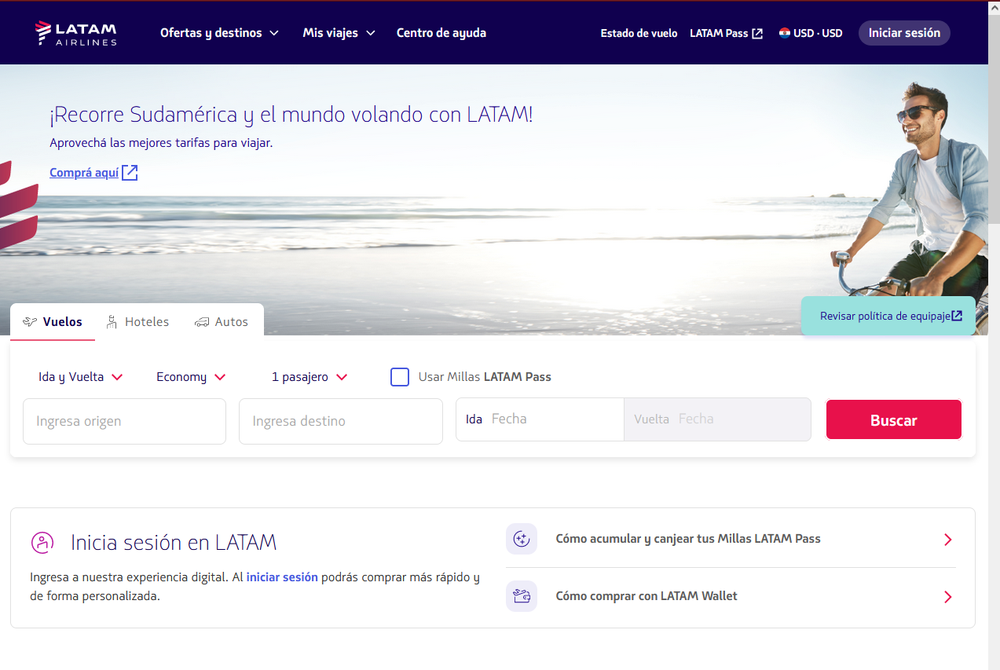

Ahora realizamos la requests. Pero como `son sitios dinámicos` y hacen uso de `Javascript`, en Jupyter notebook, python NO puede procesar este lenguaje y por eso hacemos uso de `Selenium`

```python
import requests
from bs4 import BeautifulSoup

url = 'https://www.latamairlines.com/py/es/ofertas-vuelos?origin=ASU&outbound=2023-08-01T12%3A00%3A00.000Z&destination=BCN&inbound=null&adt=1&chd=0&inf=0&trip=OW&cabin=Economy&redemption=false&sort=RECOMMENDED'

agent = {"User-Agent":"Mozilla/5.0"}
r = requests.get(url, headers=agent)

r.status_code

s = BeautifulSoup(r.text, 'lxml')

print(s.prettify())
```

Hasta acá accedemos al html pero no a la información que buscamos. Ya que necesitamos interpretar el Javascript. Para ello Implementamos `selenium` 

```python
from selenium import webdriver
```

y la librería para cargar el driver del navegador en el cache

```python
from webdriver_manager.chrome import ChromeDriverManager
```

Declaramos `driver` para ejecutar el driver de selenium, pero antes declaramos `options` y agregamos argumentos, en este caso el argumento para abrir el navegador en modo incógnito.

```python
options = webdriver.ChromeOptions()
options.add_argument('--incognito')
driver = webdriver.Chrome(ChromeDriverManager().install(), options=options)
```

Ejecutamos el `driver` y le pasamos la url de la pagina de Latam Airlines

```python
driver.get(url)
```

Para cerrar el navegador

```python
drive.close()
```

---

> 🛠 Tip:  Si haces el request y te sale un status code 403 quiere decir que fue rechazada (busca que es el codigo 403 de HTTP en google).  Esto sucede porque tu User-Agent es el que trae por defecto el modulo requests:


```python
#aqui para ver el codigo de estado
print(response.status_code)
# y aqui podras ver tu user-agent
print(response.request.headers)
```

Te dará como salida/Output (o muy similar):

```
403
{'User-Agent': 'python-requests/2.24.0', 'Accept-Encoding': 'gzip, deflate', 'Accept': '*/*', 'Connection': 'keep-alive'}

```

Solo tienes que modificar este Header usando el User-Agent que usa tu navegador, en mi caso es:

- Mozilla/5.0 (Windows NT 10.0; Win64; x64; rv:80.0) Gecko/20100101 Firefox/80.0

Puedes encontrarlo en El inspector de tus dev tools , en el apartado de red (inspector de elementos en el navegador).

Para que te funcione solo modificas el header asi:

```python
headers ={
    'User-Agent': 'Mozilla/5.0 (Windows NT 10.0; Win64; x64; rv:80.0) Gecko/20100101 Firefox/80.0'
}
response = requests.get(url, headers=headers)
print(response.status_code)
print(response.request.headers)
```

y te dará un Output así:

```
200
{'User-Agent': 'Mozilla/5.0 (Windows NT 10.0; Win64; x64; rv:80.0) Gecko/20100101 Firefox/80.0', 'Accept-Encoding': 'gzip, deflate', 'Accept': '*/*', 'Connection': 'keep-alive'}

```

Si quieres entender el porqué modificando el User-Agent si te da un request con código 200, busca para qué funciona.

En este blog te explica que es User-Agent: [https://developer.mozilla.org/en-US/docs/Web/HTTP/Headers/User-Agent](https://developer.mozilla.org/en-US/docs/Web/HTTP/Headers/User-Agent)

Aquí te explica como hacerlo: [https://www.kite.com/python/answers/how-to-make-a-request-with-a-user-agent-in-python](https://www.kite.com/python/answers/how-to-make-a-request-with-a-user-agent-in-python)

---

## Otros ejemplos Resueltos

#### Ejemplo 1

```python
from selenium import webdriver
from selenium.webdriver.chrome.service import Service

try:
    options = webdriver.ChromeOptions ()
    options.add_argument ('--incognito')
    
    ser = Service ("C:\\Users\\Auler\\Downloads\\chromedriver.exe")
    driver = webdriver.Chrome (service = ser, options = options)
    
    driver.get (sitio)
    
except Exception as e:
    print ('Error:')
    print (e)
    print ('\n')
```

#### Ejemplo 2

```python
from selenium import webdriver

options = webdriver.ChromeOptions()
options.add_argument('--incognito')
driver = webdriver.Chrome(executable_path='chromedriver.exe',options=options)

url = '...'
driver.get(url)```
```

# 13. **Selección de elementos** 
> #### [M3C2 Seleccion De Elementos](M3C2-seleccion-de-elementos.ipynb) puedes mirar este archivo como guía de esta sección.

Se recomienda a la hora de inspeccionar paginas web, tener el inspector de elemento en otra ventana separada, para que no afecte la navegación del mismo ya que las paginas web reconocen la resolución del navegador, y acomodan el contenido en función a ello .  

Para buscar y seleccionar uno o varios elementos de la web utilizaremos la función `find_element` o `find_elements` y armar el `xpath` (la ruta XML) que nos va a permitir identificar donde se encuentran cada uno de los elementos que necesitamos extraer a través de los tag y sus atributos.

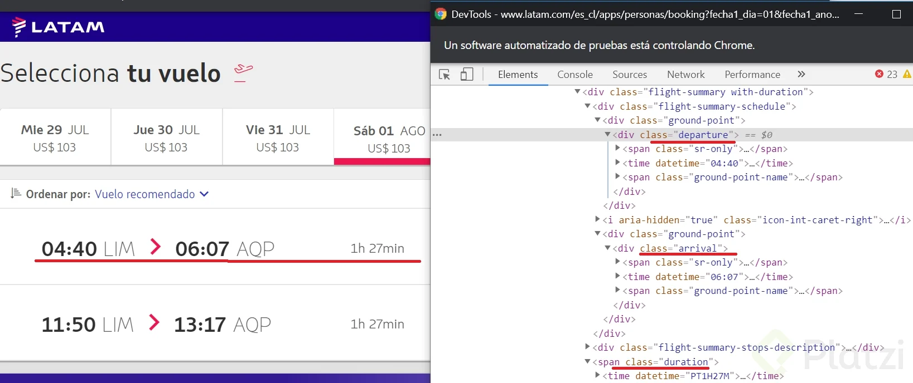

En la misma documentación Oficial de Selenium obtendremos todo lo necesario para aprender a utilizar la función de `find_element` para un elemento, o para múltiples elementos `find_elements`

[Locating Elements - Selenium Python Bindings 2 documentation](https://selenium-python.readthedocs.io/locating-elements.html)

#### Xpath cheatseeht

[Xpath cheatsheet](https://devhints.io/xpath)

#### introducción a Xpath

[XPath Tutorial](https://www.w3schools.com/xml/xpath_intro.asp)

Elementos importantes de Xpath:

```python
"//" busca en todos los hijos del elemento.
"/" busca sólo en hijos directos
"." indica que la búsqueda debe empezar en ese elemento y no en el origen del árbol
Los atributos de los tags se buscan entre [] y con @
```

## ¡Empecemos! ✈

Vamos a scrapear el sitio de Latam para averiguar datos de vuelos en función el origen y destino, fecha y cabina. 


Vamos a scrapear el sitio de Latam para averiguar datos de vuelos. La información que esperamos obtener de cada vuelo es:
- Horas de salida y llegada (duración)

```python
from selenium import webdriver
#importamos libreria para cargar el driver automaticamente
from webdriver_manager.firefox import GeckoDriverManager
# pagina del vuelo seleccionado ida, fecha, destino
url='https://www.latamairlines.com/py/es/ofertas-vuelos?origin=ASU&outbound=2023-08-01T12%3A00%3A00.000Z&destination=BCN&inbound=null&adt=1&chd=0&inf=0&trip=OW&cabin=Economy&redemption=false&sort=RECOMMENDED'
```

Paso 1: instanciar un **driver** del navegador (Necesitamos controladores web para diferentes navegadores web, en este ejemplo usamos para firefox. )

```python
options = webdriver.FirefoxOptions()
# Podemos agregarle opciones al driver para utilizar los distintos modos del navegador
options.add_argument('-private')
driver = webdriver.Firefox(executable_path=GeckoDriverManager().install(), options=options)
```

Paso 2: hacer que el navegador cargue la página web.

```python
driver.get(url)
```
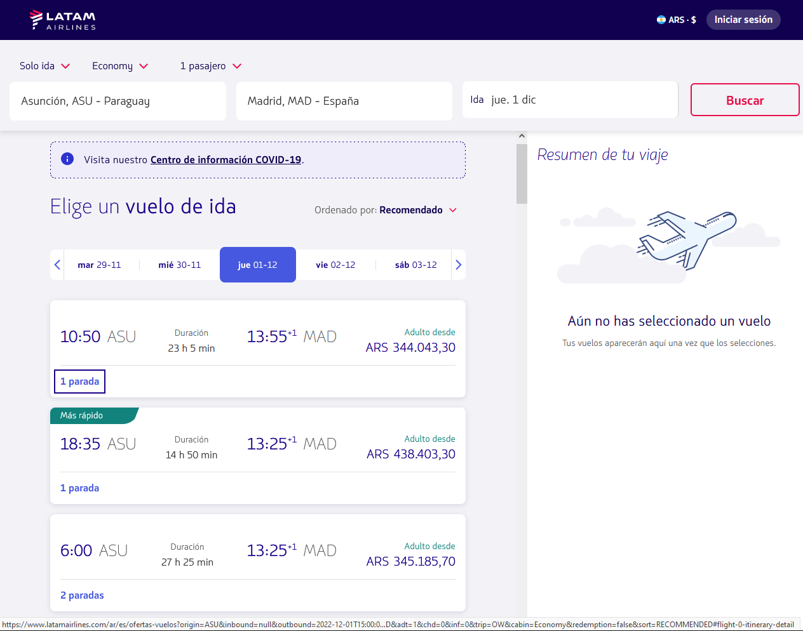

paso 3: Extraer información de la pagina. Carguemos la página y analicemos dónde se encuentra la información. Vemos que el bloque de vuelos se encuentra en una `ul` y que cada vuelo es un item de la lista, `li`.

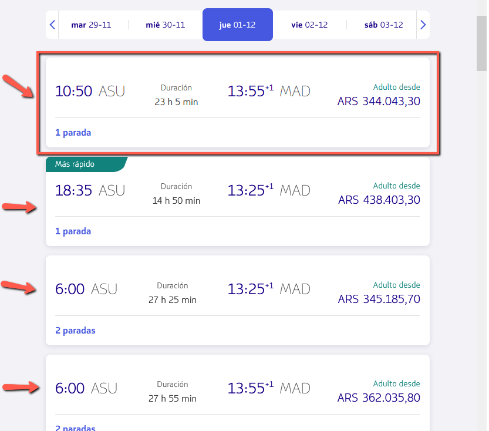

```python
#Usaremos el Xpath para obtener la lista de vuelos
vuelos = driver.find_elements('xpath','//ol/li')
print (vuelos)
```

```
# nos devuelve una lista de objetos selenium
[<selenium.webdriver.remote.webelement.WebElement (session="742d6ba4-917a-4f2b-b3ef-07645908e7c8", element="7ba3e480-987b-4ee7-951e-bdb77af4522b")>, <selenium.webdriver.remote.webelement.WebElement (session="742d6ba4-917a-4f2b-b3ef-07645908e7c8", element="77cd6bbf-6e4c-4b75-b52b-bd969bfe567a")>, <selenium.webdriver.remote.webelement.WebElement (session="742d6ba4-917a-4f2b-b3ef-07645908e7c8", element="003e2b53-f5f1-40a8-ae1e-d95d0148696b")>,
.
.
.]
```

Obtengamos la información de la hora de salida, llegada y duración del vuelo

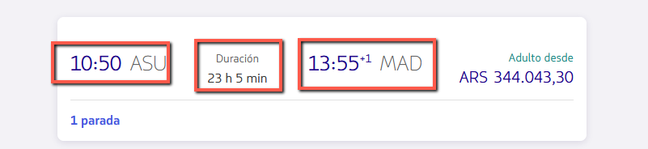

```python
#seleccionamos el primer vuelo
vuelo_1=vuelos[0]
#hora de salida
hora_salida=vuelo_1.find_element('xpath','//div[@class="sc-klSiHT hjzFuR flight-information"]/span[1]').text
print (hora_salida)
```

```
10:50
```

```python
#hora de llegada
hora_llegada=vuelo_1.find_element('xpath','.//div[3]/span[1]').text.replace('\n+1','')
print (hora_llegada)
```

```
13:55
```

```python
# Duracion del vuelo
duracion_vuelo= vuelo_1.find_element('xpath','.//div[2]/span[2]').text
print (duracion_vuelo)
```

```
23 h 5 min
```

Paso 4: cerrar el navegador

```python
driver.close()
```

### Otros ejercicios Resueltos


> 🛠 Reto: Obtener fecha de salida, llegada y duración de un vuelo utilizando selenium y Xpath.

Al leer y/o analizar estos ejercicios quizas te puedan ayudar a solucionar algun error en tu propio codigo o ver como otros usuarios resuelven de diferentes maneras el mismo problema.

#### Ejercicio 1

```python
from time import sleep
import requests as req
from bs4 import BeautifulSoup as bs
from selenium import webdriver as wd
from selenium.webdriver.firefox.service import Service
from selenium.webdriver.common.by import By

URL = "https://connect.avianca.com/flights/CLO/NAP/2022-05-02/2022-09-30/1-adults?res=CO&lang=ES&utm_source=avianca"
wp_url = "https://chat.whatsapp.com/GRYhS6aPodA8vZNwOtcnbb"
XPATH_FLIGHTS = "//*/li[@class='Itinerary']/text()"
FOX = Service(r"C:\Drivers\firefox\geckodriver.exe")

def run_firefox():
    r_url =req.get(URL)
    if r_url.status_code == 200:
        try:       
            opt = wd.FirefoxOptions()
            opt.add_argument("--incognito")
            firefox = wd.Firefox(service=FOX, options=opt)
            firefox.get(URL)
            sleep (5)
            flights = firefox.find_elements(By.XPATH, value="//*/li[@class='Itinerary']")
            print(flights)
        except Exception as erre:
            print("Error: " , "\n", erre)

if __name__ == "__main__":
    run_firefox()
```

#### Ejercicio 2

Tener en cuenta que tuve que sacarle al arrival time un text hijo que decía “+1”. Me costó un montón encontrar la solución a eso, ya que con selenium no es tan fácil. Finalmente lo logré. Además tener en cuenta que uso “contains” para no poner los “id” de las clases, que seguramente van cambiando con el tiempo:

```python
for flight in flights:
    departure_time = flight.find_element(By.XPATH, './/div[contains(@class, "flight-information")][1]/span').text
    flight_duration = flight.find_element(By.XPATH, './/div[contains(@class, "flight-duration")]/span[2]').text
    arrival_time_el = flight.find_element(By.XPATH, './/div[contains(@class, "flight-information")][2]/span')
    arrival_time_child = arrival_time_el.find_element(By.XPATH, './*').text
    arrival_time = arrival_time_el.text.replace(arrival_time_child, '')
    print(f'Departure time: {departure_time}. Flight duration: {flight_duration}. Arrival time: {arrival_time}')
```

#### Ejercicio 3

```python
hora_salida = vuelo.find_element(by=By.XPATH,value='.//div[@class="sc-bEeSwp fYVRJw flight-information"]/span[1]').text
aeropuerto_salida = vuelo.find_element(by=By.XPATH,value='//div[@class="sc-bEeSwp fYVRJw flight-information"]/span[2]').text
duracion_vuelo = vuelo.find_element(by=By.XPATH,value='//div[@class="sc-bEeSwp fYVRJw flight-duration"]/span[2]').text
```

#### Ejercicio 4

```python
from selenium import webdriver

# Cabe resaltar que la carpeta 'webdriver.exe' se encuentra dentro de la carpeta del proyecto local en Jupyter Notebook. 
options = webdriver.ChromeOptions()
options.add_argument('--incognito')
driver = webdriver.Chrome(executable_path='chromedriver.exe', options=options)
url = 'https://www.latamairlines.com/pe/es/ofertas-vuelos?origin=LIM&inbound=2022-09-26T17%3A00%3A00.000Z&outbound=2022-09-23T17%3A00%3A00.000Z&destination=BOG&adt=1&chd=0&inf=0&trip=RT&cabin=Economy&redemption=false&sort=RECOMMENDED'

# Conectarse con la página web, en mi caso, me conecté a la página web de Latam Airlines Perú.
driver.get(url)

# Extraer la información de los vuelos
from selenium.webdriver.common.by import By
vuelos = driver.find_elements(by=By.XPATH, value='//li[@class="sc-bJTOcE dnJSKm"]')
vuelo = vuelos[0]

# Dado que la información de la hora de salida y llegada se encuentra en diferentes 'div', pero tienen el mismo nombre de clase, por lo tanto, se debe utilizar el método '.find_elements()' para obtener mencionada información.

tiempo_salida_llegada = vuelo.find_elements(by=By.XPATH, value='.//div[@class="sc-cLxPOX jDdIbe flight-information"]/span[@class="sc-eTyWNx ilRvHO"]')

# Información de la hora de salida
tiempo_salida = tiempo_salida_llegada[0].text

# Información de la hora de llegada
tiempo_llegada = tiempo_salida_llegada[1].text

# Información de la duración del vuelo
duracion_vuelo = vuelo.find_element(by=By.XPATH, value='.//div[@class="sc-cLxPOX jDdIbe flight-duration"]/span[@class="sc-bsVVwV jAgyHF"]').text
```

#### Ejercicio 5

```python
from selenium import webdriver
from selenium.webdriver.chrome.service import Service
from selenium.webdriver.common.by import By

options = webdriver.ChromeOptions()
options.add_argument('--incognito')
s=Service('D:/drivers/chromedriver.exe')
driver = webdriver.Chrome(service=s, options=options)
url='https://www.latamairlines.com/co/es/ofertas-vuelos?origin=CLO&inbound=2022-09-24T17%3A00%3A00.000Z&outbound=2022-09-23T17%3A00%3A00.000Z&destination=BOG&adt=1&chd=0&inf=0&trip=RT&cabin=Economy&redemption=false&sort=RECOMMENDED'
driver.get(url)
vuelos = driver.find_element("xpath", '//div[@class="sc-ZUflv hlABHQ"]')
print(vuelos)>
```

#### Ejercicio 6

```python
# solucion vieja “DeprecationWarning” Ya no se usa find_elements_by_xpath. selenium actualizo
for flight in flights:
    flight_info = flight.find_elements_by_xpath('.//div[@class="sc-hAXbOi jocxib flight-information"]')
    departure = flight_info[0].find_element_by_xpath('.//span[@class="sc-cfWELz iIRsqM"]').text
    arrival = flight_info[1].find_element_by_xpath('.//span[@class="sc-cfWELz iIRsqM"]').text
    flight_time = flight.find_element_by_xpath('.//span[@class="sc-hCaUpS cTjSBD"]').text
    arrival = arrival.replace('\n', '')
    print(f'Salida:{departure} Llegada:{arrival} Duración:{flight_time}')
```

#### Ejercicio 7

```python
#Solucion vieja “DeprecationWarning” Ya no se usa find_elements_by_xpath. selenium actualizo
def obtener_info_vuelo(vuelo):
    hora_salida, hora_llegada = vuelo.find_elements_by_xpath('.//span[contains(@class, "dFRJGh")]')
    duracion = vuelo.find_element_by_xpath('.//span[contains(@class, "ZOLOQ")]')
    precio = vuelo.find_element_by_xpath('.//span[contains(@class, "displayAmount")]')
    return (hora_salida.text, hora_llegada.text, duracion.text, precio.get_attribute('aria-label'))
```

#### Ejercicio 8

```python
# Solucion vieja “DeprecationWarning” Ya no se usa find_elements_by_xpath. selenium actualizo
for vuelo in vuelos:
    schedule = vuelo.find_elements_by_xpath('.//div[@class="sc-izvnbC eqFECQ flight-information"]/span[@class="sc-gMcBNU gwIRwm"]')
    duration = vuelo.find_element_by_xpath('.//span[@class="sc-iLVFha jrpeUd"]')
    print(f'Salida a: {schedule[0].text}, llega a:  {schedule[1].text} y dura: {duration.text}')
```

## Importante

Si ha ustedes no les sale ningún viaje cuando usan el `Chrome` con Python (webdriver) pero mágicamente usando Chrome normal si salen viajes, es porque Latam ha detectado que estás usando `selenium` y no quiere dejarte ver sus viajes. ¿Cómo solucionar eso?

Añade este código después de `options` al momento de instanciar el driver:

```python
options.add_argument('--disable-blink-features=AutomationControlled')
options.add_experimental_option("excludeSwitches", ["enable-automation"])
options.add_experimental_option('useAutomationExtension', False)
```

## Paginas de interés

Como armar tus propios Xpath

[Xpath cheatsheet](https://devhints.io/xpath)

Introducción Selenium

[guru99 - Selenium Tutorial](https://www.guru99.com/selenium-tutorial.html)

[guru99 - What is Selenium? Introduction to Selenium Automation Testing](https://www.guru99.com/introduction-to-selenium.html)

[guru99 - Find Element and FindElements by XPath in Selenium WebDriver](https://www.guru99.com/find-element-selenium.html)

# 14. **Interactuando con los elementos** 

> #### [M3C3 Interactuando con los elementos](M3C3-interactuando-con-los-elementos.ipynb) puedes mirar este archivo como guía de esta sección.

En esta sección veremos cómo obtener la información de las escalas de cada vuelo. Vayamos a la página web y veamos dónde se encuentran esos datos.

> 🛠 Para desplegar esa información, debemos clickear en un `botón`.

## ¡Empecemos!

Vamos a scrapear el sitio de Latam para averiguar datos de vuelos. La información que esperamos obtener de cada vuelo es:

- Horas de salida y llegada (duración)
- [ahora le sumamos] → Escalas del vuelo

```python
from selenium import webdriver
#importampos libreria para cargar el driver automaticamente
from webdriver_manager.firefox import GeckoDriverManager

url='https://www.latamairlines.com/py/es/ofertas-vuelos?origin=ASU&outbound=2023-08-01T12%3A00%3A00.000Z&destination=BCN&inbound=null&adt=1&chd=0&inf=0&trip=OW&cabin=Economy&redemption=false&sort=RECOMMENDED'
```

Necesitamos controladores web para diferentes navegadores web. 

Paso 1: instanciar un **driver** del navegador

```python
options = webdriver.FirefoxOptions()
# Podemos agregarle opciones al driver para utilizar los distintos modos del navegador
options.add_argument('-private')
driver = webdriver.Firefox(executable_path=GeckoDriverManager().install(), options=options)
```

Paso 2: hacer que el navegador cargue la página web.

```python
driver.get(url)
```

paso 3: Extraer información de la pagina. Carguemos la página y analicemos dónde se encuentra la información. Vemos que el bloque de vuelos se encuentra en una `ul` y que cada vuelo es un item de la lista, `li`.


```python
#Usaremos el Xpath para obtener la lista de vuelos
vuelos = driver.find_elements('xpath','//ol/li')
print (vuelos)
```

```
[<selenium.webdriver.remote.webelement.WebElement (session="742d6ba4-917a-4f2b-b3ef-07645908e7c8", element="7ba3e480-987b-4ee7-951e-bdb77af4522b")>, <selenium.webdriver.remote.webelement.WebElement (session="742d6ba4-917a-4f2b-b3ef-07645908e7c8", element="77cd6bbf-6e4c-4b75-b52b-bd969bfe567a")>, <selenium.webdriver.remote.webelement.WebElement (session="742d6ba4-917a-4f2b-b3ef-07645908e7c8", element="003e2b53-f5f1-40a8-ae1e-d95d0148696b")>,
.
.
.]
```

Obtengamos la información de la hora de salida, llegada y duración del vuelo


```python
#seleccionamos el primer vuelo
vuelo_1=vuelos[0]
#hora de salida
hora_salida=vuelo_1.find_element('xpath','//div[@class="sc-klSiHT hjzFuR flight-information"]/span[1]').text
print (hora_salida)
```

```
10:50
```

```python
#hora de llegada
hora_llegada=vuelo_1.find_element('xpath','.//div[3]/span[1]').text.replace('\n+1','')
print (hora_llegada)
```

```
13:55
```

```python
# Duracion del vuelo
duracion_vuelo= vuelo_1.find_element('xpath','.//div[2]/span[2]').text
print (duracion_vuelo)
```

```
23 h 5 min
```

Algunos datos a los cuales queremos acceder se encuentran dentro de otro link o al darle clic en un enlace, ejemplo un modal dentro de la pagina. 

Para esto debemos usar `selenium`. Ahora veremos cómo obtener la información de las escalas de cada vuelo, para desplegar esa información de las escalas, debemos clickear un `link` para que se habilite el modal que contiene la información. Seleccionemos:

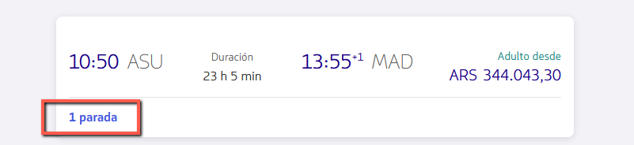

```python
#creamos un objeto, con el link que despliega un modal con la informacion de las escalas
link_escalas = vuelo_1.find_element('xpath','//div[@class="sc-iKiVwC fbWfQZ"]//a')
print (link_escalas)
```

```
<selenium.webdriver.remote.webelement.WebElement (session="30b5a596-d633-47be-b92e-51501d732334", element="c0f163fc-4bed-4785-bb6e-d8e0f7649ce0")>
```

 Para dar clic en el tag a , ya identificado solo ejecutamos el método .click()

```python
# ahora veremos como se abre el modal
link_escalas.click()
```

Automáticamente nos abre el menú de itinerario de vuelo . Y vemos cómo se despliega la información que estamos buscando. ****Notar que cambió el html de la página al hacer click sobre ese botón****

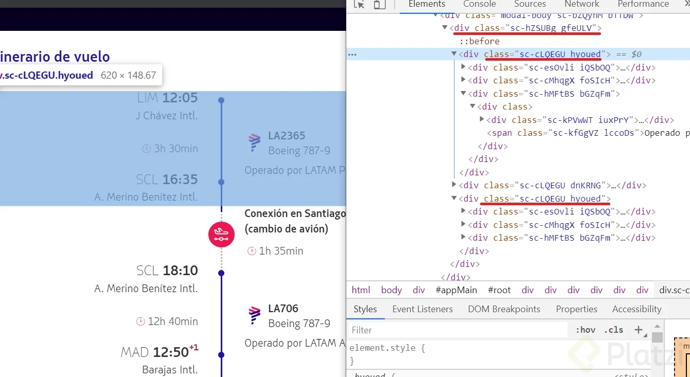

(imagen de referencia) Ya abierto el modal. Realizamos la ruta para identificar la cantidad de escalas del vuelo. Esta vez utilizamos ‘find_elements’ en plural porque traeremos varios elementos. Y cuando imprimimos paradas “section” nos traerá los tramos del vuelo. 

Para saber la cantidad de escala de nuestro vuelo, debemos seleccionar los segmentos “`section`” que contiene el vuelo, actualmente vemos que las paradas están contenidas en elementos `sections`, así que debemos contabilizar las paradas

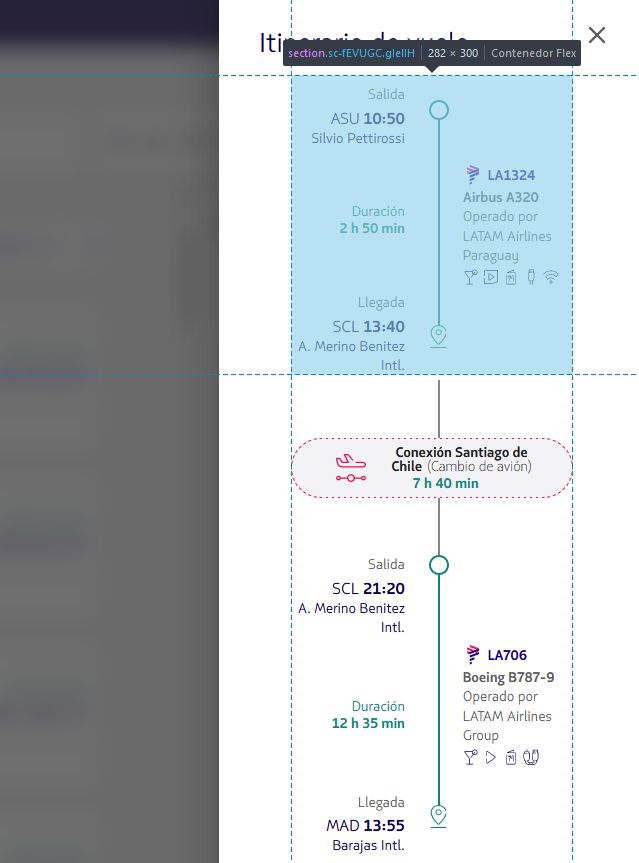

```python
paradas= link_escalas.find_elements('xpath','//section[@class="sc-fGSyRc fCuylQ"]')
print(paradas)
```

```
[<selenium.webdriver.remote.webelement.WebElement (session="30b5a596-d633-47be-b92e-51501d732334", element="7925cac6-dcd6-4095-b814-cb90c2f0b262")>, <selenium.webdriver.remote.webelement.WebElement (session="30b5a596-d633-47be-b92e-51501d732334", element="0c5a1db1-7c65-40db-b24e-e6c591391a78")>]
```

Para la cantidad de escalas podemos contar los tramos “section” y restar 1 y obtendremos la cantidad de escalas para el vuelo scrapeado.

```python
escalas=len(paradas)-1
print(escalas)
```

```
1
```

Paso 4: cerrar el navegador

```python
driver.close()
```

### Resumen
Ahora pudimos obtener la cantidad de escalas interactuando con el navegador. Vemos la importancia de Selenium para poder scrapear sitios en los que la informacion no esta en el HTML planto, inicial que viene al hacer la requests al sitio directamente, si no que aparece a medida que vamos interactuando con los elementos del sitio. 

### Otros ejercicios Resueltos

> 🛠 Reto: del reto anterior agregar las escalas de un vuelo
(Si están usando Selenium 4, es posible que “find_element_by_xpath” muestre un “deprecated warning” utilizar find_element())

#### Ejemplo 1

Si están usando Selenium 4, es posible que “find_element_by_xpath” muestre un “deprecated warning”. De esta forma pueden evitar ese warning:

```python
from selenium.webdriver.common.by import By
vuelos = driver.find_element(by=By.XPATH, value='su_xpath')
```

#### Ejemplo 2

```python

#deprecated warning
vuelos = driver.find_elements_by_xpath('//li[@class="sc-eAudoH rtrCi"]')
vuelo = vuelos[0].find_element_by_xpath('.//div[@class="sc-izvnbC eqFECQ flight-information"]/span[1][@class="sc-gMcBNU gwIRwm"]')
vuelo.text
# Close Chrome window
driver.close()
```

#### Ejemplo 3

Función para obtener la info de todos los vuelos seleccionados

```python
def itinerario_vuelo(vuelo):
    escalas = []

    # Se da click sobre el enlace de escalas
    boton_escalas = vuelo.find_element_by_xpath('.//div[contains(@class,"eMunVf")]/a')
    boton_escalas.click()

    time.sleep(0.5)

    secciones = vuelo.find_elements_by_xpath('//section[@data-test="section-info-leg"]')
    for seccion in secciones:
        escalas.append(seccion.find_element_by_xpath('//div[contains(@class, "airline-wrapper")]').text)

    time.sleep(0.5)

    # Se cierra la ventana emergente
    boton_escalas_close = vuelo.find_element_by_xpath('//div[@role="dialog"]/button')
    boton_escalas_close.click()

    return escalas
```

# 15. **Scrapeando escalas y tarifas**

> #### [M3C4 Scrapeando escalas y tarifas](M3C4-screapeando-escalas-y-tarifas.ipynb) puedes mirar este archivo como guía de esta sección.

En esta sección veremos cómo obtener la información de las escalas de cada vuelo.

De cada segmento del modal que nos proporciona un vuelo necesitamos:
- origen
- hora de salida
- destino
- hora de llegada
- duración del vuelo
- numero de vuelo
- modelo de avión
- duración de la escala

A simple vista en el código de la pagina no esta al momento de cargar los datos de donde queremos viajar y cuando por lo que debemos hacer clic en un link de la parada del vuelo para que nos aparezcan todas estos datos y poder scrapear.

## ¡Empecemos! ✈

```python
from selenium import webdriver
#importampos libreria para cargar el driver automaticamente
from webdriver_manager.firefox import GeckoDriverManager

url='https://www.latamairlines.com/py/es/ofertas-vuelos?origin=ASU&outbound=2023-08-01T12%3A00%3A00.000Z&destination=BCN&inbound=null&adt=1&chd=0&inf=0&trip=OW&cabin=Economy&redemption=false&sort=RECOMMENDED'
```

Necesitamos controladores web para diferentes navegadores web. 

Paso 1: instanciar un **driver** del navegador

```python
options = webdriver.FirefoxOptions()
# Podemos agregarle opciones al driver para utilizar los distintos modos del navegador
options.add_argument('-private')
driver = webdriver.Firefox(executable_path=GeckoDriverManager().install(), options=options)
```

Paso 2: hacer que el navegador cargue la página web.

```python
driver.get(url)
```

paso 3: Extraer información de la pagina. Carguemos la página y analicemos dónde se encuentra la información. Vemos que el bloque de vuelos se encuentra en una `ul` y que cada vuelo es un item de la lista, `li`.


```python
#Usaremos el Xpath para obtener la lista de vuelos
vuelos = driver.find_elements('xpath','//ol/li')
print (vuelos)
```

```
[<selenium.webdriver.remote.webelement.WebElement (session="742d6ba4-917a-4f2b-b3ef-07645908e7c8", element="7ba3e480-987b-4ee7-951e-bdb77af4522b")>, <selenium.webdriver.remote.webelement.WebElement (session="742d6ba4-917a-4f2b-b3ef-07645908e7c8", element="77cd6bbf-6e4c-4b75-b52b-bd969bfe567a")>, <selenium.webdriver.remote.webelement.WebElement (session="742d6ba4-917a-4f2b-b3ef-07645908e7c8", element="003e2b53-f5f1-40a8-ae1e-d95d0148696b")>,
.
.
.]
```

Obtengamos la información de la hora de salida, llegada y duración del vuelo


```python
#seleccionamos el primer vuelo
vuelo_1=vuelos[0]
#hora de salida
hora_salida=vuelo_1.find_element('xpath','//div[@class="sc-klSiHT hjzFuR flight-information"]/span[1]').text
print (hora_salida)
```

```
10:50
```

```python
#hora de llegada
hora_llegada=vuelo_1.find_element('xpath','.//div[3]/span[1]').text.replace('\n+1','')
print (hora_llegada)
```

```
13:55
```

```python
# Duracion del vuelo
duracion_vuelo= vuelo_1.find_element('xpath','.//div[2]/span[2]').text
print (duracion_vuelo)
```

```
23 h 5 min
```

Algunos datos a los cuales queremos acceder se encuentran dentro de otro link o al darle clic en un enlace, ejemplo un modal dentro de la pagina. 

Para esto debemos usar `selenium`. Ahora veremos cómo obtener la información de las escalas de cada vuelo, para desplegar esa información de las escalas, debemos clickear un `link` para que se habilite el modal que contiene la información. Seleccionemos:


```python
#creamos un objeto, con el link que despliega un modal con la informacion de las escalas
link_escalas = vuelo_1.find_element('xpath','//div[@class="sc-iKiVwC fbWfQZ"]//a')
print (link_escalas)
```

```
<selenium.webdriver.remote.webelement.WebElement (session="30b5a596-d633-47be-b92e-51501d732334", element="c0f163fc-4bed-4785-bb6e-d8e0f7649ce0")>
```

 Para dar clic en el tag a , ya identificado solo ejecutamos el método .click()

```python
# ahora veremos como se abre el modal
link_escalas.click()
```

Automáticamente nos abre el menú de itinerario de vuelo . Y vemos cómo se despliega la información que estamos buscando. ****Notar que cambió el html de la página al hacer click sobre ese botón****


(imagen de referencia) Ya abierto el modal. Realizamos la ruta para identificar la cantidad de escalas del vuelo. Esta vez utilizamos ‘find_elements’ en plural porque traeremos varios elementos. Y cuando imprimimos paradas “section” nos traerá los tramos del vuelo. 

Para saber la cantidad de escala de nuestro vuelo, debemos seleccionar los segmentos “`section`” que contiene el vuelo, actualmente vemos que las paradas están contenidas en elementos `sections`, así que debemos contabilizar las paradas


```python
segmentos= link_escalas.find_elements('xpath','//section[@class="sc-fGSyRc fCuylQ"]')
# print(segmentos, len(segmentos))
for i in segmentos:
    print (i)
```

```
[<selenium.webdriver.remote.webelement.WebElement (session="30b5a596-d633-47be-b92e-51501d732334", element="7925cac6-dcd6-4095-b814-cb90c2f0b262")>, <selenium.webdriver.remote.webelement.WebElement (session="30b5a596-d633-47be-b92e-51501d732334", element="0c5a1db1-7c65-40db-b24e-e6c591391a78")>]
```

Para la cantidad de escalas podemos contar los tramos “section” y restar 1 y obtendremos la cantidad de escalas para el vuelo scrapeado.

```python
escalas=len(paradas)-1
print(escalas)
```

```
1
```
--- hasta aqui es lo mismo que la seccion anterior ---

Ahora buscaremos obtener:

- destino
- hora de llegada
- duración del vuelo
- duración de la escala. Tip: el último segmento no tendrá esta información
- número del vuelo
- modelo del avión

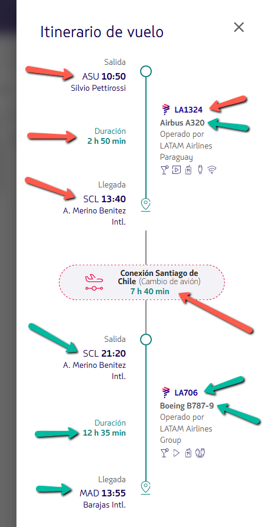

```python
#Recorremos los segmentos del modal que nos proporciona un vuelo
for i in segmentos:
    segmento = i
    salida=segmento.find_element('xpath','.//div[@class="sc-jFpLkX jAGOAr"]/div[@class="sc-fguZLD kepXur"]/div[@class="iataCode"]/span[1]').text
    hora_salida=segmento.find_element('xpath','.//div[@class="sc-jFpLkX jAGOAr"]/div[@class="sc-fguZLD kepXur"]/div[@class="iataCode"]/span[2]').text
    duracion_segmento=segmento.find_element('xpath','.//div[@class="sc-jFpLkX jAGOAr"]//div[@class="sc-ewMkZo hQNSAX"]/span[2]').text
    destino_segmento=segmento.find_element('xpath','.//div[@class="sc-jFpLkX jAGOAr"]//div[@class="sc-eCXBzT goeYBu"]/div[@class="iataCode"]/span[1]').text
    numero_vuelo_segmento=segmento.find_element('xpath','.//div[@class="sc-dzQEYZ dslPlz airline-wrapper"]').text
    modelo_avion_segmento=segmento.find_element('xpath','.//div[@class="sc-sVRsr eXYUTi"]//span[@class="airplane-code"]').text
    
    print(f'Salida:{salida}\nHora Salida:{hora_salida}\nDuracion: {duracion_segmento}\nLlegada:{destino_segmento}\nNumero de vuelo:{numero_vuelo_segmento}\nModelo Avion:{modelo_avion_segmento}\n')

```
nos dara como resultado algo similar a esto: 
```
Salida:ASU
Hora Salida:10:50
Duracion: 2 h 50 min
Llegada:SCL
Numero de vuelo:LA1324
Modelo Avion:Airbus A320

Salida:SCL
Hora Salida:21:20
Duracion: 12 h 35 min
Llegada:MAD
Numero de vuelo:LA706
Modelo Avion:Boeing B787-9

```

```python
#obtenemos la duracion del vuelo
escalas_vuelo=link_escalas.find_elements('xpath','//section[@class="sc-kiXyGy sc-eZXMBi dKgCnQ connectionInfo"]')
for i in escalas_vuelo:
    escala=i
    escala_vuelo=escala.find_element('xpath','.//div[@class="sc-ekQYnd cByWfv"]//span[@class="connection-text"]').text
    duracion_escala_vuelo=escala.find_element('xpath','.//div[@class="sc-ekQYnd cByWfv"]//span[@class="time"]').text
    print(f'Escala:{escala_vuelo}\nDuracion Escala:{duracion_escala_vuelo}')
    # print (i)
```

```
Escala:Conexión Lima
Duracion Escala:10 h 20 min
Escala:Conexión Madrid
Duracion Escala:1 h 25 min
```

Una vez que hayamos obtenido toda la información, debemos cerrar el modal/pop-up.

```python
driver.find_element('xpath','//*[@id="itinerary-modal-0-dialog-close"]').click()
```

Por último debemos obtener la información de las tarifas. Para eso, debemos clickear sobre el vuelo (sobre cualquier parte)

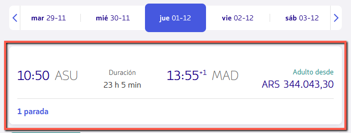

```python
vuelo_1.click()
```

La información de los precios para cada tarifa está contenida en una tablas (ol). Tenemos los precios y categorías de cada una de las tarifas

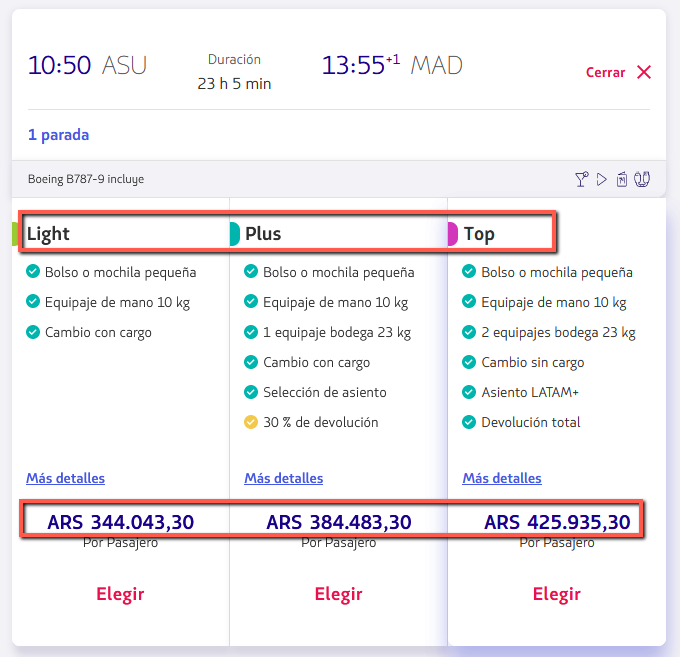

```python
tarifas= vuelo_1.find_elements('xpath','.//ol[@class="sc-buGlAa jhwXGF"]/li[@class="sc-kecUPG dPNrrD"]')
print (tarifas)
```

```
[<selenium.webdriver.remote.webelement.WebElement (session="37a80af2-e0a0-4b71-8c4a-435a3dcf3c7d", element="a5816e6d-561b-4548-9d44-fc3a18c8d2f4")>, <selenium.webdriver.remote.webelement.WebElement (session="37a80af2-e0a0-4b71-8c4a-435a3dcf3c7d", element="0b19a154-b134-494f-ae6e-90df1046ca7f")>, <selenium.webdriver.remote.webelement.WebElement (session="37a80af2-e0a0-4b71-8c4a-435a3dcf3c7d", element="6917ddfc-b544-4112-b241-4c70a68dfd72")>]
```

Obtenemos los precios, donde creamos una lista, de precios con la clave:valor por cada categoría de precio

```python
# creamos una lista donde almacenaremos los precios de cada tarifa
precios=[]
for tarifa in tarifas:
    #buscamos en cada pocision de la tarifa los siquientes elementos
    nombre = tarifa.find_element('xpath','.//div[@class="sc-gGsJSs dhstcp"]/div[1]/span[@class="sc-fhiYOA iwcbaW"]').text
    moneda= tarifa.find_element('xpath','.//div[@class="sc-gGsJSs dhstcp"]/div[3]//span[contains(@class,"currency")]').text
    valor= tarifa.find_element('xpath','.//div[@class="sc-gGsJSs dhstcp"]/div[3]//span[@class="sc-ckYZGd grNCid"]').text
    #guardo los valores que obtengo en un diccionario
    dict_tarifa={nombre:{'moneda':moneda,'valor':valor}}
    #guradamos nuestro diccionario con los datos de tarifa a nuestra lia de precio
    precios.append(dict_tarifa)
    print(dict_tarifa)
    # print(f'Nombre Tarfia:{nombre}\nMoneda:{moneda}\nPrecio:{valor}\n\n')
```

```
{'light': {'moneda': 'ARS', 'valor': '344.043,30'}}
{'plus': {'moneda': 'ARS', 'valor': '384.483,30'}}
{'top': {'moneda': 'ARS', 'valor': '425.935,30'}}
```

Por el momento es todo. Cerramos el navegador (driver)

Paso 4: cerrar el navegador

```python
driver.close()
```

---

> 🛠 Una forma fácil de visualizar qué es lo que estamos extrayendo en el mismo notebook es:

```python
#importar la libreria
from IPython.display import HTML, display_html

display_html(HTML(segment.get_attribute('innerHTML')))

```

donde segment es un objeto de clase`selenium.webdriver`, dependera de que clase de driver utilicen.

El output no es el más estético de todos pero nos puede servir para entender qué estamos extrayendo.


### Otros ejercicios resuelto por otros Alumnos del curso

> 🛠 Reto: obtener El destino de cada escala, la hora de llegada de cada escala, la duración de cada vuelo, la duración de la escala, el numero de vuelo, y el modelo del avión.

>💡 (Si están usando Selenium 4, es posible que “find_element_by_xpath” muestre un “deprecated warning” utilizar find_element())

#### Ejemplo1

Va mi aporte válido para mayo 2022. Obtengo 3 tablas (vuelos, tarifas y segmentos) que luego puedo vincular en una base de datos con el id del vuelo, para hacer el análisis:

```python
flights_data = []
tariffs_data = []
segments_data = []

flights = driver.find_elements(By.XPATH, '//ol[@aria-label="Vuelos disponibles."]//div[contains(@id, "WrapperCardFlight")]')
for idf, flight in enumerate(flights):
    
    # Get flights data
    print(f'Getting flight {idf} data...')
    departure_time = flight.find_element(By.XPATH, './/div[contains(@class, "flight-information")][1]/span').text
    flight_duration = flight.find_element(By.XPATH, './/div[contains(@class, "flight-duration")]/span[2]').text
    arrival_time_el = flight.find_element(By.XPATH, './/div[contains(@class, "flight-information")][2]/span')
    arrival_time_child = arrival_time_el.find_element(By.XPATH, './*').text
    arrival_time = arrival_time_el.text.replace(arrival_time_child, '').strip()

    flights_data.append({
        'flight_id': idf,
        'departure_time' : departure_time,
        'flight_duration' : flight_duration,
        'arrival_time' : arrival_time
        })
    print(f'Flight {idf} data appended\n')

    # Get tariffs:
    print(f'Flight {idf} - Getting tariffs...')
    flight.click()
    tariffs = flight.find_elements(By.XPATH, '//ol[@aria-label="Tarifas disponibles."]/li[contains(@id, "WrapperBundleCardbundle-detail")]')
    for idt, tariff in enumerate(tariffs):
        tari
        ff_name = tariff.find_elements(By.XPATH, './/div[@aria-hidden="true"]//span')[0].text.replace('\n', '')
        tariff_price = tariff.find_element(By.XPATH, './/span[contains(@class, "displayAmount")]').text
        tariffs_data.append({
            'flight_id': idf,
            'tariff_id': idt,
            'tariff_name': tariff_name,
            'tariff_price' : tariff_price
        })
    print(f'Flight {idf} - Tariff {tariff_name} data appended\n')
    
    # Hide tariffs
    tariffs_close_btn = flight.find_element(By.XPATH, './/button[contains(@class, "MuiButtonBase-root")]')
    tariffs_close_btn.click()

    # Get segments:
    print(f'Getting segments...')
    segments_open_btn = flight.find_element(By.XPATH, './/a[contains(@id, "itinerary-modal")]')
    segments_open_btn.click()
    sleep(2)
    segments = flight.find_elements(By.XPATH, '//section[contains(@data-test, "section-info-leg")]')
    for ids, segment in enumerate(segments):
        print(f'Flight {idf} - Getting segment {ids} data...')
        flight_number = segment.find_element(By.XPATH, './/div[contains(@class, "airline-wrapper")]').text.replace('*', '')
        airplane_code = segment.find_element(By.XPATH, './/span[@class="airplane-code"]').text
        origin_airport = segment.find_element(By.XPATH, './/span[contains(@class, "pathInfo-origin")]/following-sibling::div[contains(@class, "iataCode")]/span[not(@class="time")]').text
        origin_time = segment.find_element(By.XPATH, './/span[contains(@class, "pathInfo-origin")]/following-sibling::div[contains(@class, "iataCode")]/span[@class="time"]').text
        segment_duration = segment.find_element(By.XPATH, './/span[contains(@class, "pathInfo-duration")]/following-sibling::span[@class="time"]').text
        destination_airport = segment.find_element(By.XPATH, './/span[contains(@class, "pathInfo-destination")]/following-sibling::div[contains(@class, "iataCode")]/span[not(@class="time")]').text
        destination_time = segment.find_element(By.XPATH, './/span[contains(@class, "pathInfo-destination")]/following-sibling::div[contains(@class, "iataCode")]/span[@class="time"]').text
        connections = segment.find_elements(By.XPATH, './following-sibling::section[contains(@data-test, "section-info-connection")]')
        if connections:
            connection_city = connections[0].find_element(By.XPATH, './/span[@class="connection-text"]').text.replace('Conexión ', '')
            connection_duration = connections[0].find_element(By.XPATH, './/span[@class="time"]').text
        else:
            connection_city = ''
            connection_duration = ''

        segments_data.append({
            'flight_id': idf,
            'segment_id' : ids,
            'flight_number' : flight_number,
            'airplane_code' : airplane_code,
            'origin_airport' : origin_airport,
            'origin_time' : origin_time,
            'segment_duration' : segment_duration,
            'destination_airport' : destination_airport,
            'destination_time' : destination_time,
            'connection_city' : connection_city,
            'connection_duration' : connection_duration
        })
        print(f'Flight {idf} - Segment {ids} data appended\n')

    # Hide segments
    segments_close_btn = driver.find_element(By.XPATH, '//div[contains(@class, "MuiDialog-container")]//button[contains(@class, "MuiButtonBase-root")]')
    segments_close_btn.click()
```

```python
import pandas as pd

df_flights = pd.json_normalize(flights_data)
df_flights.to_csv('flights.csv', sep=';')

df_tariffs = pd.json_normalize(tariffs_data)
df_tariffs.to_csv('tariffs.csv', sep=';')

df_segments = pd.json_normalize(segments_data)
df_segments.to_csv('segments.csv', sep=';')
```

#### Ejemplo2

Solución del reto a Julio de 2021

```python
# obtener todas las escalas
stops = driver.find_elements_by_xpath('//section[@class="sc-jWxkHr fPpyxb"]')

# iterar sobre las escalas y extraer la información
for s, stop in enumerate(stops):
    dep = stop.find_element_by_xpath('.//div[@class="sc-geAPOV biWURZ"]')
    dep_city = dep.find_element_by_xpath('.//div[@class="iataCode"]//span').text
    dep_time = dep.find_element_by_xpath('.//div[@class="iataCode"]//span[@class="time"]').text
    dep_aport =  dep.find_element_by_xpath('.//span[@class="ariport-name"]').text
    
    flight_time = stop.find_element_by_xpath('.//div[@class="sc-bJTOcE iJlaOT"]//span[@class="time"]').text
    airplane = stop.find_element_by_xpath('.//span[@class="airplane-code"]').text
    
    arr = stop.find_element_by_xpath('.//div[@class="sc-PLyBE iVAtbp"]')
    arr_city = arr.find_element_by_xpath('.//div[@class="iataCode"]//span').text
    arr_time = arr.find_element_by_xpath('.//div[@class="iataCode"]//span[@class="time"]').text
    arr_aport =  arr.find_element_by_xpath('.//span[@class="ariport-name"]').text
```

imprimiendo se obtiene algo como:

Stop 1

Airplane: Airbus A321

Departure: BOG(El Dorado Intl.) 13:00

Flight time: 6 h 10 min

Arrival: GRU(Guarulhos Intl.) 21:10

Stop 2

Airplane: Boeing B787-9

Departure: GRU(Guarulhos Intl.) 23:10

Flight time: 9 h 45 min

Arrival: MAD(Barajas Intl.) 13:55

Para las tarifas fue mucho más sencillo con el código que tiene ahora el sitio

```python
# click en el vuelo
flights[0].find_element_by_xpath('.//div[@class="sc-hizQCF mUhbx"]').click()

# definir e iterar por las tarifas
fares = driver.find_elements_by_xpath('//div[@class="sc-dTsoBL izUUnZ"]')
for f in fares:
    print(
        f.find_element_by_xpath('.//span[@class="sc-ileJJU bxvQhO displayAmount"]').text
    )
```

$334.468

$369.953

$426.728

$1.484.474

#### Ejemplo3

```python
# Trayecto 1
segmento = segmentos[0]

horarios = segmento.find_elements_by_xpath('.//div[@class="sc-bwCtUz iybVbT"]/time')
horario_salida = horarios[0].text
horario_llegada = horarios[1].text

lugares = segmento.find_elements_by_xpath('.//div[@class="sc-bwCtUz iybVbT"]/abbr')
lugar_salida = lugares[0].text
lugar_llegada = lugares[-1].text

informacion_1 = segmento.find_element_by_xpath('.//div[@class="sc-bwCtUz iybVbT"]/span').text

duracion_vuelo_1 = segmento.find_element_by_xpath('.//span[@class="sc-esjQYD dMquDU"]/time').get_attribute('datetime')

n_vuelo_1 = segmento.find_element_by_xpath('.//div[@class="airline-flight-details"]//b').text

n_avion = segmento.find_element_by_xpath('.//div[@class="airline-flight-details"]/span[@class="sc-gzOgki uTyOl"]').text

tiempos = segmento.find_elements_by_xpath('.//span[@class="sc-esjQYD dMquDU"]//time')
tiempo_primer_trayecto = tiempos[0].text
tiempo_en_aerolinea = tiempos[-1].text
```

```python
# Trayecto 2
segmento = segmentos[-1]

horarios = segmento.find_elements_by_xpath('.//div[@class="sc-bwCtUz iybVbT"]/time')
horario_salida = horarios[0].text
horario_llegada = horarios[1].text

lugares = segmento.find_elements_by_xpath('.//div[@class="sc-bwCtUz iybVbT"]/abbr')
lugar_llegada = lugares[-1].text

informacion_1 = segmento.find_element_by_xpath('.//div[@class="sc-bwCtUz iybVbT"]/span').text

duracion_vuelo_1 = segmento.find_element_by_xpath('.//span[@class="sc-esjQYD dMquDU"]/time').get_attribute('datetime')

n_vuelo_1 = segmento.find_element_by_xpath('.//div[@class="airline-flight-details"]//b').text

n_avion = segmento.find_element_by_xpath('.//div[@class="airline-flight-details"]/span[@class="sc-gzOgki uTyOl"]').text

tiempos = segmento.find_elements_by_xpath('.//span[@class="sc-esjQYD dMquDU"]//time')
tiempo_segundo_trayecto = tiempos[-1].text
```

```python
# cerrar la ventana de escalas
boton_cerrar_escalas = driver.find_element_by_xpath('//div[@class="modal-header sc-dnqmqq cGfTsx"]/button')
boton_cerrar_escalas.click()

# abrir la ventana de precios economy
boton_precios = vuelo.find_element_by_xpath('.//div[@class="flight-container"]/button')
boton_precios.click()
```

```python
# Datos de precios economy
tarifas_economy = vuelo.find_elements_by_xpath('.//div[@class="fares-table-wrapper"]//tfoot//span[@class="price"]/span[@class="value"]')
tarifa_1 = precios_economy[0].text
tarifa_2 = precios_economy[1].text
tarifa_3 = precios_economy[-1].text

# abrir ventana de precios premium business
boton_precios = vuelo.find_element_by_xpath('.//div[@class="ReactCollapse--content"]//li[@id="J"]/button')
boton_precios.click()

# Datos de precios premium business
tarifas_premium = vuelo.find_elements_by_xpath('.//div[@class="fares-table-wrapper"]//tfoot//span[@class="price"]/span[@class="value"]')
tarifa_1 = precios_economy[0].text
tarifa_2 = precios_economy[1].text
```

#### Ejemplo4 (con otra web de vuelos)

Tuve que importar time porque en aeroméxico tarda un momento en cerrar y abrir el menú y si no esperas se rompe.

```python
from selenium import webdriver
import time

driver = webdriver.Firefox()
URL = 'https://aeromexico.com/es-mx/reserva/opciones?itinerary=MEX_JFK_2020-06-26&leg=1&travelers=A1_C0_I0_PH0_PC0'

driver.get(URL)
flights = driver.find_elements_by_xpath('//table[@class="FlightOptionsGrid-table"]/tbody/tr')

for i, flight in enumerate(flights):
    departure_and_arrival = flight.find_elements_by_xpath('.//div[@class="FlightOptionsTimeline-time"]')
    departure = departure_and_arrival[0].text
    arrival = departure_and_arrival[1].text
    flight_duration = flight.find_element_by_xpath('.//p[@class="FlightOptionsFlightInfoSummary-summary"][1]/span[last()]')
    
    button_details = flight.find_element_by_xpath('.//button[@class="FlightOptionsFlightInfo-btnWrapper"]')
    button_details.click()
    time.sleep(1)
    segments = button_details.find_elements_by_xpath('//div[@class="FlightDetailsSegment"]')
    button_close = button_details.find_element_by_xpath('//button[contains(@class, "Modal-close")]')
    
    segments_with_downtime = segments[:-1]
    last_segment = segments[-1]
    
    print(f'Viaje {i+1}:') 
    for segment in segments_with_downtime:
        segment_departure_and_arrival_destinations = segment.find_elements_by_xpath('.//div[@class="FlightDetailsSegment-cityPair"]/div/div[@class="FlightDetailsSegment-flightCity"]')
        segment_departure_destination = segment_departure_and_arrival_destinations[0].get_attribute('textContent')
        segment_arrival_destination = segment_departure_and_arrival_destinations[1].get_attribute('textContent')
        
        segment_departure_and_arrival = segment.find_elements_by_xpath('.//div[@class="FlightDetailsSegment-cityPair"]/div/div[@class="FlightDetailsSegment-flightTime"]')
        segment_departure = segment_departure_and_arrival[0].get_attribute('textContent')
        segment_arrival = segment_departure_and_arrival[1].get_attribute('textContent')
        
        downtime = segment.find_element_by_xpath('.//div[@class="FlightDetailsSegment-layover"]/span/div/span')
        print(f'Lugar de partida: {segment_departure_destination}')
        print(f'Lugar de destino: {segment_arrival_destination}')
        print(f'Hora de salida: {segment_departure}')
        print(f'Hora de llegada: {segment_arrival}')
        print(f'--- --- ---{downtime.get_attribute("textContent")} --- --- ---')
        print()
        
    last_departure_both = last_segment.find_elements_by_xpath('.//div[@class="FlightDetailsSegment-cityPair"]/div/div[@class="FlightDetailsSegment-flightCity"]')
    last_departure = last_departure_both[0]
    last_destination = last_departure_both[1]
    print(f'Lugar de partida: {last_departure.text}')
    print(f'Lugar de destino: {last_destination.text}')
    print(f'Hora de salida: {departure}')
    print(f'Hora de llegada: {arrival}')
    print(f'El vuelo dura: {flight_duration.text}')
    print()
    print()
    button_close.click()
    time.sleep(1)
```

#### Ejemplo5

Cuando hay más de un elemento que hace match cuando realizas un querie con XPATH , este solo te traerá el primer elemento. Segmento 1:

```python
a=segmento.find_elements_by_xpath('.//span[@class="sc-hXRMBi gVvErD"]')
a_1= a[0].text
a_2= a[1].text
print(a_1)
print(a_2)

# Obtener Hora de salida y la hora de llegada del primer y segundo aeropueto
tiempo = segmento.find_elements_by_xpath('.//div[@class="sc-bwCtUz iybVbT"]/time')
ida = tiempo[0].get_attribute('datetime')
llegada = tiempo[1].get_attribute('datetime')
print(ida)
print(llegada)

# Tiempo estimado de vuelo
segmento.find_element_by_xpath('.//span[@class="sc-esjQYD dMquDU"]/time').get_attribute('datetime')

# Siglas del aeropuerto de llegada
siglas = segmento.find_elements_by_xpath('.//div[@class="sc-bwCtUz iybVbT"]/abbr')
print(f'{siglas[1].get_attribute("title")} y {siglas[0].get_attribute("title")}')

#Modelo del avion
segmento.find_element_by_xpath('.//span[@class="sc-gzOgki uTyOl"]').text
```

Segmento intermedio:

```python
#Segundo segmento: Trasbordo
segmento_1= segmentos[1]

#Tiempo de espera del trasbordo
segmento_1.find_element_by_xpath('.//span[@class="sc-esjQYD dMquDU"]/time').get_attribute('datetime')
```

Tercer segmento:

```python
#Tercer segmento: llegada.
segmento2= segmentos[2]

b = segmento2.find_elements_by_xpath('.//div[@class="sc-bwCtUz iybVbT"]/abbr')
b1=b[0].get_attribute('title')
b2=b[1].get_attribute('title')
print(b1)
print(b2)

# Hora de llegada f
tiempo2 = segmento2.find_elements_by_xpath('.//div[@class="sc-bwCtUz iybVbT"]/time')
ida1=tiempo2[0].get_attribute('datetime')
llegada2=tiempo2[1].get_attribute('datetime')
print(ida1)
print(llegada2)

#Aeropuertos
aero = segmento2.find_elements_by_xpath('.//span[@class="sc-hXRMBi gVvErD"]')
aero_1= aero[0].text
aero_2= aero[1].text
print(aero_1)
print(aero_2)

#Tiempo de viaje
segmento2.find_element_by_xpath('.//span[@class="sc-esjQYD dMquDU"]/time').get_attribute('datetime')
```

#### Ejemplo6

```python
escalas_tag = vuelo.find_elements_by_xpath('//div[@class="sc-cLQEGU dnKRNG"]//time')    
escalas = list(map(lambda escala : escala.get_attribute('datetime') , escalas_tag))

for i, segmento in enumerate(segmentos):
    global escalas
    aeropuertos_tag = segmento.find_elements_by_xpath('.//div[@class="sc-iujRgT jEtESl"]//abbr[@class="sc-hrWEMg hlCkST"]')
    aeropuertos = list(map(lambda aeropuerto : aeropuerto.get_attribute('title') , aeropuertos_tag))
    horas_tag = segmento.find_elements_by_xpath('.//div[@class="sc-iujRgT jEtESl"]//time')
    horas = list(map(lambda hora : hora.get_attribute('datetime') , horas_tag))
    duracion = segmento.find_element_by_xpath('.//div[@class="sc-bMVAic hShZwU"]//time').get_attribute('datetime')
    modelo = segmento.find_element_by_xpath('.//div[@class="sc-hMFtBS bGZqFm"]//span[@class="sc-gzOgki uTyOl"]').text
    vuelo = segmento.find_element_by_xpath('.//div[@class="sc-hMFtBS bGZqFm"]//b').text
    print(f'Tramo N# {i+1}: vuelo {vuelo}, nave {modelo}.')
    print(f'salida a las {horas[0]} desde el aeropuerto {aeropuertos[0]}, llegada a las {horas[1]} al aeropuerto {aeropuertos[1]}.')
    print(f'Duracion del tramo: {duracion}')
    if i < len(segmentos) - 1:
        print(f'Duracion de escala: {escalas[i]}')
    
#Output:
Tramo N# 1: vuelo LA8013, nave Airbus 320-200.
salida a las 18:00 desde el aeropuerto EZE, llegada a las 20:50 al aeropuerto GRU.
Duracion del tramo: 2:50
Duracion de escala: 1:50
Tramo N# 2: vuelo LA8064, nave Airbus 350-900.
salida a las 22:40 desde el aeropuerto GRU, llegada a las 13:35 al aeropuerto MAD.
Duracion del tramo: 9:55
```

```python
tarifas_tag = vuelo.find_elements_by_xpath('.//ul[@class="selection-tabs-fare-list"]//span[@class="price"]')
monedas = list(map(lambda tarifa : tarifa.find_element_by_xpath('./span[@class="currency-symbol"]').text , tarifas_tag))
valores = list(map(lambda tarifa : tarifa.find_element_by_xpath('./span[@class="value"]/span').text , tarifas_tag))
tarifas = list(map(lambda moneda, valor : f'{moneda} {valor}', monedas, valores))
categorias_tag = vuelo.find_elements_by_xpath('.//div[@class="selection-tabs"]//h4[@class="fare-category"]/span')
categorias = list(map(lambda categoria : categoria.text , categorias_tag)) 
tarifa_por_categoria = dict(zip(categorias, tarifas))
tarifa_por_categoria

**output:**

{'Light': 'ARS 51.069,80', 'Plus': 'ARS 56.173,00', 'Top': 'ARS 109.961,75'}
```

#### Ejemplo7

```python
# Vamos a ver el origen de cada escala
# Reto! El destino de cada escala, la hora de llegada de cada escala, la duracion de cada vuelo, la duracion de la escala, el numero de vuelo, y el modelo del avion.

for segmento in segmentos:

    city = segmento.find_elements_by_xpath('.//div[@class="sc-bwCtUz iybVbT"]/abbr')
    de_city = city[0].text
    ar_city = city[1].text

    schedule = segmento.find_elements_by_xpath('.//div[@class="sc-bwCtUz iybVbT"]/time')
    de_schedule = schedule[0].get_attribute('datetime')
    ar_schedule = schedule[1].get_attribute('datetime')

    duration = segmento.find_element_by_xpath('.//span[@class="sc-esjQYD dMquDU"]/time').get_attribute('datetime')

    flight_no = segmento.find_element_by_xpath('.//div[@class="airline-flight-details"]/b').text
    airplane = segmento.find_element_by_xpath('.//div[@class="airline-flight-details"]/span[@class="sc-gzOgki uTyOl"]').text

    print(de_city, de_schedule, ar_city, ar_schedule, f'Duracion del vuelo {duration}', flight_no, airplane)

duration_scale = vuelo.find_element_by_xpath('//div[@class="sc-cLQEGU dnKRNG"]//span[@class="sc-esjQYD dMquDU"]/time').get_attribute('datetime')
print(f'Con escala de {duration_scale}')
```

```python
# Informacion de las tarifas
# Lo primero es cerrar la ventana a la que se le habia dado click
driver.find_element_by_xpath('//div[@class="modal-header sc-dnqmqq cGfTsx"]/button').click()
# Ahora hay que click sobre el vuelo
vuelo.find_element_by_xpath('.//div[@class="flight-container"]/button').click()
```

```python
# Encontrar la moneda y el valor del vuelo

fare_type = vuelo.find_elements_by_xpath('.//table[@class="fare-options-table"]//thead//th[contains(@class, "fare")]//span')
currency = vuelo.find_elements_by_xpath('.//table[@class="fare-options-table"]//tfoot//td[contains(@class, "fare")]//span[@class="currency-symbol"]')
tarifas = vuelo.find_elements_by_xpath('.//table[@class="fare-options-table"]//tfoot//td[contains(@class, "fare")]//span[@class="value"]')

for i in range(len(tarifas)):
    print(fare_type[i].text, currency[i].text, tarifas[i].text)
```

# 16. **Construyendo Funciones** 

> #### [M3C5 Construyendo Funciones](M3C5-Construyendo-Funciones.ipynb) puedes mirar este archivo como guía de esta sección.

Será de gran utilidad armar funciones que resuelvan la extracción de información de cada sección de la página.

Por eso te propongo armar 3 funciones  que utilicen todo lo que veníamos construyendo del primer vuelo, para que esta vez vayamos aplicando a todos los vuelos, para eso son las funciones que creamos, obtendremos los datos de escalas y las tarifas de todos los vuelos.

```python
def obtener_precios(vuelo):
    '''
    Función que retorna una lista de diccionarios con las distintas tarifas
    '''
    tarifas= vuelo.find_elements('xpath','.//ol[@class="sc-iAVDmT DwgCo"]/li[@class="sc-jjgyjb buqrVI"]')
    precios=[]
    for tarifa in tarifas:
        #buscamos en cada pocision de la tarifa los siquientes elementos
        nombre = tarifa.find_element('xpath','.//div[@class="sc-gGsJSs dhstcp"]/div[1]/span[@class="sc-fhiYOA iwcbaW"]').text
        moneda= tarifa.find_element('xpath','.//div[@class="sc-gGsJSs dhstcp"]/div[3]//span[contains(@class,"currency")]').text
        valor= tarifa.find_element('xpath','.//div[@class="sc-gGsJSs dhstcp"]/div[3]//span[@class="sc-ckYZGd grNCid"]').text
        #guardo los valores que obtengo en un diccionario
        dict_tarifa={nombre:{'moneda':moneda,'valor':valor}}
        #guradamos nuestro diccionario con los datos de tarifa a nuestra lia de precio
        precios.append(dict_tarifa)
        print(dict_tarifa)
    return precios
```

```python
def obtener_datos_escalas(vuelo):
    '''
    Función que retorna una lista de diccionarios con la información de 
    las escalas de cada vuelo
    '''
    # seleccionamos los elementos pertencientes a los vuelos antes de las escalas
    segmentos= vuelo.find_elements('xpath','//section[@class="sc-fGSyRc fCuylQ"]')
    datos_escalas=[]
    duracion_escalas_dic={}    
    for segmento in segmentos:
        #origen
        salida=segmento.find_element('xpath','.//div[@class="sc-jFpLkX jAGOAr"]/div[@class="sc-fguZLD kepXur"]/div[@class="iataCode"]/span[1]').text
        #hora de salida
        hora_salida=segmento.find_element('xpath','.//div[@class="sc-jFpLkX jAGOAr"]/div[@class="sc-fguZLD kepXur"]/div[@class="iataCode"]/span[2]').text
        #destino
        destino_segmento=segmento.find_element('xpath','.//div[@class="sc-jFpLkX jAGOAr"]//div[@class="sc-eCXBzT goeYBu"]/div[@class="iataCode"]/span[1]').text
        #Hora de llegada
        hora_llegada=segmento.find_element('xpath','.//div[@class="sc-eCXBzT goeYBu"]/div[@class="iataCode"]/span[2]').text
        #Duracion del vuelo
        duracion_segmento=segmento.find_element('xpath','.//div[@class="sc-jFpLkX jAGOAr"]//div[@class="sc-ewMkZo hQNSAX"]/span[2]').text
        #Numero de vuelo
        numero_vuelo_segmento=segmento.find_element('xpath','.//div[@class="sc-dzQEYZ dslPlz airline-wrapper"]').text
        #Modelo de avion
        modelo_avion_segmento=segmento.find_element('xpath','.//div[@class="sc-sVRsr eXYUTi"]//span[@class="airplane-code"]').text
        
        # Armo un diccionario para almacenar los datos
        datos_escalas_dict={
            'salida':salida,
            'hora_salida':hora_salida,
            'destino':destino_segmento,
            'hora_llega':hora_llegada,
            'duracion':duracion_segmento,
            'numero_vuelo':numero_vuelo_segmento,
            'modelo_avion':modelo_avion_segmento
        }
        datos_escalas.append(datos_escalas_dict)
    
    # seleccionamos los segmentos pertencientes a las escalas
    escalas_vuelo=vuelo.find_elements('xpath','//section[@class="sc-kiXyGy sc-eZXMBi dKgCnQ connectionInfo"]')
    for num_escala, escala in enumerate(escalas_vuelo):
        escala=escala
        #conexion de la escala
        escala_vuelo=escala.find_element('xpath','.//div[@class="sc-ekQYnd cByWfv"]//span[@class="connection-text"]').text
        #duracion de la escala
        duracion_escala_vuelo=escala.find_element('xpath','.//div[@class="sc-ekQYnd cByWfv"]//span[@class="time"]').text
        # guardamos en un diccionario la escala actual
        duracion_escalas={f'Escala {num_escala+1}':escala_vuelo,f'Duracion Escala {num_escala+1}':duracion_escala_vuelo}
        # actualizamos nuestro dicionario de escalas totales
        duracion_escalas_dic.update(duracion_escalas)

    # agregamos nuestras escalas totales en nuestra lista de datos    
    datos_escalas.append({'duracion_escalas':duracion_escalas_dic})

    return datos_escalas
```

```python
def obtener_tiempos(vuelo):
    '''
    Función que retorna un diccionario con los horarios de salida y llegada de cada
    vuelo, incluyendo la duración. 
    Nota: la duración del vuelo no es la hora de llegada - la hora de salida porque
    puede haber diferencia de horarios entre el origen y el destino.
    '''
    #hora de salida
    hora_salida=vuelo_1.find_element('xpath','//div[@class="sc-klSiHT hjzFuR flight-information"]/span[1]').text
    #hora de llegada
    hora_llegada=vuelo_1.find_element('xpath','.//div[3]/span[1]').text.replace('\n+1','')
    # Duracion del vuelo
    duracion_vuelo= vuelo_1.find_element('xpath','.//div[2]/span[2]').text

    tiempos_vuelo_dict={
        'hora_salida':hora_salida,
        'hora_llegada':hora_llegada,
        'duracion_vuelo':duracion_vuelo
    }
    return tiempos_vuelo_dict

```

---

### **Ejercicios resuelto por otros Alumnos del curso**

>🛠 Reto: crear funciones en base a todo lo que construimos en las secciones anteriores

>(Si están usando Selenium 4, es posible que “find_element_by_xpath” muestre un “deprecated warning” utilizar find_element())

#### Ejercicio 1

Le agregue la función time.sleep adentro del código, para que este esperara a que la pagina cargara antes de ejecutarse. Les dejo el código.

```python
# Podemos agregarle opciones al driver para utilizar los distintos modos del Chrome
from selenium import webdriver
from bs4 import BeautifulSoup
import time

def obtener_precios(vuelo):
    # Funcion que retorna una lista de diccionarios con las distintas tarifas
    precios = []
    # Ahora hay que click sobre el vuelo
    vuelo.find_element_by_xpath('.//div[@class="flight-container"]/button').click()
    time.sleep(0.5)

    fare_type = vuelo.find_elements_by_xpath('.//table[@class="fare-options-table"]//thead//th[contains(@class, "fare")]//span')
    currency = vuelo.find_elements_by_xpath('.//table[@class="fare-options-table"]//tfoot//td[contains(@class, "fare")]//span[@class="currency-symbol"]')
    tarifas = vuelo.find_elements_by_xpath('.//table[@class="fare-options-table"]//tfoot//td[contains(@class, "fare")]//span[@class="value"]')

    for i in range(len(tarifas)):
        nombre = fare_type[i].text
        moneda = currency[i].text
        valor = tarifas[i].text
        dict_tarifa = {nombre : {'Moneda':moneda, 'Valor': valor}}
        precios.append(dict_tarifa)

    vuelo.find_element_by_xpath('.//div[@class="flight-container"]/button').click()
    return precios

def obtener_datos_escalas(vuelo):
# Funcion que retorna una lista de diccionariso con la informaci[on de las escalas de cada vuelo
    info_escalas = []
    vuelo.find_element_by_xpath('.//div[@class="flight-summary-stops-description"]/button').click()
    time.sleep(0.5)

    segmentos = vuelo.find_elements_by_xpath('//div[@class="sc-cLQEGU hyoued"]')
    
    segmentos_procesados = 0

    tiempo_escala = vuelo.find_elements_by_xpath('//div[@class="sc-hZSUBg gfeULV"]/div[@class="sc-cLQEGU dnKRNG"]//span[@class="sc-esjQYD dMquDU"]/time') 

    for segmento in segmentos:

        city = segmento.find_elements_by_xpath('.//div[@class="sc-bwCtUz iybVbT"]/abbr')
        de_city = city[0].text
        ar_city = city[1].text

        schedule = segmento.find_elements_by_xpath('.//div[@class="sc-bwCtUz iybVbT"]/time')
        de_schedule = schedule[0].get_attribute('datetime')
        ar_schedule = schedule[1].get_attribute('datetime')

        flight_no = segmento.find_element_by_xpath('.//div[@class="airline-flight-details"]/b').text
        airplane = segmento.find_element_by_xpath('.//div[@class="airline-flight-details"]/span[@class="sc-gzOgki uTyOl"]').text

        if segmento != segmentos[-1]:
            duration_stop = tiempo_escala[segmentos_procesados].get_attribute('datetime')
            segmentos_procesados =+ 1
        else:
            duration_stop = ''

        data_dict = {
            'Origen': de_city,
            'Dep time': de_schedule,
            'Destino': ar_city,
            'Arr Time': ar_schedule,
            'Numero vuelo': flight_no,
            'Modelo Avion': airplane,
            'Duracion escala': duration_stop
        }
        info_escalas.append(data_dict)

    driver.find_element_by_xpath('//div[@class="modal-header sc-dnqmqq cGfTsx"]/button').click()

    return info_escalas

def obtener_tiempos(vuelo):
# Funcion que retorna un diccionario con los horarios de salida y llegada de cada vuelo, incluyendo la duracion.
# Nota: La duracion del vuelo no es la hora de llegada - la hora de salida porque puede haber diferencia de horarios en las ciudades.
    tiempos = []
    vuelo.find_element_by_xpath('.//div[@class="flight-summary-stops-description"]/button').click()

    segmentos = vuelo.find_elements_by_xpath('//div[@class="sc-cLQEGU hyoued"]')  
    for segmento in segmentos:
        city = segmento.find_elements_by_xpath('.//div[@class="sc-bwCtUz iybVbT"]/abbr')
        de_city = city[0].text
        ar_city = city[1].text

        schedule = segmento.find_elements_by_xpath('.//div[@class="sc-bwCtUz iybVbT"]/time')
        de_schedule = schedule[0].get_attribute('datetime')
        ar_schedule = schedule[1].get_attribute('datetime')

        duration = segmento.find_element_by_xpath('.//span[@class="sc-esjQYD dMquDU"]/time').get_attribute('datetime')
        data_dict = {
            'Origen': de_city,
            'Dep time': de_schedule,
            'Destino': ar_city,
            'Arr Time': ar_schedule,
            'Duracion del vuelo': duration
        }
        tiempos.append(data_dict)
    
    driver.find_element_by_xpath('//div[@class="modal-header sc-dnqmqq cGfTsx"]/button').click()

    return tiempos

def main():

    time.sleep(8)
    try:
        driver.find_element_by_xpath('//div[@class="slidedown-footer"]/button[@class="align-right secondary slidedown-button"]').click()
    except:
        pass
    try:
        driver.find_element_by_xpath('//div[@class="lightbox-container"]//span[@class="close"]').click()
    except:
        pass

    # Para seleccionar las cosas, necesitamos usar un XPATH
    vuelos = driver.find_elements_by_xpath('//li[@class="flight"]')
    vuelo = vuelos[10]
    
    precios = obtener_precios(vuelo)
    print(precios)

    info_escalas = obtener_datos_escalas(vuelo)
    print(info_escalas)

    tiempos = obtener_tiempos(vuelo)
    print(tiempos)

    driver.close()

if __name__ == "__main__":

    url = 'https://www.latam.com/es_co/apps/personas/booking?fecha1_dia=16&fecha1_anomes=2021-01&auAvailability=1&ida_vuelta=ida&vuelos_origen=Bogot%C3%A1&from_city1=BOG&vuelos_destino=Lima&to_city1=SCL&flex=1&vuelos_fecha_salida_ddmmaaaa=20/01/2021&cabina=Y&nadults=1&nchildren=0&ninfants=0&cod_promo=&stopover_outbound_days=0&stopover_inbound_days=0&application=#/'
    options = webdriver.ChromeOptions()
    options.add_argument('--incognito')
    driver = webdriver.Chrome(executable_path='./chromedriver', options=options)
    driver.get(url)

    main()
```

#### Ejercicio 2

```python
def obtener_tiempos(vuelo):
    """Función que a partir de un vuelo devuelve un diccionario con los tiempos
       de cada viaje por escala
    """
    
    #Abrir modal
    boton_escalas = vuelo.find_element_by_xpath('.//div[@class="flight-summary-stops-description"]//button')
    boton_escalas.click()
    
    segments = vuelo.find_elements_by_xpath(
        '//div[@class="segments-graph"]/div[@class="segments-graph-segment"]'
    )
    
    flights_durations = {}
    
    for i, segment in enumerate(segments):
        duration = segment.find_element_by_xpath('.//span[@class="duration flight-schedule-duration"]//time').get_attribute('datetime')
        flights_durations[i] = duration
    
    return flights_durations

    # Cerrar modal 
    driver.find_element_by_xpath('//div[@class="modal-dialog"]//button[@class="close"]').click()
```

Si la función “obtener_datos_escalas” no trae ningún dato, coloquen al principio de la misma estas líneas:

```python
#Abrir modal
boton_escalas = vuelo.find_element_by_xpath('.//div[@class="flight-summary-stops-description"]//button')
boton_escalas.click()
```

y al final estas otras:

```python
# Cerrar modal 
driver.find_element_by_xpath('//div[@class="modal-dialog"]//button[@class="close"]').click()
```

#### Ejercicio 3

```python
#Realizamos la funcion que va a retornar las escalas
def obtener_datos_escala(vuelo):
    
    #Abrir modal
    boton_escalas = vuelo.find_element_by_xpath('.//div[@class="flight-summary-stops-description"]//button')
    boton_escalas.click()
    
    segmentos = vuelo.find_elements_by_xpath('//div[@class="sc-hZSUBg gfeULV"]/div[@class="sc-cLQEGU hyoued"]')
    tiempo_escala = vuelo.find_elements_by_xpath('//div[@class="sc-hZSUBg gfeULV"]/div[@class="sc-cLQEGU dnKRNG"]//span[@class="sc-esjQYD dMquDU"]/time')    
    info_escalas = []
    
    for segmento in segmentos:
        escala = segmento.find_elements_by_xpath('.//div[@class="sc-bwCtUz iybVbT"]/abbr[@class="sc-hrWEMg hlCkST"]')
        #origen
        origen = escala[0].text
        #destino
        destino = escala[1].text
        #duracion
        duracion = segmento.find_element_by_xpath('.//span[@class="sc-esjQYD dMquDU"]/time').get_attribute('datetime')
        #vuelo
        vuelo = segmento.find_element_by_xpath('.//div[@class="airline-flight-details"]//b').text
        #avion
        avion = segmento.find_element_by_xpath('.//span[@class="sc-gzOgki uTyOl"]').text
        #duracion de la escala
        if segmento != segmentos[-1]:
            duracion_escala = tiempo_escala[0].get_attribute('datetime')
        else:
            duracion_escala = ''
        data_dict = {
            'origen':origen,
            'destino':destino,
            'duracion':duracion,
            'numero_vuelo':vuelo,
            'modelo_avion':avion,
            'duracion_escala':duracion_escala,
        }
        print(data_dict)
        info_escalas.append(data_dict)
   
    # Cerrar modal 
    driver.find_element_by_xpath('//div[@class="modal-content sc-iwsKbI eHVGAN"]//button[@class="close"]').click()    
   
            
    return(info_escalas)
```
# 17. **Construyendo la función para unificar el scraper**

> #### [M3C6 Unficando Scraper](M3C6-unificando-el-escraper.ipynb) puedes mirar este archivo como guía de esta sección.

Una vez que tenemos todas las funciones listas de nuestro scraping, debemos de llamarla para poder obtener  información.

Así que todo lo que estuvimos haciendo previamente en las secciones, ahora unificamos en funciones.

Y luego lo llamaremos en una única función principal.

## Empecemos! ✈

Importamos todas las librerías necesarias para el scraping

```python
from selenium import webdriver
#importampos libreria para cargar el driver automaticamente
from webdriver_manager.firefox import GeckoDriverManager
import time

url='https://www.latamairlines.com/py/es/ofertas-vuelos?origin=ASU&outbound=2023-08-01T12%3A00%3A00.000Z&destination=BCN&inbound=null&adt=1&chd=0&inf=0&trip=OW&cabin=Economy&redemption=false&sort=RECOMMENDED'
```

creamos una función que retorna una lista de diccionarios con las distintas tarifas

```python
def obtener_precios(vuelo):
    '''
    Función que retorna una lista de diccionarios con las distintas tarifas
    '''
    tarifas= vuelo.find_elements('xpath','.//ol[@class="sc-buGlAa jhwXGF"]/li[@class="sc-kecUPG dPNrrD"]')
    precios=[]
    for tarifa in tarifas:
        #buscamos en cada pocision de la tarifa los siquientes elementos
        nombre = tarifa.find_element('xpath','.//div[@class="sc-gGsJSs dhstcp"]/div[1]/span[@class="sc-fhiYOA iwcbaW"]').text
        moneda= tarifa.find_element('xpath','.//div[@class="sc-gGsJSs dhstcp"]/div[3]//span[contains(@class,"currency")]').text
        valor= tarifa.find_element('xpath','.//div[@class="sc-gGsJSs dhstcp"]/div[3]//span[@class="sc-ckYZGd grNCid"]').text
        
        #guardo los valores que obtengo en un diccionario
        dict_tarifa={nombre:{'moneda':moneda,'valor':valor}}
        
        #guardamos nuestro diccionario con los datos de tarifa a nuestra lista de precio
        precios.append(dict_tarifa)
    return precios
```

Función que retorna una lista de diccionarios con la información de las escalas de cada vuelo

```python
def obtener_datos_escalas(vuelo):
    '''
    Función que retorna una lista de diccionarios con la información de 
    las escalas de cada vuelo
    '''
    # seleccionamos los elementos pertencientes a los vuelos antes de las escalas
    segmentos= vuelo.find_elements('xpath','//section[@class="sc-fGSyRc fCuylQ"]')
    datos_escalas=[]
    duracion_escalas_dic={}    
    for segmento in segmentos:
        #origen
        salida=segmento.find_element('xpath','.//div[@class="sc-jFpLkX jAGOAr"]/div[@class="sc-fguZLD kepXur"]/div[@class="iataCode"]/span[1]').text
        #hora de salida
        hora_salida=segmento.find_element('xpath','.//div[@class="sc-jFpLkX jAGOAr"]/div[@class="sc-fguZLD kepXur"]/div[@class="iataCode"]/span[2]').text
        #destino
        destino_segmento=segmento.find_element('xpath','.//div[@class="sc-jFpLkX jAGOAr"]//div[@class="sc-eCXBzT goeYBu"]/div[@class="iataCode"]/span[1]').text
        #Hora de llegada
        hora_llegada=segmento.find_element('xpath','.//div[@class="sc-eCXBzT goeYBu"]/div[@class="iataCode"]/span[2]').text
        #Duracion del vuelo
        duracion_segmento=segmento.find_element('xpath','.//div[@class="sc-jFpLkX jAGOAr"]//div[@class="sc-ewMkZo hQNSAX"]/span[2]').text
        #Numero de vuelo
        numero_vuelo_segmento=segmento.find_element('xpath','.//div[@class="sc-dzQEYZ dslPlz airline-wrapper"]').text
        #Modelo de avion
        modelo_avion_segmento=segmento.find_element('xpath','.//div[@class="sc-sVRsr eXYUTi"]//span[@class="airplane-code"]').text
        
        # Armo un diccionario para almacenar los datos
        datos_escalas_dict={
            'salida':salida,
            'hora_salida':hora_salida,
            'destino':destino_segmento,
            'hora_llega':hora_llegada,
            'duracion':duracion_segmento,
            #'duracion_escala':duracion_escala_vuelo,
            'numero_vuelo':numero_vuelo_segmento,
            'modelo_avion':modelo_avion_segmento
        }
        datos_escalas.append(datos_escalas_dict)
    
    # seleccionamos los segmentos pertencientes a las escalas
    escalas_vuelo=vuelo.find_elements('xpath','//section[@class="sc-kiXyGy sc-eZXMBi dKgCnQ connectionInfo"]')
    for num_escala, escala in enumerate(escalas_vuelo):
        escala=escala
        #conexion de la escala
        escala_vuelo=escala.find_element('xpath','.//div[@class="sc-ekQYnd cByWfv"]//span[@class="connection-text"]').text
        #duracion de la escala
        duracion_escala_vuelo=escala.find_element('xpath','.//div[@class="sc-ekQYnd cByWfv"]//span[@class="time"]').text
        # guardamos en un diccionario la escala actual
        duracion_escalas={f'Escala {num_escala+1}':escala_vuelo,f'Duracion Escala {num_escala+1}':duracion_escala_vuelo}
        # actualizamos nuestro dicionario de escalas totales
        duracion_escalas_dic.update(duracion_escalas)

    # agregamos nuestras escalas totales en nuestra lista de datos    
    datos_escalas.append({'duracion_escalas':duracion_escalas_dic})

    return datos_escalas
```

Función que retorna un diccionario con los horarios de salida y llegada de cada vuelo, incluyendo la duración. 

Nota: la duración del vuelo no es la (hora de llegada - la hora de salida) porque puede haber diferencia de horarios entre el origen y el destino.

```python
def obtener_tiempos(vuelo):
    '''
    Función que retorna un diccionario con los horarios de salida y llegada de cada
    vuelo, incluyendo la duración. 
    Nota: la duración del vuelo no es la hora de llegada - la hora de salida porque
    puede haber diferencia de horarios entre el origen y el destino.
    '''
    #hora de salida
    hora_salida=vuelo.find_element('xpath','.//div[@class="sc-klSiHT hjzFuR flight-information"]/span[1]').text
    #hora de llegada
    hora_llegada=vuelo.find_element('xpath','.//div[3]/span[1]').text.replace('\n+1','')
    # Duracion del vuelo
    duracion_vuelo= vuelo.find_element('xpath','.//div[2]/span[2]').text

    tiempos_vuelo_dict={
        'hora_salida':hora_salida,
        'hora_llegada':hora_llegada,
        'duracion_vuelo':duracion_vuelo
    }
    return tiempos_vuelo_dict
```

Creamos la función principal donde iniciamos el driver y mandamos los argumentos que necesitan las funciones anteriores

Para tratar con el tiempo de carga de cada página antes de poder examinarla podemos optar por dos soluciones: 

## **`Demora estática`**

En esta sección implementamos uso de la función `time.sleep(n_segundos)` damos un tiempo para que primero se carguen los datos de la pagina y luego de ese tiempo obtener los datos cargados previamente. 

En otras palabras Insertamos la demora estática una vez hemos solicitado la carga de la página

Pero esto es una solo una forma de demora, de esta manera se espera la cantidad x de segundos determinado en la función antes de avanzar con el código. Tenemos otra opción “inteligente” `demora dinamica`, pero lo implementaremos en la siguiente sección.

```python
def obtener_info(driver):
    #Usaremos el Xpath para obtener la lista de vuelos
    vuelos = driver.find_elements('xpath','//ol/li[@class="sc-bvTASY cfqKKq"]')
    print(f'Se encontaron {len(vuelos)} vuelos.')
    print(f'Iniciando Scraping...')
    info=[]
    contador=0
    for vuelo in vuelos:
        contador+=1
        print(f'Analizando {contador} de {len(vuelos)} vuelos')
        #obtener los tiempos generales de cada vuelo
        tiempos=obtener_tiempos(vuelo)
        #clickeamos sobe el link escalas
        vuelo.find_element('xpath','.//div[@class="sc-iKiVwC fbWfQZ"]//a').click()
        #esperamos que cargue el contenido
        time.sleep(10)
        escalas=obtener_datos_escalas(vuelo)
        #cerramos el modal
        driver.find_element('xpath','//div[@class="MuiDialog-container MuiDialog-scrollPaper"]').click()
        time.sleep(10)
        #clickeamos el vuelo para ver los precios
        vuelo.find_element('xpath','.//div[@class="sc-cIbcTr iuAYhf"]').click()
        # vuelo.click()
        #esperamos que cargue el contenidon de los precios
        time.sleep(10)
        precios=obtener_precios(vuelo)
        #click nuevamente para cerrar los precios que se desplegaron
        vuelo.find_element('xpath','.//div[@id="undefined--button-wrapper"]//button').click()

        info.append({'precios':precios,'tiempos':tiempos,'escalas':escalas})

    return info
```

inicializamos el driver y llamamos a la función principal `obtener_info` 

```python
options = webdriver.FirefoxOptions()
# Podemos agregarle opciones al driver para utilizar los distintos modos del navegador
options.add_argument('-private')
driver = webdriver.Firefox(executable_path=GeckoDriverManager().install(), options=options)
driver.get(url)
#si aparece un mensaje popups apenas inicie la web
def close_dialog():
    '''
    Función que cierra los dialog o popups de la página
    '''
    dialogs = driver.find_elements('xpath', '//div[contains(@class,"MuiDialog-container")]')
    if len(dialogs):
        dialogs[0].find_element('xpath', './/button[contains(@class,"Dialog__CloseButton")]').click()

close_dialog()
time.sleep(10)
obtener_info(driver)
```
salida
```

[WDM] - Downloading: 19.0kB [00:00, 6.52MB/s]                   
C:\Users\mario\AppData\Local\Temp\ipykernel_23504\821188174.py:4: DeprecationWarning: executable_path has been deprecated, please pass in a Service object
  driver = webdriver.Firefox(executable_path=GeckoDriverManager().install(), options=options)
Output exceeds the size limit. Open the full output data in a text editor
Se encontaron 27 vuelos.
Iniciando Scraping...
Analizando 1 de 27 vuelos
Analizando 2 de 27 vuelos
Analizando 3 de 27 vuelos
...
...
...

```
y tambien nuestra informacion obtenida

```
[{'precios': [{'plus': {'moneda': 'USD', 'valor': '1,341.30'}},
   {'top': {'moneda': 'USD', 'valor': '3,153.30'}}],
  'tiempos': {'hora_salida': '6:55 a. m.',
   'hora_llegada': '5:20 p. m.',
   'duracion_vuelo': '28 h 25 min'},
  'escalas': [{'salida': 'ASU',
    'hora_salida': '6:55 a. m.',
    'destino': 'LIM',
    'hora_llega': '10:00 a. m.',
    'duracion': '4 h 5 min',
    'numero_vuelo': 'LA1320',
    'modelo_avion': 'Airbus A320'},
   {'salida': 'LIM',
    'hora_salida': '8:20 p. m.',
    'destino': 'MAD',
    'hora_llega': '2:35 p. m.',
    'duracion': '11 h 15 min',
    'numero_vuelo': 'LA5391',
    'modelo_avion': 'Airbus A350-900'},
   {'salida': 'MAD',
    'hora_salida': '4:00 p. m.',
    'destino': 'BCN',
    'hora_llega': '5:20 p. m.',
    'duracion': '1 h 20 min',
    'numero_vuelo': 'LA1523',
    'modelo_avion': 'Airbus A319'},
   {'duracion_escalas': {'Escala 1': 'Conexión Lima',
     'Duracion Escala 1': '10 h 20 min',
     'Escala 2': 'Conexión Madrid',
     'Duracion Escala 2': '1 h 25 min'}}]},
     ...
     ...
     ...

```

por ultimo podemos cerrar el navegador

```python
driver.close()
```
# 18. **Demoras dinámicas** 
> #### [M3C7 Implementando Demora Dinamica](M3C7-demora-dinamicas.ipynb) puedes mirar este archivo como guía de esta sección.


Para evitar fallos de carga de la página y de mensajes emergente que no dejen realizar el scraper, se implementan `demoras dinámicas`, estas a diferencia de la `demora estática` brindan un mejor rendimiento ya que no tienen que esperar el tiempo estático sino que esperan a que se cargue la página y si tarda menos del tiempo estipulado, empieza a hacer el scraper.

## **`Demora dinámica`**

Utilizando una función de Selenium que detectará cuando un elemento esté presente en la página como una señal de que ya ha cargado en un rango de tiempo y si se excede este rango de tiempo, podemos lanzar una excepción.

En la documentación oficial podemos encontrar diferentes manera de poder implementar estas esperas inteligentes

[Documentation Waits](https://www.selenium.dev/documentation/webdriver/waits/)

[Waits - selenium-python.readthedocs.io](https://selenium-python.readthedocs.io/waits.html)

## Empecemos!

Para ello debemos importar varias librerías

```python
from selenium import webdriver

# #importampos libreria para cargar el driver automaticamente de firefox
# from webdriver_manager.firefox import GeckoDriverManager

#importampos libreria para cargar el driver manualemente de google chrome
from selenium.webdriver.chrome.options import Options
import time

#pagina web que vamos a hacer el scraping
url='https://www.latamairlines.com/py/es/ofertas-vuelos?origin=ASU&outbound=2023-08-01T12%3A00%3A00.000Z&destination=BCN&inbound=null&adt=1&chd=0&inf=0&trip=OW&cabin=Economy&redemption=false&sort=RECOMMENDED'
```

librerías necesarias para las demoras inteligentes

```python
from selenium.webdriver.support.ui import WebDriverWait
from selenium.webdriver.support import expected_conditions as EC
from selenium.webdriver.common.by import By
from selenium.common.exceptions import TimeoutException
```

ahora las funciones principales de nuestro scraper

```python
def obtener_precios(vuelo):
    '''
    Función que retorna una lista de diccionarios con las distintas tarifas
    '''

    tarifas= vuelo.find_elements('xpath','.//ol[@class="sc-buGlAa jhwXGF"]/li')
    precios=[]

    for tarifa in tarifas:
        #buscamos en cada pocision de la tarifa los siquientes elementos
        nombre = tarifa.find_element('xpath','.//div[@class="sc-gGsJSs dhstcp"]/div[1]/span[@class="sc-fhiYOA iwcbaW"]').text
        moneda= tarifa.find_element('xpath','.//div[@class="sc-gGsJSs dhstcp"]/div[3]//span[contains(@class,"currency")]').text
        valor= tarifa.find_element('xpath','.//div[@class="sc-gGsJSs dhstcp"]/div[3]//span[@class="sc-ckYZGd grNCid"]').text
        
        #guardo los valores que obtengo en un diccionario
        dict_tarifa={nombre:{'moneda':moneda,'valor':valor}}
        
        #guardamos nuestro diccionario con los datos de tarifa a nuestra lista de precio
        precios.append(dict_tarifa)
    return precios
```

```python
def obtener_datos_escalas(vuelo):
    '''
    Función que retorna una lista de diccionarios con la información de 
    las escalas de cada vuelo
    '''
    
    segmentos= vuelo.find_elements('xpath','//article[@class="sc-lffWgi vYKpy"]//section[@class="sc-fGSyRc fCuylQ"]')
    datos_escalas = []
    duracion_escalas_dic = {}
    for segmento in segmentos:
        # espera inteligente para encontrar un elemento y guardar
        wait_seg = WebDriverWait(segmento, 15)

        # origen
        #origen_segmento=segmento.find_element(By.XPATH,'.//div[@class="sc-jFpLkX jAGOAr"]/div[@class="sc-fguZLD kepXur"]/div[@class="iataCode"]/span[1]').text
        
        #origen demora - inteligente
        origen_segmento = wait_seg.until(EC.presence_of_element_located(
            (By.XPATH, './/div[@class="sc-fguZLD kepXur"]/div[@class="iataCode"]/span[last()-1]'))).text

        # hora de salida
        #hora_salida=segmento.find_element(By.XPATH,'.//div[@class="sc-jFpLkX jAGOAr"]/div[@class="sc-fguZLD kepXur"]/div[@class="iataCode"]/span[@class="time"]').text
        
        # hora de salida - demora inteligente
        hora_salida = WebDriverWait(segmento, 15).until(EC.presence_of_element_located(
            (By.XPATH, './/div[@class="sc-fguZLD kepXur"]/div[@class="iataCode"]/span[2]'))).text

        # destino
        #destino_segmento=segmento.find_element('xpath','.//div[@class="sc-jFpLkX jAGOAr"]//div[@class="sc-eCXBzT goeYBu"]/div[@class="iataCode"]/span[1]').text
        
        # desitno - demora inteligente
        destino_segmento = WebDriverWait(segmento, 15).until(EC.presence_of_element_located(
            (By.XPATH, './/div[@class="sc-eCXBzT goeYBu"]/div[@class="iataCode"]/span[1]'))).text

        # Hora de llegada
        #hora_llegada=segmento.find_element('xpath','.//div[@class="sc-eCXBzT goeYBu"]/div[@class="iataCode"]/span[2]').text

        #Hora de llegada - demora inteligente
        hora_llegada = WebDriverWait(segmento, 15).until(EC.presence_of_element_located(
            (By.XPATH, './/div[@class="sc-eCXBzT goeYBu"]/div[@class="iataCode"]/span[2]'))).text

        # Duracion del vuelo
        #duracion_segmento=segmento.find_element('xpath','.//div[@class="sc-jFpLkX jAGOAr"]//div[@class="sc-ewMkZo hQNSAX"]/span[2]').text

        #Duracion del vuelo - demora inteligente
        duracion_segmento = WebDriverWait(segmento, 15).until(EC.presence_of_element_located(
            (By.XPATH, './/div[@class="sc-ewMkZo hQNSAX"]/span[2]'))).text

        # Numero de vuelo
        #numero_vuelo_segmento=segmento.find_element('xpath','.//div[@class="sc-dzQEYZ dslPlz airline-wrapper"]').text

        # Numero de vuelo - demora inteligente
        numero_vuelo_segmento = WebDriverWait(segmento, 15).until(EC.presence_of_element_located(
            (By.XPATH, './/div[@class="sc-dzQEYZ dslPlz airline-wrapper"]'))).text

        # Modelo de avion
        #modelo_avion_segmento=segmento.find_element('xpath','.//div[@class="sc-sVRsr eXYUTi"]//span[@class="airplane-code"]').text

        # Modelo de avion - demora inteligente 
        modelo_avion_segmento = WebDriverWait(segmento, 15).until(EC.presence_of_element_located(
            (By.XPATH, './/div[@class="sc-sVRsr eXYUTi"]//span[@class="airplane-code"]'))).text

        # Armo un diccionario para almacenar los datos
        datos_escalas_dict = {
            'origen': origen_segmento,
            'hora_salida': hora_salida,
            'destino': destino_segmento,
            'hora_llega': hora_llegada,
            'duracion': duracion_segmento,
            'numero_vuelo': numero_vuelo_segmento,
            'modelo_avion': modelo_avion_segmento
        }
        datos_escalas.append(datos_escalas_dict)

    # seleccionamos los segmentos(section) del modal  pertencientes a las escalas
    escalas_vuelo = vuelo.find_elements(
        'xpath', '//section[@class="sc-kiXyGy sc-eZXMBi dKgCnQ connectionInfo"]')
    
    #recorremos cada segmento de escala para obtener su informacion
    for num_escala, escala in enumerate(escalas_vuelo):
        escala = escala
        # conexion de la escala
        escala_vuelo = escala.find_element(
            'xpath', './/div[@class="sc-ekQYnd cByWfv"]//span[@class="connection-text"]').text
        # duracion de la escala
        duracion_escala_vuelo = escala.find_element(
            'xpath', './/div[@class="sc-ekQYnd cByWfv"]//span[@class="time"]').text
        # guardamos en un diccionario la escala actual
        duracion_escalas = {f'Escala {num_escala+1}': escala_vuelo,
                            f'Duracion Escala {num_escala+1}': duracion_escala_vuelo}
        # actualizamos nuestro dicionario de escalas totales
        duracion_escalas_dic.update(duracion_escalas)

    # agregamos nuestras escalas totales en nuestra lista de datos
    datos_escalas.append({'duracion_escalas': duracion_escalas_dic})
    return datos_escalas
```

```python
def obtener_tiempos(vuelo):
    '''
    Función que retorna un diccionario con los horarios de salida y llegada de cada
    vuelo, incluyendo la duración. 
    Nota: la duración del vuelo no es la hora de llegada - la hora de salida porque
    puede haber diferencia de horarios entre el origen y el destino.
    '''
    #hora de salida
    hora_salida=vuelo.find_element('xpath','.//div[@class="sc-klSiHT hjzFuR flight-information"]/span[1]').text
    #hora de llegada
    hora_llegada=vuelo.find_element('xpath','.//div[3]/span[1]').text.replace('\n+1','')
    # Duracion del vuelo
    duracion_vuelo= vuelo.find_element('xpath','.//div[2]/span[2]').text

    tiempos_vuelo_dict={
        'hora_salida':hora_salida,
        'hora_llegada':hora_llegada,
        'duracion_vuelo':duracion_vuelo
    }

    return tiempos_vuelo_dict
```

```python
def obtener_info(driver):
    #Usaremos el Xpath para obtener la lista de vuelos
    # Sin demora inteligente
    #vuelos = driver.find_elements('xpath','//ol/li[@class="sc-bvTASY cfqKKq"]')
    
    # implementamos demora inteligente para que cargen primero todos los elementos y luego continue el codigo
    wait= WebDriverWait(driver, 10)
    vuelos = wait.until(EC.presence_of_all_elements_located((By.XPATH,'//ol/li[@class="sc-bvTASY cfqKKq"]')))
    
    print(f'Se encontaron {len(vuelos)} vuelos.')
    print(f'Iniciando Scraping...')
    info=[]
    contador=0
    for vuelo in vuelos:
        #contador < 10 -> para hacer pruebas hasta el vuelo numero 10
        if contador<20:
            contador+=1
            print(f'Analizando {contador} de {len(vuelos)} vuelos')

            #obtener los tiempos generales de cada vuelo
            tiempos=obtener_tiempos(vuelo)
            print(f'{tiempos}\n')
            
            #clickeamos sobe el link escalas para que se habra el modal
            #vuelo.find_element('xpath','.//div[@class="sc-iKiVwC fbWfQZ"]//a').click()
            
            #le damos tiempo a que cargue el modal con todos sus elementos para luego poder analizar
            # time.sleep(10)
            WebDriverWait(vuelo, 10).until(EC.presence_of_element_located((By.XPATH, './/div[@class="sc-iKiVwC fbWfQZ"]//a'))).click()
            
            # guardamos nuestro elemento que contiene todas las escales para hacer scroll hasta el ultimo elemento
            element= vuelo.find_element('xpath','//div[@class="MuiDialogContent-root sc-bZQynM hnBdls"]')
            verical_ordinate = 100
            for i in range(0, 10):
                #print(verical_ordinate)
                driver.execute_script("arguments[0].scrollTop = arguments[1]", element, verical_ordinate)
                verical_ordinate += 100
                time.sleep(1)

            print('Termino de cargar las escalas')

            #guardamos las escalas y llama a la funcion -> obtener escalas
            escalas=obtener_datos_escalas(vuelo)
            print(f'{escalas}\n')
            
            #cerramos el modal de las escalas
            driver.find_element('xpath','//div[@class="MuiDialog-container MuiDialog-scrollPaper"]').click()

            #clickeamos el vuelo para ver los precios implementando demora dinamica
            vuelo.find_element('xpath','.//div[@class="sc-cIbcTr iuAYhf"]').click()
            WebDriverWait(driver, 15).until(EC.presence_of_all_elements_located((By.XPATH,'.//ol[@class="sc-buGlAa jhwXGF"]/li')))
            
            print('La tabla de precios terminó de cargar')
            
            #guardamos los precios y llama a la funcion -> obtener precios
            precios=obtener_precios(vuelo)
            print(f'{precios}\n*********************************************\n')
            
            #click nuevamente para cerrar los precios que se desplegaron
            vuelo.find_element('xpath','.//div[@id="undefined--button-wrapper"]/button').click()

            # guardamos toda la informacion recogida en una lista
            info.append({'precios':precios,'tiempos':tiempos,'escalas':escalas})

    return info
```

nuestra función que inicia el scraper

```python
#cargar drive automaticamente utilizando webdriver
# options = webdriver.FirefoxOptions()

#cargar drive automaticamente utilizando webdriver
#driver = webdriver.Firefox(executable_path=GeckoDriverManager().install(), options=options)

#carga driver manualmente
options= Options()

# Podemos agregarle opciones al driver para utilizar los distintos modos del navegador
options.add_argument('--incognito')

#carga driver manualmente
driver = webdriver.Chrome(options=options)
driver.maximize_window()
driver.get(url)

#si aparece un mensaje popups apenas inicie la web entonces lo cerramos
def close_dialog():
    '''
    Función que cierra los dialog o popups de la página
    '''
    dialogs = driver.find_elements(By.XPATH, '//div[contains(@class,"MuiDialog-container")]')
    if len(dialogs):
        dialogs[0].find_element(By.XPATH, './/button[contains(@class,"Dialog__CloseButton")]').click()

close_dialog()

#introducir demora/delay o tiempo maximo de espera
delay=15

try:
    # introducir demora inteligente para que carguen toda la lista de vuelos
    WebDriverWait(driver, delay ).until(EC.presence_of_all_elements_located((By.XPATH, '//div[@id="WrapperBodyFlights"]//ol/li[@class="sc-bvTASY cfqKKq"]')))
    print('La página terminó de cargar')
    obtener_info(driver)
except TimeoutException:
    print('La página tardó demasiado en cargar')
finally:
    #cerrar el navegador
    driver.close()
```
```
La página terminó de cargar
Se encontaron 27 vuelos.
Iniciando Scraping...
Analizando 1 de 27 vuelos
{'hora_salida': '6:55 a. m.', 'hora_llegada': '5:20 p. m.', 'duracion_vuelo': '28 h 25 min'}

Termino de cargar las escalas
[{'origen': 'ASU', 'hora_salida': '6:55 a. m.', 'destino': 'LIM', 'hora_llega': '10:00 a. m.', 'duracion': '4 h 5 min'}, {'origen': 'LIM', 'hora_salida': '8:20 p. m.', 'destino': 'MAD', 'hora_llega': '2:35 p. m.', 'duracion': '11 h 15 min'}, {'origen': 'MAD', 'hora_salida': '4:00 p. m.', 'destino': 'BCN', 'hora_llega': '5:20 p. m.', 'duracion': '1 h 20 min'}, {'duracion_escalas': {'Escala 1': 'Conexión Lima', 'Duracion Escala 1': '10 h 20 min', 'Escala 2': 'Conexión Madrid', 'Duracion Escala 2': '1 h 25 min'}}]

La tabla de precios terminó de cargar
[{'plus': {'moneda': 'USD', 'valor': '1,341.20'}}, {'top': {'moneda': 'USD', 'valor': '3,153.20'}}]
*********************************************

Analizando 2 de 27 vuelos
...
...
...


```


> 🛠 También pueden usar: `driver.implicitly_wait(3)`
Donde 3 son los segundos máximos que esperará el driver hasta que se rendericen los elementos.

NOTAS:

Para los que tengan ventanas emergente a la hora de hacer scraper (por ejemplo una ventana sobre prevenir el coranavirus) una solución:

- Al inicio de la función `obtener_info` puse esta línea
    
    ```python
    driver.find_element_by_xpath("//span[@class=‘close’]").click()
    ```
    
- Y en la demora inteligente puse esto:
    - Lo cual me sirve para esperar a que la ventana sobre el coronavirus sea visible en pantalla (presence no sirve ya que la venta siempre está “presente” pero fuera de visibilidad).
    
    ```python
    vuelo = WebDriverWait(driver, delay).until(EC.visibility_of_element_located((By.XPATH, “//span[@class=‘close’]”)))
    ```
    

## Ejercicios Resueltos por otros usuarios del curso

##### Ejercicio 1

Latam Airlines (17-11-2022)

En mi caso tengo que cerrar un dialog que se muestra al cargar la pagina  indicando si deseo moverme a la pagina de Rep. Dominicana pero dicha compañía no opera en mi país. 

Tuve otra dificultad al cargar las tarifas y le puse una demora inteligente esperando a que se muestren los span que contienen de las horas.

```python
import requests
from bs4 import BeautifulSoup

url = 'https://www.latamairlines.com/us/es/ofertas-vuelos?origin=BUE&inbound=null&outbound=2022-11-30T16%3A00%3A00.000Z&destination=MAD&adt=1&chd=0&inf=0&trip=OW&cabin=Economy&redemption=false&sort=RECOMMENDED'
req = requests.get(url)
soup = BeautifulSoup(req.text, 'lxml')

from selenium import webdriver
from selenium.webdriver.chrome.service import Service
from webdriver_manager.chrome import ChromeDriverManager

from selenium.webdriver.common.by import By
from selenium.webdriver.support import expected_conditions as EC
from selenium.webdriver.support.ui import WebDriverWait
from selenium.common.exceptions import TimeoutException

def close_dialog():
    '''
    Función que cierra los dialog o popups de la página
    '''
    dialogs = driver.find_elements(By.XPATH, '//div[contains(@class,"MuiDialog-container")]')
    if len(dialogs):
        dialogs[0].find_element(By.XPATH, './/button[contains(@class,"Dialog__CloseButton")]').click()

def obtener_precios(vuelo):
    '''
    Función que retorna una lista de diccionarios con las distintas tarifas
    '''
    precios = list()
    tarifas = vuelo.find_elements(By.XPATH, './/ol/li')
    for tarifa in tarifas:
        nombre = tarifa.find_element(By.XPATH, './/span').get_property('innerText')
        display_amount = tarifa.find_element(By.XPATH, './/span[contains(@class,"displayAmount")]')
        moneda = display_amount.find_element(By.XPATH, './/span[contains(@class,"currency")]').text
        monto = display_amount.find_element(By.XPATH, './/span[2]').text
        tarifa_dict = {nombre: dict(moneda=moneda, monto=monto)}
        precios.append(tarifa_dict)

    return precios

def obtener_datos_escalas(vuelo):
    '''
    Función que retorna una lista de diccionarios con la información de
    las escalas de cada vuelo
    '''
    info_escalas = list()
    sections_container = vuelo.find_element(By.XPATH, '//div[contains(@class,"MuiDialogContent-root")]/article')    
    WebDriverWait(sections_container, 5).until(lambda s: len(s.find_elements(By.XPATH, './/span[@class="time"]')) > 1)
    sections = sections_container.find_elements(By.XPATH, './div/section')
    cant_escalas = len(sections_container.find_elements(By.XPATH, './div/section[@data-test="section-info-leg"]'))-1

    for i, section in enumerate(sections):
        if section.get_attribute('data-test') != 'section-info-leg':
            duracion_escala = section.find_element(By.XPATH, './/span[@class="time"]').text
            info_escalas[-1][f'duracion_escala_{int((i+1)/2)}'] = duracion_escala
            continue
        airport_names = section.find_elements(By.XPATH, './/span[@class="ariport-name"]')
        times = section.find_elements(By.XPATH, './/span[@class="time"]')
        origen = airport_names[0].text
        hora_partida = times[0].text
        duracion_vuelo = times[1].text
        destino = airport_names[1].text
        hora_llegada = times[2].text
        plane_info = section.find_element(By.XPATH, './/div[contains(@class,"plane-info")]')
        numero_vuelo = plane_info.find_element(By.XPATH, 
                        './/div[@class="incoming-outcoming-title"]/div[contains(@class,"airline-wrapper")]').text
        modelo_avion = plane_info.find_element(By.XPATH, './/span[@class="airplane-code"]').text
        info = dict(origen=origen, hora_partida=hora_partida, duracion_vuelo=duracion_vuelo, 
                    destino=destino, hora_llegada=hora_llegada, numero_vuelo=numero_vuelo, 
                    modelo_avion=modelo_avion)
        info_escalas.append(info)

    return {'cant_escalas': cant_escalas, 'info': info_escalas}

def obtener_tiempos(vuelo):
    '''
    Función que retorna una lista diccionarios con los horarios de salida y llegada de cada
    vuelo, incluyendo la duración.
    Nota: la duración del vuelo no es la hora de llegada menos la hora de salida porque
    puede haber diferencia de horarios entre el origen y destino
    '''
    tiempos = dict()
    origin_info = vuelo.find_elements(By.XPATH, './/div[contains(@class,"flight-information")][1]/span')
    origen = origin_info[1].text
    # salida = origin_info.find_element(By.XPATH, './/div[contains(@class,"flight-information")][1]/span[1]').text
    hora_partida = origin_info[0].text
    duracion_vuelo = vuelo.find_element(By.XPATH, './/div[contains(@class,"flight-duration")]/span[2]').text
    destination_info = vuelo.find_elements(By.XPATH, './/div[contains(@class,"flight-information")][2]/span')
    # llegada = vuelo.find_element(By.XPATH, './/div[contains(@class,"flight-information")][2]/span[1]').text
    hora_llegada = destination_info[0].text.replace('\n', ' ')
    destino = destination_info[1].text
    tiempos = dict(origen=origen, hora_partida=hora_partida, duracion_vuelo=duracion_vuelo, 
                destino=destino, hora_llegada=hora_llegada)
    return tiempos

def obtener_info(driver):
    vuelos = driver.find_elements(By.XPATH, '//div[@id="WrapperBodyFlights"]/ol/li')
    print(f'Se encontraron {len(vuelos)} vuelos.')
    print('Iniciando Scraping....')
    info = list()
    for i, vuelo in enumerate(vuelos):
        print(f'Vuelo {i + 1}', end='')
        # obtenemos los tiempos generales de cada vuelo
        tiempos = obtener_tiempos(vuelo)
        print('.', end='')
        # clickeamos sobre el botón de las escalas (parada)
        btn_escalas = vuelo.find_element(By.XPATH, './/div[contains(@id, "ContainerFooterCard")]/a')
        btn_escalas.click()
        # obtenemos las escalas de cada vuelo
        escalas = obtener_datos_escalas(vuelo)
        print('.', end='')
        # cerramos el modal
        close_dialog()
        # clickeamos el vuelo para mostrar las tarifas
        vuelo.click()
        # obtenemos las tarifas de cada vuelo
        precios = obtener_precios(vuelo)
        print('.')
        vuelo.click()
        info.append(dict(tiempos=tiempos, escalas=escalas, precios=precios))

    return info

options = webdriver.ChromeOptions()
options.add_argument('--incognito')
driver = webdriver.Chrome(service=Service(ChromeDriverManager().install()), options=options)
driver.maximize_window()
driver.implicitly_wait(10)
driver.get(url)
close_dialog()
try:
    # introducir demora inteligente
    WebDriverWait(driver, 10).until(EC.presence_of_element_located((By.XPATH, '//div[@id="WrapperBodyFlights"]/ol/li')))
    print('La página terminó de cargar')
    info_vuelos = obtener_info(driver)
    print(info_vuelos)
except TimeoutException:
    print('La página tardó demasiado en cargar')
finally:
    driver.close()
```

La salida en pantalla:

```python
La página terminó de cargar
Se encontraron 30 vuelos.
Iniciando Scraping....
Vuelo 1...
Vuelo 2...
Vuelo 3...
```